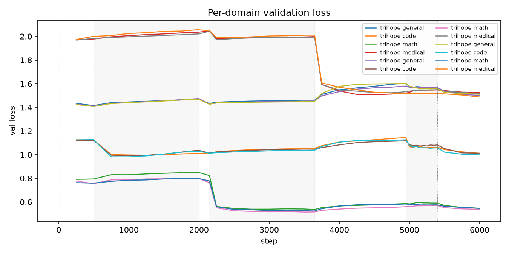
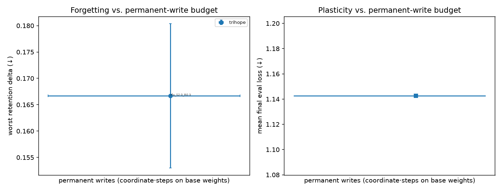
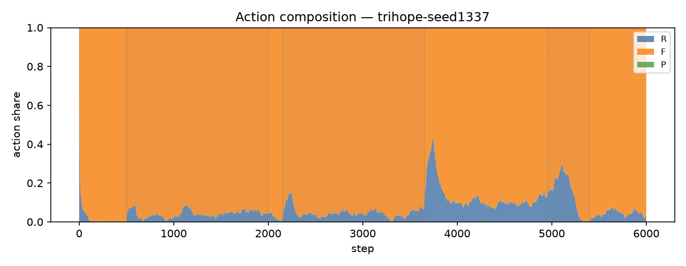
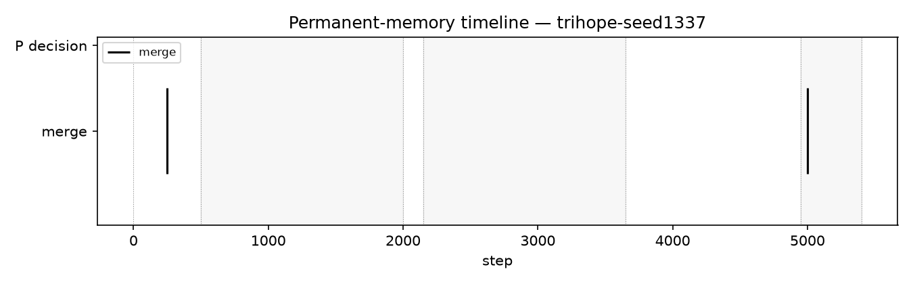
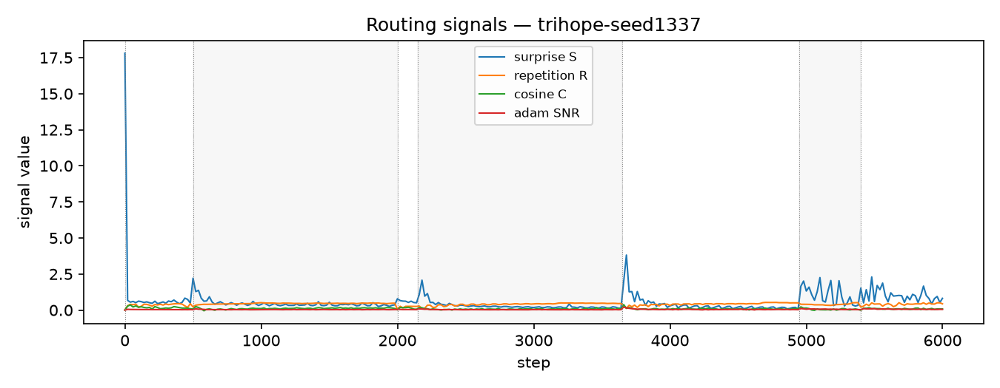
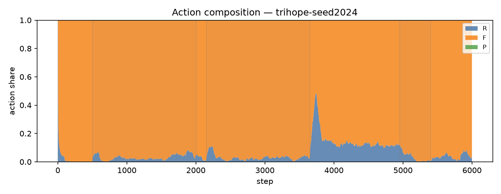
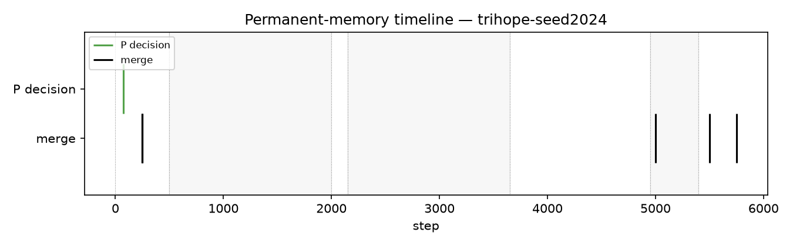
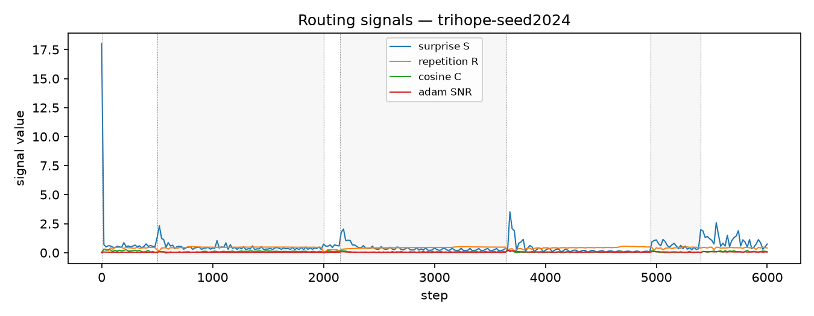
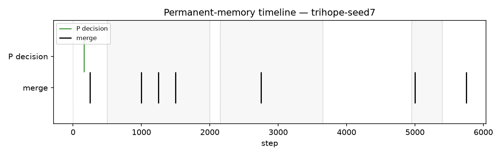
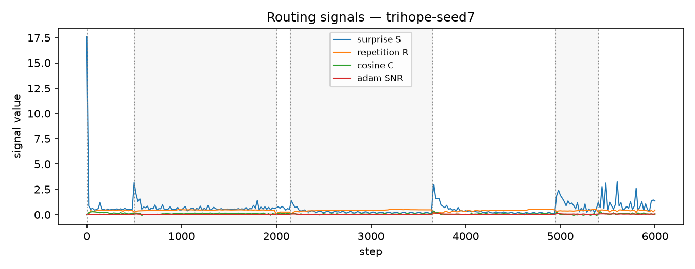

# Report — baselines_small_v1

3 runs: trihope-seed1337, trihope-seed2024, trihope-seed7

## forgetting_table

| spec_id   |   final_loss_general_mean |   final_loss_general_std |   final_loss_code_mean |   final_loss_code_std |   final_loss_math_mean |   final_loss_math_std |   final_loss_medical_mean |   final_loss_medical_std |   final_em_code_mean |   final_em_code_std |   final_em_math_mean |   final_em_math_std |   final_em_medical_mean |   final_em_medical_std |   worst_retention_delta_general_mean |   worst_retention_delta_general_std |   worst_retention_delta_code_mean |   worst_retention_delta_code_std |   worst_retention_delta_math_mean |   worst_retention_delta_math_std |   worst_retention_delta_medical_mean |   worst_retention_delta_medical_std |   wall_clock_s_mean |   wall_clock_s_std |   tokens_per_sec_mean |   tokens_per_sec_std |   peak_mem_gb_mean |   peak_mem_gb_std |   controller_fraction_mean |   controller_fraction_std |   r_count_mean |   r_count_std |   f_count_mean |   f_count_std |   p_count_mean |   p_count_std |   consolidations_mean |   consolidations_std |
|:----------|--------------------------:|-------------------------:|-----------------------:|----------------------:|-----------------------:|----------------------:|--------------------------:|-------------------------:|---------------------:|--------------------:|---------------------:|--------------------:|------------------------:|-----------------------:|-------------------------------------:|------------------------------------:|----------------------------------:|---------------------------------:|----------------------------------:|---------------------------------:|-------------------------------------:|------------------------------------:|--------------------:|-------------------:|----------------------:|---------------------:|-------------------:|------------------:|---------------------------:|--------------------------:|---------------:|--------------:|---------------:|--------------:|---------------:|--------------:|----------------------:|---------------------:|
| trihope   |                     1.509 |                   0.0072 |                 1.0079 |                0.0081 |                 0.5442 |                0.0049 |                    1.5093 |                   0.0199 |               0.0938 |              0.0156 |               0.0469 |              0.0413 |                  0.0156 |                 0.0156 |                               0.1667 |                              0.0137 |                            0.1028 |                           0.0279 |                             0.056 |                           0.0029 |                               0.0156 |                              0.0124 |             5387.69 |            101.906 |               859.004 |              17.9475 |            11.5274 |            0.0022 |                     0.4217 |                    0.0146 |        2161.67 |       225.267 |        35083.7 |       111.384 |         0.6667 |        0.5774 |                     5 |               2.6458 |

## action_share_by_phase

| spec_id   | phase             |   r_share_mean |   r_share_std |   f_share_mean |   f_share_std |   p_share_mean |   p_share_std |   mean_coords_opened_mean |   mean_coords_opened_std |
|:----------|:------------------|---------------:|--------------:|---------------:|--------------:|---------------:|--------------:|--------------------------:|-------------------------:|
| trihope   | code_recurrent    |         3.8407 |        0.5334 |        96.1593 |        0.5334 |         0      |        0      |                       0   |                     0    |
| trihope   | code_revisit      |         6.4321 |        6.0345 |        93.5679 |        6.0345 |         0      |        0      |                       0   |                     0    |
| trihope   | general_warm      |         0.7    |        0.0333 |        99.2778 |        0.0192 |         0.0222 |        0.0192 |                    1398.1 |                  1210.79 |
| trihope   | math_recurrent    |         3.6852 |        1.0911 |        96.3148 |        1.0911 |         0      |        0      |                       0   |                     0    |
| trihope   | medical_recurrent |        14.2479 |        1.0431 |        85.7521 |        1.0431 |         0      |        0      |                       0   |                     0    |
| trihope   | mixed_tail        |         4.7315 |        0.7883 |        95.2685 |        0.7883 |         0      |        0      |                       0   |                     0    |
| trihope   | novel_inject      |         0.8889 |        0.5092 |        99.1111 |        0.5092 |         0      |        0      |                       0   |                     0    |

## ablation_deltas

_no data_

## p_selection_stats

| spec_id   |   seed |   p_decisions |   consolidations |   forced_consolidations |   first_p_step |   first_merge_step |   mean_S_at_P |   mean_C_at_P |   mean_V_at_P |   mean_R_at_P |
|:----------|-------:|--------------:|-----------------:|------------------------:|---------------:|-------------------:|--------------:|--------------:|--------------:|--------------:|
| trihope   |   1337 |             0 |                2 |                       0 |            nan |                250 |      nan      |      nan      |      nan      |      nan      |
| trihope   |   2024 |             1 |                6 |                       0 |             76 |                250 |        0.4665 |        0.6648 |        0.0295 |        0.5294 |
| trihope   |      7 |             1 |                7 |                       0 |            161 |                250 |        0.5681 |        0.7099 |        0.028  |        0.5444 |

## adapter_reuse_aulc

| spec_id   | phase          |   aulc_mean |   aulc_std |   final_loss_mean |   final_loss_std |
|:----------|:---------------|------------:|-----------:|------------------:|-----------------:|
| trihope   | math_recurrent |       0.244 |     0.0188 |            0.1754 |            0.039 |

## damage_recovery

_no data_

## budget_curve

| spec_id   | threshold_tag   |   permanent_writes_mean |   permanent_writes_std |   p_action_coords_mean |   p_action_coords_std |   merged_coords_mean |   merged_coords_std |   active_fraction_mean_mean |   active_fraction_mean_std |   replayed_total_mean |   replayed_total_std |   worst_retention_delta_mean |   worst_retention_delta_std |   mean_retention_delta_mean |   mean_retention_delta_std |   final_loss_general_mean |   final_loss_general_std |   final_loss_code_mean |   final_loss_code_std |   final_loss_math_mean |   final_loss_math_std |   final_loss_medical_mean |   final_loss_medical_std |   steps_to_recover_code_mean |   steps_to_recover_code_std |
|:----------|:----------------|------------------------:|-----------------------:|-----------------------:|----------------------:|---------------------:|--------------------:|----------------------------:|---------------------------:|----------------------:|---------------------:|-----------------------------:|----------------------------:|----------------------------:|---------------------------:|--------------------------:|-------------------------:|-----------------------:|----------------------:|-----------------------:|----------------------:|--------------------------:|-------------------------:|-----------------------------:|----------------------------:|
| trihope   | rfp_S2.0_R0.3   |             3.87973e+07 |            2.02242e+07 |             4.1943e+06 |           3.63237e+06 |           3.4603e+07 |         1.66456e+07 |                           0 |                          0 |               207.667 |              52.7289 |                       0.1667 |                      0.0137 |                      0.0615 |                     0.0069 |                     1.509 |                   0.0072 |                 1.0079 |                0.0081 |                 0.5442 |                0.0049 |                    1.5093 |                   0.0199 |                      133.333 |                     144.338 |

## teacher_attribution

| run              | spec_id   |   seed | teacher                                       | phase             |   R_count |   F_count |   P_count |   replay_count |   coords_opened_F |   coords_opened_P |   consolidations_attributed |   merged_coords_attributed |
|:-----------------|:----------|-------:|:----------------------------------------------|:------------------|----------:|----------:|----------:|---------------:|------------------:|------------------:|----------------------------:|---------------------------:|
| trihope-seed1337 | trihope   |   1337 | general_teacher_deepseek_r1_distill_llama_70b | general_warm      |        22 |      2978 |         0 |             12 |           1032192 |                 0 |                      0      |                0           |
| trihope-seed1337 | trihope   |   1337 | code_teacher_deepseek_r1                      | code_recurrent    |       394 |      8606 |         0 |             42 |           3571712 |                 0 |                      0      |                0           |
| trihope-seed1337 | trihope   |   1337 | general_teacher_deepseek_r1_distill_llama_70b | novel_inject      |         7 |       893 |         0 |              0 |                 0 |                 0 |                      0      |                0           |
| trihope-seed1337 | trihope   |   1337 | math_teacher_deepseek_r1_distill_qwen_1p5b    | math_recurrent    |       445 |      8555 |         0 |            180 |          15400960 |                 0 |                      0      |                0           |
| trihope-seed1337 | trihope   |   1337 | medical_teacher_qwen2p5_1p5b_instruct_clean   | medical_recurrent |      1024 |      6776 |         0 |            450 |          39124992 |                 0 |                      0      |                0           |
| trihope-seed1337 | trihope   |   1337 | code_teacher_deepseek_r1                      | code_revisit      |       360 |      2340 |         0 |            642 |          56016896 |                 0 |                      0.1955 |                1.84486e+06 |
| trihope-seed1337 | trihope   |   1337 | medical_teacher_qwen2p5_1p5b_instruct_clean   | mixed_tail        |       138 |       780 |         0 |            240 |          20758528 |                 0 |                      0      |                0           |
| trihope-seed1337 | trihope   |   1337 | general_teacher_deepseek_r1_distill_llama_70b | mixed_tail        |         1 |       821 |         0 |              0 |                 0 |                 0 |                      0      |                0           |
| trihope-seed1337 | trihope   |   1337 | math_teacher_deepseek_r1_distill_qwen_1p5b    | mixed_tail        |        26 |       952 |         0 |             12 |           1048576 |                 0 |                      0      |                0           |
| trihope-seed1337 | trihope   |   1337 | code_teacher_deepseek_r1                      | mixed_tail        |         0 |       882 |         0 |              0 |                 0 |                 0 |                      0      |                0           |
| trihope-seed1337 | trihope   |   1337 | general_teacher_deepseek_r1_distill_llama_70b | code_revisit      |         0 |         0 |         0 |              0 |                 0 |                 0 |                      0.015  |           141913           |
| trihope-seed1337 | trihope   |   1337 | math_teacher_deepseek_r1_distill_qwen_1p5b    | code_revisit      |         0 |         0 |         0 |              0 |                 0 |                 0 |                      0.2256 |                2.12869e+06 |
| trihope-seed1337 | trihope   |   1337 | medical_teacher_qwen2p5_1p5b_instruct_clean   | code_revisit      |         0 |         0 |         0 |              0 |                 0 |                 0 |                      0.5639 |                5.32172e+06 |
| trihope-seed2024 | trihope   |   2024 | general_teacher_deepseek_r1_distill_llama_70b | general_warm      |        20 |      2979 |         1 |              0 |                 0 |           6291456 |                      0      |                0           |
| trihope-seed2024 | trihope   |   2024 | code_teacher_deepseek_r1                      | code_recurrent    |       298 |      8702 |         0 |             42 |           3555328 |                 0 |                      0      |                0           |
| trihope-seed2024 | trihope   |   2024 | general_teacher_deepseek_r1_distill_llama_70b | novel_inject      |        13 |       887 |         0 |              0 |                 0 |                 0 |                      0      |                0           |
| trihope-seed2024 | trihope   |   2024 | math_teacher_deepseek_r1_distill_qwen_1p5b    | math_recurrent    |       272 |      8728 |         0 |             84 |           7258112 |                 0 |                      0      |                0           |
| trihope-seed2024 | trihope   |   2024 | medical_teacher_qwen2p5_1p5b_instruct_clean   | medical_recurrent |      1185 |      6615 |         0 |            540 |          46661632 |                 0 |                      0      |                0           |
| trihope-seed2024 | trihope   |   2024 | code_teacher_deepseek_r1                      | code_revisit      |        58 |      2642 |         0 |            132 |          11567104 |                 0 |                      0.0877 |           827823           |
| trihope-seed2024 | trihope   |   2024 | medical_teacher_qwen2p5_1p5b_instruct_clean   | mixed_tail        |       105 |       825 |         0 |            108 |           9371648 |                 0 |                      0.75   |                4.71859e+06 |
| trihope-seed2024 | trihope   |   2024 | general_teacher_deepseek_r1_distill_llama_70b | mixed_tail        |         2 |       910 |         0 |              0 |                 0 |                 0 |                      0      |                0           |
| trihope-seed2024 | trihope   |   2024 | code_teacher_deepseek_r1                      | mixed_tail        |         7 |       857 |         0 |             12 |           1015808 |                 0 |                      0.6875 |                4.32538e+06 |
| trihope-seed2024 | trihope   |   2024 | math_teacher_deepseek_r1_distill_qwen_1p5b    | mixed_tail        |        31 |       863 |         0 |             30 |           2588672 |                 0 |                      0.5625 |                3.53894e+06 |
| trihope-seed2024 | trihope   |   2024 | math_teacher_deepseek_r1_distill_qwen_1p5b    | code_revisit      |         0 |         0 |         0 |              0 |                 0 |                 0 |                      0.1228 |                1.15895e+06 |
| trihope-seed2024 | trihope   |   2024 | medical_teacher_qwen2p5_1p5b_instruct_clean   | code_revisit      |         0 |         0 |         0 |              0 |                 0 |                 0 |                      0.7895 |                7.45041e+06 |
| trihope-seed7    | trihope   |      7 | general_teacher_deepseek_r1_distill_llama_70b | general_warm      |        21 |      2978 |         1 |              6 |            507904 |           6291456 |                      0      |                0           |
| trihope-seed7    | trihope   |      7 | code_teacher_deepseek_r1                      | code_recurrent    |       345 |      8655 |         0 |             48 |           4177920 |                 0 |                      2      |                1.25829e+07 |
| trihope-seed7    | trihope   |      7 | general_teacher_deepseek_r1_distill_llama_70b | novel_inject      |         4 |       896 |         0 |              0 |                 0 |                 0 |                      0      |                0           |
| trihope-seed7    | trihope   |      7 | math_teacher_deepseek_r1_distill_qwen_1p5b    | math_recurrent    |       278 |      8722 |         0 |             90 |           7667712 |                 0 |                      0      |                0           |
| trihope-seed7    | trihope   |      7 | medical_teacher_qwen2p5_1p5b_instruct_clean   | medical_recurrent |      1125 |      6675 |         0 |            564 |          48365568 |                 0 |                      0      |                0           |
| trihope-seed7    | trihope   |      7 | code_teacher_deepseek_r1                      | code_revisit      |       103 |      2597 |         0 |            246 |          21594112 |                 0 |                      0.1406 |                1.3271e+06  |
| trihope-seed7    | trihope   |      7 | math_teacher_deepseek_r1_distill_qwen_1p5b    | mixed_tail        |        11 |       937 |         0 |             24 |           2048000 |                 0 |                      0      |                0           |
| trihope-seed7    | trihope   |      7 | code_teacher_deepseek_r1                      | mixed_tail        |         0 |       858 |         0 |              0 |                 0 |                 0 |                      0.1818 |                1.1439e+06  |
| trihope-seed7    | trihope   |      7 | medical_teacher_qwen2p5_1p5b_instruct_clean   | mixed_tail        |       188 |       700 |         0 |            234 |          20021248 |                 0 |                      0.8182 |                5.14755e+06 |
| trihope-seed7    | trihope   |      7 | general_teacher_deepseek_r1_distill_llama_70b | mixed_tail        |         2 |       904 |         0 |              0 |                 0 |                 0 |                      0      |                0           |
| trihope-seed7    | trihope   |      7 | general_teacher_deepseek_r1_distill_llama_70b | code_revisit      |         0 |         0 |         0 |              0 |                 0 |                 0 |                      0.0078 |            73728           |
| trihope-seed7    | trihope   |      7 | math_teacher_deepseek_r1_distill_qwen_1p5b    | code_revisit      |         0 |         0 |         0 |              0 |                 0 |                 0 |                      0.1172 |                1.10592e+06 |
| trihope-seed7    | trihope   |      7 | medical_teacher_qwen2p5_1p5b_instruct_clean   | code_revisit      |         0 |         0 |         0 |              0 |                 0 |                 0 |                      0.7344 |                6.93043e+06 |

## containment

_no data_

## Figures

