# Report — ablation_grid_v1

13 runs: consolidation_strict-seed1337, moments_optimizer-seed1337, no_cosine-seed1337, no_repetition-seed1337, no_surprise-seed1337, no_teacher_conf-seed1337, no_volatility-seed1337, stability_instant-seed1337, topk_100-seed1337, topk_25-seed1337, topm_2-seed1337, topm_all-seed1337, trihope-seed1337

## forgetting_table

| spec_id              |   final_loss_general_mean |   final_loss_general_std |   final_loss_code_mean |   final_loss_code_std |   final_loss_math_mean |   final_loss_math_std |   final_loss_medical_mean |   final_loss_medical_std |   final_em_code_mean |   final_em_code_std |   final_em_math_mean |   final_em_math_std |   final_em_medical_mean |   final_em_medical_std |   worst_retention_delta_general_mean |   worst_retention_delta_general_std |   worst_retention_delta_code_mean |   worst_retention_delta_code_std |   worst_retention_delta_math_mean |   worst_retention_delta_math_std |   worst_retention_delta_medical_mean |   worst_retention_delta_medical_std |   wall_clock_s_mean |   wall_clock_s_std |   tokens_per_sec_mean |   tokens_per_sec_std |   peak_mem_gb_mean |   peak_mem_gb_std |   controller_fraction_mean |   controller_fraction_std |   r_count_mean |   r_count_std |   f_count_mean |   f_count_std |   p_count_mean |   p_count_std |   consolidations_mean |   consolidations_std |
|:---------------------|--------------------------:|-------------------------:|-----------------------:|----------------------:|-----------------------:|----------------------:|--------------------------:|-------------------------:|---------------------:|--------------------:|---------------------:|--------------------:|------------------------:|-----------------------:|-------------------------------------:|------------------------------------:|----------------------------------:|---------------------------------:|----------------------------------:|---------------------------------:|-------------------------------------:|------------------------------------:|--------------------:|-------------------:|----------------------:|---------------------:|-------------------:|------------------:|---------------------------:|--------------------------:|---------------:|--------------:|---------------:|--------------:|---------------:|--------------:|----------------------:|---------------------:|
| consolidation_strict |                    1.5153 |                      nan |                 1.0102 |                   nan |                 0.5479 |                   nan |                    1.5132 |                      nan |               0.0469 |                 nan |               0.0312 |                 nan |                  0.0312 |                    nan |                               0.173  |                                 nan |                            0.126  |                              nan |                            0.0489 |                              nan |                               0.0156 |                                 nan |             4157.29 |                nan |              1121.6   |                  nan |            11.531  |               nan |                     0.2916 |                       nan |           2210 |           nan |          35086 |           nan |              0 |           nan |                     0 |                  nan |
| moments_optimizer    |                    1.5296 |                      nan |                 1.058  |                   nan |                 0.594  |                   nan |                    1.634  |                      nan |               0.0938 |                 nan |               0.0156 |                 nan |                  0      |                    nan |                               0.4179 |                                 nan |                            0.5516 |                              nan |                            0.1819 |                              nan |                              -0.1522 |                                 nan |             4149.54 |                nan |              1123.69  |                  nan |            11.0697 |               nan |                     0.2618 |                       nan |          10401 |           nan |          33921 |           nan |              0 |           nan |                     0 |                  nan |
| no_cosine            |                    1.5547 |                      nan |                 1.0509 |                   nan |                 0.5768 |                   nan |                    1.5261 |                      nan |               0.1406 |                 nan |               0.0312 |                 nan |                  0      |                    nan |                               0.2078 |                                 nan |                            0.5723 |                              nan |                            0.0426 |                              nan |                               0.0085 |                                 nan |             5119.33 |                nan |               910.823 |                  nan |            11.3528 |               nan |                     0.2203 |                       nan |           2290 |           nan |          33083 |           nan |           1713 |           nan |                   789 |                  nan |
| no_repetition        |                    1.4736 |                      nan |                 0.9882 |                   nan |                 0.5377 |                   nan |                    1.4807 |                      nan |               0.1562 |                 nan |               0.0312 |                 nan |                  0      |                    nan |                               0.1061 |                                 nan |                            0.0544 |                              nan |                            0.0284 |                              nan |                               0.0166 |                                 nan |             4413.12 |                nan |              1056.58  |                  nan |            10.5818 |               nan |                     0.1556 |                       nan |              0 |           nan |          35989 |           nan |             11 |           nan |                    12 |                  nan |
| no_surprise          |                    1.5318 |                      nan |                 1.0322 |                   nan |                 0.5784 |                   nan |                    1.5395 |                      nan |               0.0781 |                 nan |               0.0469 |                 nan |                  0.0156 |                    nan |                               0.3091 |                                 nan |                            0.3279 |                              nan |                            0.1204 |                              nan |                               0.0016 |                                 nan |             5143.55 |                nan |               906.535 |                  nan |            11.5255 |               nan |                     0.2431 |                       nan |           6076 |           nan |          32365 |           nan |              1 |           nan |                     7 |                  nan |
| no_teacher_conf      |                    1.5311 |                      nan |                 1.0254 |                   nan |                 0.565  |                   nan |                    1.5094 |                      nan |               0.0938 |                 nan |               0.0312 |                 nan |                  0.0156 |                    nan |                               0.1989 |                                 nan |                            0.1507 |                              nan |                            0.0617 |                              nan |                               0.0138 |                                 nan |             4836.99 |                nan |               963.989 |                  nan |            11.5298 |               nan |                     0.2371 |                       nan |           2503 |           nan |          34835 |           nan |              0 |           nan |                     2 |                  nan |
| no_volatility        |                    1.5121 |                      nan |                 1.0078 |                   nan |                 0.5503 |                   nan |                    1.5141 |                      nan |               0.1094 |                 nan |               0.0156 |                 nan |                  0.0312 |                    nan |                               0.1716 |                                 nan |                            0.1359 |                              nan |                            0.056  |                              nan |                               0.0266 |                                 nan |             5199.14 |                nan |               896.841 |                  nan |            11.524  |               nan |                     0.2593 |                       nan |           2303 |           nan |          35143 |           nan |              0 |           nan |                     2 |                  nan |
| stability_instant    |                    1.5119 |                      nan |                 1.0238 |                   nan |                 0.5583 |                   nan |                    1.5135 |                      nan |               0.0625 |                 nan |               0.0625 |                 nan |                  0.0156 |                    nan |                               0.1878 |                                 nan |                            0.2074 |                              nan |                            0.0667 |                              nan |                               0.0162 |                                 nan |             4279.54 |                nan |              1089.56  |                  nan |            11.5337 |               nan |                     0.2671 |                       nan |           2412 |           nan |          35138 |           nan |             16 |           nan |                     9 |                  nan |
| topk_100             |                    1.5164 |                      nan |                 1.013  |                   nan |                 0.5458 |                   nan |                    1.5094 |                      nan |               0.0469 |                 nan |               0.0156 |                 nan |                  0.0156 |                    nan |                               0.1787 |                                 nan |                            0.1463 |                              nan |                            0.0575 |                              nan |                               0.0307 |                                 nan |             4842.73 |                nan |               962.847 |                  nan |            11.5333 |               nan |                     0.2621 |                       nan |           2437 |           nan |          35171 |           nan |              0 |           nan |                     2 |                  nan |
| topk_25              |                    1.5074 |                      nan |                 1.0059 |                   nan |                 0.5435 |                   nan |                    1.5099 |                      nan |               0.0938 |                 nan |               0.0156 |                 nan |                  0.0156 |                    nan |                               0.1506 |                                 nan |                            0.0944 |                              nan |                            0.0384 |                              nan |                               0.0186 |                                 nan |             4810.51 |                nan |               969.296 |                  nan |            11.5303 |               nan |                     0.2573 |                       nan |           2116 |           nan |          35048 |           nan |              0 |           nan |                     2 |                  nan |
| topm_2               |                    1.5047 |                      nan |                 1.0154 |                   nan |                 0.54   |                   nan |                    1.4944 |                      nan |               0.1094 |                 nan |               0.0312 |                 nan |                  0.0312 |                    nan |                               0.139  |                                 nan |                            0.0927 |                              nan |                            0.0354 |                              nan |                               0.0096 |                                 nan |             4843.09 |                nan |               962.775 |                  nan |            11.5173 |               nan |                     0.2515 |                       nan |            720 |           nan |          11576 |           nan |              0 |           nan |                     2 |                  nan |
| topm_all             |                    1.4129 |                      nan |                 0.9478 |                   nan |                 0.4745 |                   nan |                    1.3297 |                      nan |               0.125  |                 nan |               0.0312 |                 nan |                  0.0156 |                    nan |                               0.1871 |                                 nan |                            0.2214 |                              nan |                            0.1329 |                              nan |                               0.0153 |                                 nan |             5652.19 |                nan |               824.955 |                  nan |            11.5489 |               nan |                     0.2683 |                       nan |          46089 |           nan |         636663 |           nan |              0 |           nan |                     0 |                  nan |
| trihope              |                    1.5124 |                      nan |                 1.003  |                   nan |                 0.5417 |                   nan |                    1.5086 |                      nan |               0.125  |                 nan |               0.0312 |                 nan |                  0.0156 |                    nan |                               0.172  |                                 nan |                            0.137  |                              nan |                            0.0505 |                              nan |                               0.0251 |                                 nan |             5213.15 |                nan |               894.431 |                  nan |            11.5247 |               nan |                     0.2627 |                       nan |           2275 |           nan |          35255 |           nan |              0 |           nan |                     2 |                  nan |

## action_share_by_phase

_no data_

## ablation_deltas

| spec_id              |   delta_final_loss_general |   delta_final_loss_code |   delta_final_loss_math |   delta_final_loss_medical |   delta_final_em_code |   delta_final_em_math |   delta_final_em_medical |   delta_worst_retention_delta_general |   delta_worst_retention_delta_code |   delta_worst_retention_delta_math |   delta_worst_retention_delta_medical |   delta_wall_clock_s |   delta_tokens_per_sec |   delta_peak_mem_gb |   delta_controller_fraction |   delta_r_count |   delta_f_count |   delta_p_count |   delta_consolidations |
|:---------------------|---------------------------:|------------------------:|------------------------:|---------------------------:|----------------------:|----------------------:|-------------------------:|--------------------------------------:|-----------------------------------:|-----------------------------------:|--------------------------------------:|---------------------:|-----------------------:|--------------------:|----------------------------:|----------------:|----------------:|----------------:|-----------------------:|
| consolidation_strict |                     0.0029 |                  0.0072 |                  0.0062 |                     0.0046 |               -0.0781 |                0      |                   0.0156 |                                0.001  |                            -0.011  |                            -0.0015 |                               -0.0095 |           -1055.86   |               227.167  |              0.0063 |                      0.0289 |             -65 |            -169 |               0 |                     -2 |
| moments_optimizer    |                     0.0172 |                  0.055  |                  0.0523 |                     0.1253 |               -0.0312 |               -0.0156 |                  -0.0156 |                                0.2459 |                             0.4146 |                             0.1314 |                               -0.1773 |           -1063.62   |               229.262  |             -0.455  |                     -0.0009 |            8126 |           -1334 |               0 |                     -2 |
| no_cosine            |                     0.0422 |                  0.0479 |                  0.0351 |                     0.0174 |                0.0156 |                0      |                  -0.0156 |                                0.0358 |                             0.4353 |                            -0.0079 |                               -0.0166 |             -93.8217 |                16.3922 |             -0.1719 |                     -0.0424 |              15 |           -2172 |            1713 |                    787 |
| no_repetition        |                    -0.0388 |                 -0.0149 |                 -0.0039 |                    -0.028  |                0.0312 |                0      |                  -0.0156 |                               -0.0659 |                            -0.0826 |                            -0.0221 |                               -0.0085 |            -800.036  |               162.148  |             -0.9429 |                     -0.1071 |           -2275 |             734 |              11 |                     10 |
| no_surprise          |                     0.0194 |                  0.0291 |                  0.0368 |                     0.0309 |               -0.0469 |                0.0156 |                   0      |                                0.1371 |                             0.1909 |                             0.0699 |                               -0.0235 |             -69.6064 |                12.1041 |              0.0008 |                     -0.0197 |            3801 |           -2890 |               1 |                      5 |
| no_teacher_conf      |                     0.0187 |                  0.0223 |                  0.0233 |                     0.0007 |               -0.0312 |                0      |                   0      |                                0.0269 |                             0.0138 |                             0.0112 |                               -0.0113 |            -376.165  |                69.5584 |              0.0051 |                     -0.0256 |             228 |            -420 |               0 |                      0 |
| no_volatility        |                    -0.0004 |                  0.0047 |                  0.0087 |                     0.0054 |               -0.0156 |               -0.0156 |                   0.0156 |                               -0.0005 |                            -0.0011 |                             0.0055 |                                0.0015 |             -14.0107 |                 2.4103 |             -0.0007 |                     -0.0034 |              28 |            -112 |               0 |                      0 |
| stability_instant    |                    -0.0005 |                  0.0207 |                  0.0166 |                     0.0048 |               -0.0625 |                0.0312 |                   0      |                                0.0158 |                             0.0704 |                             0.0162 |                               -0.0089 |            -933.618  |               195.128  |              0.0091 |                      0.0044 |             137 |            -117 |              16 |                      7 |
| topk_100             |                     0.004  |                  0.01   |                  0.0042 |                     0.0008 |               -0.0781 |               -0.0156 |                   0      |                                0.0066 |                             0.0093 |                             0.007  |                                0.0056 |            -370.424  |                68.4157 |              0.0086 |                     -0.0006 |             162 |             -84 |               0 |                      0 |
| topk_25              |                    -0.005  |                  0.0029 |                  0.0019 |                     0.0013 |               -0.0312 |               -0.0156 |                   0      |                               -0.0214 |                            -0.0426 |                            -0.0121 |                               -0.0065 |            -402.647  |                74.8652 |              0.0056 |                     -0.0055 |            -159 |            -207 |               0 |                      0 |
| topm_2               |                    -0.0077 |                  0.0124 |                 -0.0017 |                    -0.0143 |               -0.0156 |                0      |                   0.0156 |                               -0.033  |                            -0.0443 |                            -0.015  |                               -0.0155 |            -370.066  |                68.3446 |             -0.0074 |                     -0.0112 |           -1555 |          -23679 |               0 |                      0 |
| topm_all             |                    -0.0995 |                 -0.0552 |                 -0.0672 |                    -0.1789 |                0      |                0      |                   0      |                                0.0151 |                             0.0844 |                             0.0825 |                               -0.0098 |             439.038  |               -69.4756 |              0.0242 |                      0.0056 |           43814 |          601408 |               0 |                     -2 |

## p_selection_stats

_no data_

## replay_timing

_no data_

## adapter_reuse_aulc

| spec_id              | phase          |   aulc_mean |   aulc_std |   final_loss_mean |   final_loss_std |
|:---------------------|:---------------|------------:|-----------:|------------------:|-----------------:|
| consolidation_strict | math_recurrent |      0.2423 |        nan |            0.1463 |              nan |
| moments_optimizer    | math_recurrent |      0.2192 |        nan |            0.1084 |              nan |
| no_cosine            | math_recurrent |      0.2429 |        nan |            0.0886 |              nan |
| no_repetition        | math_recurrent |      0.2501 |        nan |            0.1441 |              nan |
| no_surprise          | math_recurrent |      0.2107 |        nan |            0.1172 |              nan |
| no_teacher_conf      | math_recurrent |      0.2725 |        nan |            0.1578 |              nan |
| no_volatility        | math_recurrent |      0.2397 |        nan |            0.1465 |              nan |
| stability_instant    | math_recurrent |      0.2363 |        nan |            0.1377 |              nan |
| topk_100             | math_recurrent |      0.2415 |        nan |            0.1422 |              nan |
| topk_25              | math_recurrent |      0.2391 |        nan |            0.141  |              nan |
| topm_2               | math_recurrent |      0.2405 |        nan |            0.1423 |              nan |
| topm_all             | math_recurrent |      0.1273 |        nan |            0.0748 |              nan |
| trihope              | math_recurrent |      0.241  |        nan |            0.1419 |              nan |

## damage_recovery

_no data_

## budget_curve

| spec_id              | threshold_tag   |   permanent_writes_mean |   permanent_writes_std |   p_action_coords_mean |   p_action_coords_std |   merged_coords_mean |   merged_coords_std |   active_fraction_mean_mean |   active_fraction_mean_std |   replayed_total_mean |   replayed_total_std |   worst_retention_delta_mean |   worst_retention_delta_std |   mean_retention_delta_mean |   mean_retention_delta_std |   final_loss_general_mean |   final_loss_general_std |   final_loss_code_mean |   final_loss_code_std |   final_loss_math_mean |   final_loss_math_std |   final_loss_medical_mean |   final_loss_medical_std |   steps_to_recover_code_mean |   steps_to_recover_code_std |
|:---------------------|:----------------|------------------------:|-----------------------:|-----------------------:|----------------------:|---------------------:|--------------------:|----------------------------:|---------------------------:|----------------------:|---------------------:|-----------------------------:|----------------------------:|----------------------------:|---------------------------:|--------------------------:|-------------------------:|-----------------------:|----------------------:|-----------------------:|----------------------:|--------------------------:|-------------------------:|-----------------------------:|----------------------------:|
| consolidation_strict |                 |             0           |                    nan |            0           |                   nan |          0           |                 nan |                      0      |                        nan |                   216 |                  nan |                       0.173  |                         nan |                      0.0646 |                        nan |                    1.5153 |                      nan |                 1.0102 |                   nan |                 0.5479 |                   nan |                    1.5132 |                      nan |                          nan |                         nan |
| moments_optimizer    |                 |             0           |                    nan |            0           |                   nan |          0           |                 nan |                      0.0003 |                        nan |                  1387 |                  nan |                       0.5516 |                         nan |                      0.1887 |                        nan |                    1.5296 |                      nan |                 1.058  |                   nan |                 0.594  |                   nan |                    1.634  |                      nan |                          nan |                         nan |
| no_cosine            |                 |             1.90568e+10 |                    nan |            1.28786e+10 |                   nan |          6.17821e+09 |                 nan |                      0.0048 |                        nan |                   181 |                  nan |                       0.5723 |                         nan |                      0.1718 |                        nan |                    1.5547 |                      nan |                 1.0509 |                   nan |                 0.5768 |                   nan |                    1.5261 |                      nan |                          nan |                         nan |
| no_repetition        |                 |             1.44703e+08 |                    nan |            6.9206e+07  |                   nan |          7.54975e+07 |                 nan |                      0      |                        nan |                     0 |                  nan |                       0.1061 |                         nan |                      0.0413 |                        nan |                    1.4736 |                      nan |                 0.9882 |                   nan |                 0.5377 |                   nan |                    1.4807 |                      nan |                          nan |                         nan |
| no_surprise          |                 |             5.34774e+07 |                    nan |            6.29146e+06 |                   nan |          4.71859e+07 |                 nan |                      0.0001 |                        nan |                   407 |                  nan |                       0.3279 |                         nan |                      0.1362 |                        nan |                    1.5318 |                      nan |                 1.0322 |                   nan |                 0.5784 |                   nan |                    1.5395 |                      nan |                          nan |                         nan |
| no_teacher_conf      |                 |             1.57286e+07 |                    nan |            0           |                   nan |          1.57286e+07 |                 nan |                      0      |                        nan |                   223 |                  nan |                       0.1989 |                         nan |                      0.0765 |                        nan |                    1.5311 |                      nan |                 1.0254 |                   nan |                 0.565  |                   nan |                    1.5094 |                      nan |                          nan |                         nan |
| no_volatility        |                 |             1.57286e+07 |                    nan |            0           |                   nan |          1.57286e+07 |                 nan |                      0      |                        nan |                   241 |                  nan |                       0.1716 |                         nan |                      0.0697 |                        nan |                    1.5121 |                      nan |                 1.0078 |                   nan |                 0.5503 |                   nan |                    1.5141 |                      nan |                          nan |                         nan |
| stability_instant    |                 |             1.66724e+08 |                    nan |            1.00663e+08 |                   nan |          6.60603e+07 |                 nan |                      0.0001 |                        nan |                   261 |                  nan |                       0.2074 |                         nan |                      0.0816 |                        nan |                    1.5119 |                      nan |                 1.0238 |                   nan |                 0.5583 |                   nan |                    1.5135 |                      nan |                          nan |                         nan |
| topk_100             |                 |             1.57286e+07 |                    nan |            0           |                   nan |          1.57286e+07 |                 nan |                      0.0001 |                        nan |                   268 |                  nan |                       0.1787 |                         nan |                      0.0724 |                        nan |                    1.5164 |                      nan |                 1.013  |                   nan |                 0.5458 |                   nan |                    1.5094 |                      nan |                          nan |                         nan |
| topk_25              |                 |             1.57286e+07 |                    nan |            0           |                   nan |          1.57286e+07 |                 nan |                      0      |                        nan |                   194 |                  nan |                       0.1506 |                         nan |                      0.0578 |                        nan |                    1.5074 |                      nan |                 1.0059 |                   nan |                 0.5435 |                   nan |                    1.5099 |                      nan |                          nan |                         nan |
| topm_2               |                 |             1.57286e+07 |                    nan |            0           |                   nan |          1.57286e+07 |                 nan |                      0      |                        nan |                   148 |                  nan |                       0.139  |                         nan |                      0.0549 |                        nan |                    1.5047 |                      nan |                 1.0154 |                   nan |                 0.54   |                   nan |                    1.4944 |                      nan |                          nan |                         nan |
| topm_all             |                 |             0           |                    nan |            0           |                   nan |          0           |                 nan |                      0.0108 |                        nan |                   192 |                  nan |                       0.2214 |                         nan |                      0.113  |                        nan |                    1.4129 |                      nan |                 0.9478 |                   nan |                 0.4745 |                   nan |                    1.3297 |                      nan |                          nan |                         nan |
| trihope              |                 |             1.57286e+07 |                    nan |            0           |                   nan |          1.57286e+07 |                 nan |                      0      |                        nan |                   255 |                  nan |                       0.172  |                         nan |                      0.0684 |                        nan |                    1.5124 |                      nan |                 1.003  |                   nan |                 0.5417 |                   nan |                    1.5086 |                      nan |                          nan |                         nan |

## teacher_attribution

_no data_

## containment

_no data_

## Figures

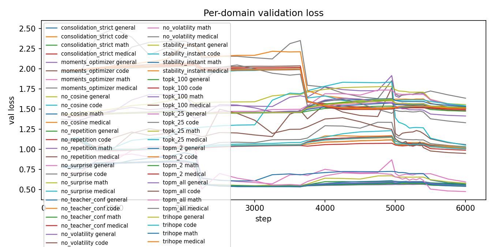
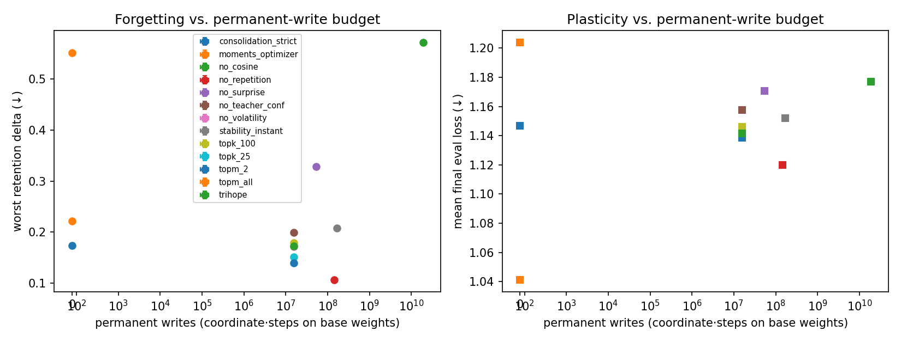
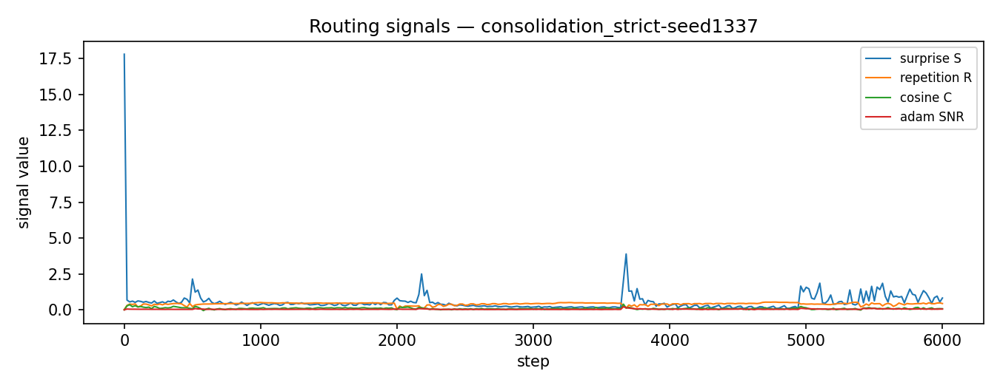
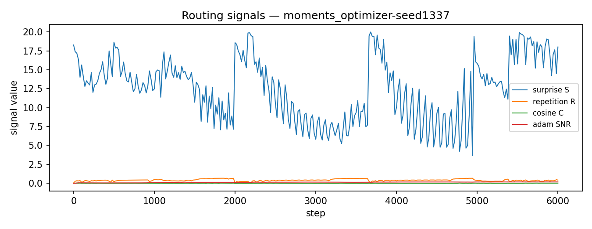
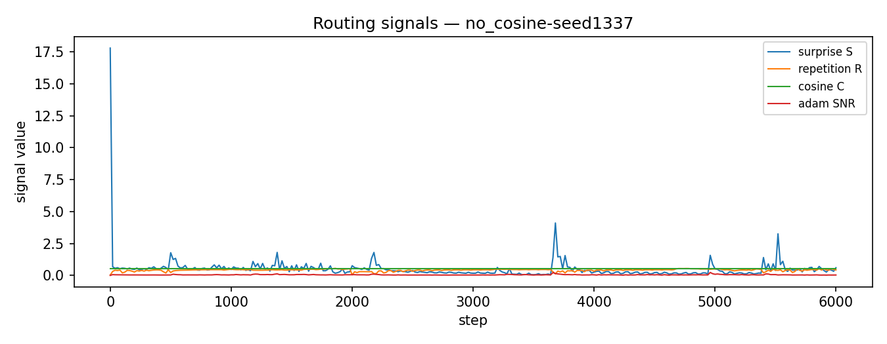
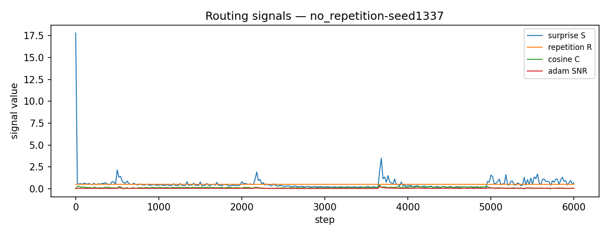
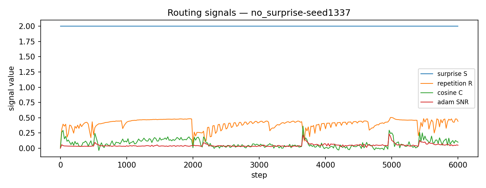
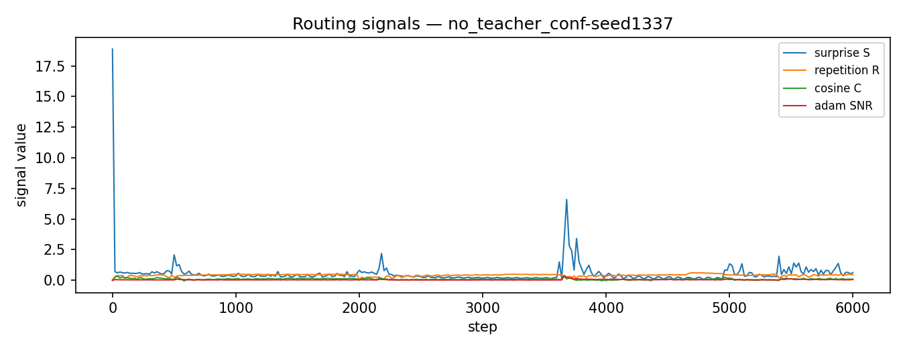
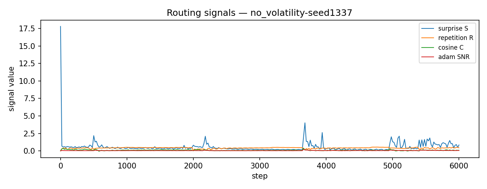

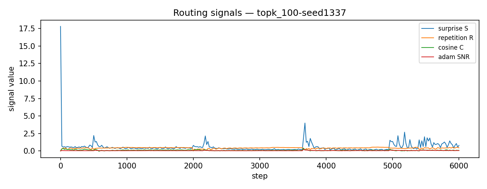
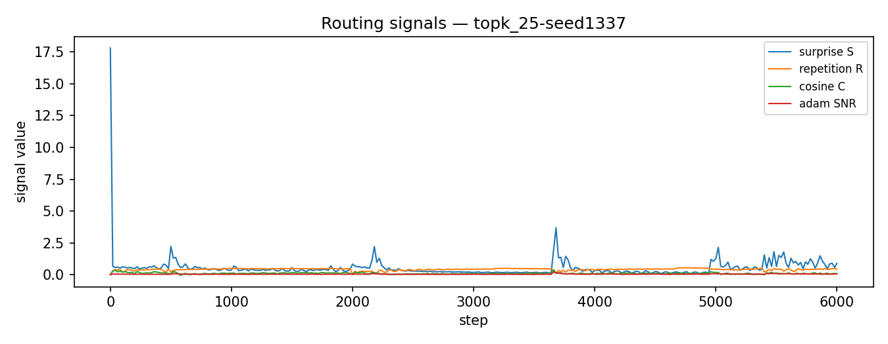
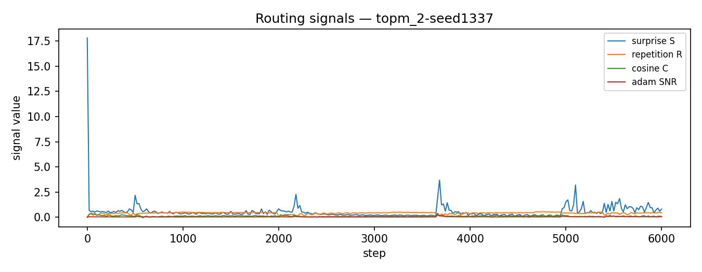
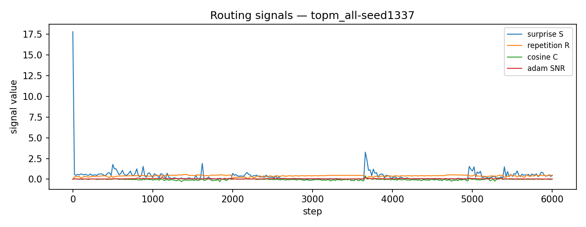
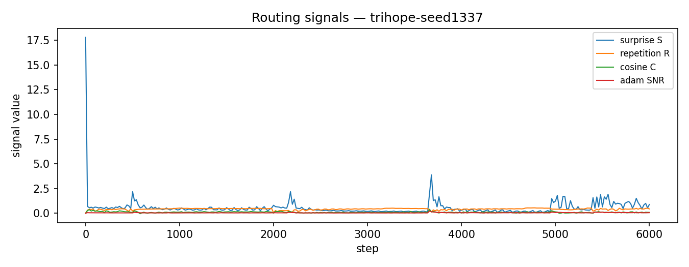
