# Report — ablation_grid_v1_replay_off

14 runs: consolidation_strict-seed1337, consolidation_strict-seed2024, consolidation_strict-seed7, moments_optimizer-seed1337, no_cosine-seed1337, no_repetition-seed1337, no_surprise-seed1337, no_teacher_conf-seed1337, no_volatility-seed1337, stability_instant-seed1337, topk_100-seed1337, topk_25-seed1337, topm_2-seed1337, topm_all-seed1337

## forgetting_table

| spec_id              |   final_loss_general_mean |   final_loss_general_std |   final_loss_code_mean |   final_loss_code_std |   final_loss_math_mean |   final_loss_math_std |   final_loss_medical_mean |   final_loss_medical_std |   final_em_code_mean |   final_em_code_std |   final_em_math_mean |   final_em_math_std |   final_em_medical_mean |   final_em_medical_std |   worst_retention_delta_general_mean |   worst_retention_delta_general_std |   worst_retention_delta_code_mean |   worst_retention_delta_code_std |   worst_retention_delta_math_mean |   worst_retention_delta_math_std |   worst_retention_delta_medical_mean |   worst_retention_delta_medical_std |   wall_clock_s_mean |   wall_clock_s_std |   tokens_per_sec_mean |   tokens_per_sec_std |   peak_mem_gb_mean |   peak_mem_gb_std |   controller_fraction_mean |   controller_fraction_std |   r_count_mean |   r_count_std |   f_count_mean |   f_count_std |   p_count_mean |   p_count_std |   consolidations_mean |   consolidations_std |
|:---------------------|--------------------------:|-------------------------:|-----------------------:|----------------------:|-----------------------:|----------------------:|--------------------------:|-------------------------:|---------------------:|--------------------:|---------------------:|--------------------:|------------------------:|-----------------------:|-------------------------------------:|------------------------------------:|----------------------------------:|---------------------------------:|----------------------------------:|---------------------------------:|-------------------------------------:|------------------------------------:|--------------------:|-------------------:|----------------------:|---------------------:|-------------------:|------------------:|---------------------------:|--------------------------:|---------------:|--------------:|---------------:|--------------:|---------------:|--------------:|----------------------:|---------------------:|
| consolidation_strict |                    1.4853 |                   0.0064 |                 1.0146 |                0.0171 |                 0.5497 |                0.0097 |                    1.4949 |                   0.0279 |               0.151  |              0.0239 |               0.0469 |              0.0271 |                  0.026  |                  0.018 |                               0.1194 |                              0.0053 |                            0.108  |                           0.0155 |                            0.0453 |                           0.0025 |                               0.0078 |                              0.0018 |             2826.32 |            21.8392 |               1637.19 |              24.1723 |            11.0416 |             0.001 |                     0.2318 |                    0.0046 |        4746.33 |        34.356 |        31238.7 |       32.6241 |             15 |             2 |                     0 |                    0 |
| moments_optimizer    |                    1.4739 |                 nan      |                 0.9878 |              nan      |                 0.5289 |              nan      |                    1.4741 |                 nan      |               0.0312 |            nan      |               0.0312 |            nan      |                  0      |                nan     |                               0.0906 |                            nan      |                            0.0482 |                         nan      |                            0.0229 |                         nan      |                               0.0124 |                            nan      |             2747.59 |           nan      |               1697.05 |             nan      |            10.5812 |           nan     |                     0.2286 |                  nan      |        9872    |       nan     |        26128   |      nan      |              0 |           nan |                     0 |                  nan |
| no_cosine            |                    1.5645 |                 nan      |                 1.0456 |              nan      |                 0.5726 |              nan      |                    1.5746 |                 nan      |               0.1094 |            nan      |               0.0312 |            nan      |                  0      |                nan     |                               0.2161 |                            nan      |                            0.3544 |                         nan      |                            0.0293 |                         nan      |                              -0.0007 |                            nan      |             2910.72 |           nan      |               1601.94 |             nan      |            11.0405 |           nan     |                     0.2051 |                  nan      |        4550    |       nan     |        29909   |      nan      |           1541 |           nan |                   809 |                  nan |
| no_repetition        |                    1.4843 |                 nan      |                 1.0113 |              nan      |                 0.5555 |              nan      |                    1.5102 |                 nan      |               0.0781 |            nan      |               0      |            nan      |                  0.0625 |                nan     |                               0.1124 |                            nan      |                            0.1339 |                         nan      |                            0.0536 |                         nan      |                               0.0162 |                            nan      |             2500.88 |           nan      |               1864.47 |             nan      |            10.5844 |           nan     |                     0.1286 |                  nan      |           0    |       nan     |        35955   |      nan      |             45 |           nan |                    12 |                  nan |
| no_surprise          |                    1.4873 |                 nan      |                 1.006  |              nan      |                 0.5473 |              nan      |                    1.4992 |                 nan      |               0.125  |            nan      |               0.0156 |            nan      |                  0.0156 |                nan     |                               0.1169 |                            nan      |                            0.1002 |                         nan      |                            0.0458 |                         nan      |                               0.0122 |                            nan      |             2958.14 |           nan      |               1576.26 |             nan      |            11.0474 |           nan     |                     0.2172 |                  nan      |        5659    |       nan     |        30328   |      nan      |             13 |           nan |                    13 |                  nan |
| no_teacher_conf      |                    1.4985 |                 nan      |                 1.0213 |              nan      |                 0.5514 |              nan      |                    1.4904 |                 nan      |               0.1406 |            nan      |               0.0469 |            nan      |                  0      |                nan     |                               0.1412 |                            nan      |                            0.1051 |                         nan      |                            0.0485 |                         nan      |                               0.0129 |                            nan      |             2799.66 |           nan      |               1665.49 |             nan      |            11.0412 |           nan     |                     0.2144 |                  nan      |        4813    |       nan     |        31171   |      nan      |             16 |           nan |                     7 |                  nan |
| no_volatility        |                    1.488  |                 nan      |                 1.0094 |              nan      |                 0.5543 |              nan      |                    1.4998 |                 nan      |               0.0938 |            nan      |               0.0312 |            nan      |                  0.0156 |                nan     |                               0.1247 |                            nan      |                            0.1155 |                         nan      |                            0.0471 |                         nan      |                               0.0132 |                            nan      |             2797.89 |           nan      |               1666.54 |             nan      |            11.0405 |           nan     |                     0.2129 |                  nan      |        4742    |       nan     |        31245   |      nan      |             13 |           nan |                    16 |                  nan |
| stability_instant    |                    1.4815 |                 nan      |                 1.0163 |              nan      |                 0.5577 |              nan      |                    1.5029 |                 nan      |               0.125  |            nan      |               0.0312 |            nan      |                  0.0312 |                nan     |                               0.1436 |                            nan      |                            0.1852 |                         nan      |                            0.0542 |                         nan      |                               0.0111 |                            nan      |             2741.36 |           nan      |               1700.91 |             nan      |            11.0474 |           nan     |                     0.2129 |                  nan      |        5064    |       nan     |        30897   |      nan      |             39 |           nan |                    48 |                  nan |
| topk_100             |                    1.4884 |                 nan      |                 1.0072 |              nan      |                 0.553  |              nan      |                    1.4991 |                 nan      |               0.125  |            nan      |               0.0312 |            nan      |                  0.0156 |                nan     |                               0.1245 |                            nan      |                            0.1107 |                         nan      |                            0.0422 |                         nan      |                               0.0084 |                            nan      |             2721.04 |           nan      |               1713.61 |             nan      |            11.0412 |           nan     |                     0.2114 |                  nan      |        4782    |       nan     |        31204   |      nan      |             14 |           nan |                    14 |                  nan |
| topk_25              |                    1.4901 |                 nan      |                 1.0116 |              nan      |                 0.5516 |              nan      |                    1.4945 |                 nan      |               0.1406 |            nan      |               0.0312 |            nan      |                  0      |                nan     |                               0.1238 |                            nan      |                            0.1076 |                         nan      |                            0.0435 |                         nan      |                               0.0137 |                            nan      |             2687.95 |           nan      |               1734.7  |             nan      |            11.0412 |           nan     |                     0.2088 |                  nan      |        4777    |       nan     |        31209   |      nan      |             14 |           nan |                    16 |                  nan |
| topm_2               |                    1.4838 |                 nan      |                 1.0042 |              nan      |                 0.5428 |              nan      |                    1.5067 |                 nan      |               0.1094 |            nan      |               0.0156 |            nan      |                  0      |                nan     |                               0.1352 |                            nan      |                            0.0968 |                         nan      |                            0.0436 |                         nan      |                               0.0144 |                            nan      |             2787.2  |           nan      |               1672.94 |             nan      |            11.0405 |           nan     |                     0.2172 |                  nan      |        1499    |       nan     |        10487   |      nan      |             14 |           nan |                    20 |                  nan |
| topm_all             |                    1.4084 |                 nan      |                 0.9473 |              nan      |                 0.4758 |              nan      |                    1.3454 |                 nan      |               0.1094 |            nan      |               0.0156 |            nan      |                  0.0156 |                nan     |                               0.187  |                            nan      |                            0.1783 |                         nan      |                            0.0922 |                         nan      |                               0.0116 |                            nan      |             3143.25 |           nan      |               1483.43 |             nan      |            11.0809 |           nan     |                     0.2224 |                  nan      |       76492    |       nan     |       595504   |      nan      |              4 |           nan |                     0 |                  nan |

## action_share_by_phase

_no data_

## ablation_deltas

_no data_

## p_selection_stats

_no data_

## replay_timing

_no data_

## adapter_reuse_aulc

| spec_id              | phase          |   aulc_mean |   aulc_std |   final_loss_mean |   final_loss_std |
|:---------------------|:---------------|------------:|-----------:|------------------:|-----------------:|
| consolidation_strict | math_recurrent |      0.2476 |     0.0127 |            0.175  |           0.0367 |
| moments_optimizer    | math_recurrent |      0.2498 |   nan      |            0.1464 |         nan      |
| no_cosine            | math_recurrent |      0.2356 |   nan      |            0.09   |         nan      |
| no_repetition        | math_recurrent |      0.2498 |   nan      |            0.1381 |         nan      |
| no_surprise          | math_recurrent |      0.2451 |   nan      |            0.1407 |         nan      |
| no_teacher_conf      | math_recurrent |      0.2803 |   nan      |            0.1584 |         nan      |
| no_volatility        | math_recurrent |      0.245  |   nan      |            0.1447 |         nan      |
| stability_instant    | math_recurrent |      0.2399 |   nan      |            0.1299 |         nan      |
| topk_100             | math_recurrent |      0.2457 |   nan      |            0.1396 |         nan      |
| topk_25              | math_recurrent |      0.2448 |   nan      |            0.1375 |         nan      |
| topm_2               | math_recurrent |      0.2467 |   nan      |            0.1417 |         nan      |
| topm_all             | math_recurrent |      0.1281 |   nan      |            0.0707 |         nan      |

## damage_recovery

_no data_

## budget_curve

| spec_id              | threshold_tag   |   permanent_writes_mean |   permanent_writes_std |   p_action_coords_mean |   p_action_coords_std |   merged_coords_mean |   merged_coords_std |   active_fraction_mean_mean |   active_fraction_mean_std |   replayed_total_mean |   replayed_total_std |   worst_retention_delta_mean |   worst_retention_delta_std |   mean_retention_delta_mean |   mean_retention_delta_std |   final_loss_general_mean |   final_loss_general_std |   final_loss_code_mean |   final_loss_code_std |   final_loss_math_mean |   final_loss_math_std |   final_loss_medical_mean |   final_loss_medical_std |   steps_to_recover_code_mean |   steps_to_recover_code_std |
|:---------------------|:----------------|------------------------:|-----------------------:|-----------------------:|----------------------:|---------------------:|--------------------:|----------------------------:|---------------------------:|----------------------:|---------------------:|-----------------------------:|----------------------------:|----------------------------:|---------------------------:|--------------------------:|-------------------------:|-----------------------:|----------------------:|-----------------------:|----------------------:|--------------------------:|-------------------------:|-----------------------------:|----------------------------:|
| consolidation_strict |                 |             9.96147e+07 |            1.27133e+07 |            9.96147e+07 |           1.27133e+07 |          0           |                   0 |                      0      |                          0 |                     0 |                    0 |                       0.1194 |                      0.0053 |                      0.0551 |                     0.0047 |                    1.4853 |                   0.0064 |                 1.0146 |                0.0171 |                 0.5497 |                0.0097 |                    1.4949 |                   0.0279 |                          nan |                         nan |
| moments_optimizer    |                 |             0           |          nan           |            0           |         nan           |          0           |                 nan |                      0      |                        nan |                     0 |                  nan |                       0.0906 |                    nan      |                      0.0403 |                   nan      |                    1.4739 |                 nan      |                 0.9878 |              nan      |                 0.5289 |              nan      |                    1.4741 |                 nan      |                          nan |                         nan |
| no_cosine            |                 |             1.78772e+10 |          nan           |            1.15448e+10 |         nan           |          6.33235e+09 |                 nan |                      0.0043 |                        nan |                     0 |                  nan |                       0.3544 |                    nan      |                      0.1406 |                   nan      |                    1.5645 |                 nan      |                 1.0456 |              nan      |                 0.5726 |              nan      |                    1.5746 |                 nan      |                          nan |                         nan |
| no_repetition        |                 |             4.49839e+08 |          nan           |            3.6805e+08  |         nan           |          8.17889e+07 |                 nan |                      0.0001 |                        nan |                     0 |                  nan |                       0.1339 |                    nan      |                      0.059  |                   nan      |                    1.4843 |                 nan      |                 1.0113 |              nan      |                 0.5555 |              nan      |                    1.5102 |                 nan      |                          nan |                         nan |
| no_surprise          |                 |             1.79306e+08 |          nan           |            8.80804e+07 |         nan           |          9.12261e+07 |                 nan |                      0      |                        nan |                     0 |                  nan |                       0.1169 |                    nan      |                      0.0567 |                   nan      |                    1.4873 |                 nan      |                 1.006  |              nan      |                 0.5473 |              nan      |                    1.4992 |                 nan      |                          nan |                         nan |
| no_teacher_conf      |                 |             1.50995e+08 |          nan           |            1.03809e+08 |         nan           |          4.71859e+07 |                 nan |                      0      |                        nan |                     0 |                  nan |                       0.1412 |                    nan      |                      0.0598 |                   nan      |                    1.4985 |                 nan      |                 1.0213 |              nan      |                 0.5514 |              nan      |                    1.4904 |                 nan      |                          nan |                         nan |
| no_volatility        |                 |             1.98181e+08 |          nan           |            8.80804e+07 |         nan           |          1.101e+08   |                 nan |                      0      |                        nan |                     0 |                  nan |                       0.1247 |                    nan      |                      0.0591 |                   nan      |                    1.488  |                 nan      |                 1.0094 |              nan      |                 0.5543 |              nan      |                    1.4998 |                 nan      |                          nan |                         nan |
| stability_instant    |                 |             6.22854e+08 |          nan           |            2.89407e+08 |         nan           |          3.33447e+08 |                 nan |                      0.0001 |                        nan |                     0 |                  nan |                       0.1852 |                    nan      |                      0.0789 |                   nan      |                    1.4815 |                 nan      |                 1.0163 |              nan      |                 0.5577 |              nan      |                    1.5029 |                 nan      |                          nan |                         nan |
| topk_100             |                 |             1.91889e+08 |          nan           |            9.43718e+07 |         nan           |          9.75176e+07 |                 nan |                      0      |                        nan |                     0 |                  nan |                       0.1245 |                    nan      |                      0.058  |                   nan      |                    1.4884 |                 nan      |                 1.0072 |              nan      |                 0.553  |              nan      |                    1.4991 |                 nan      |                          nan |                         nan |
| topk_25              |                 |             2.04472e+08 |          nan           |            9.43718e+07 |         nan           |          1.101e+08   |                 nan |                      0      |                        nan |                     0 |                  nan |                       0.1238 |                    nan      |                      0.0579 |                   nan      |                    1.4901 |                 nan      |                 1.0116 |              nan      |                 0.5516 |              nan      |                    1.4945 |                 nan      |                          nan |                         nan |
| topm_2               |                 |             2.45367e+08 |          nan           |            1.101e+08   |         nan           |          1.35266e+08 |                 nan |                      0      |                        nan |                     0 |                  nan |                       0.1352 |                    nan      |                      0.0556 |                   nan      |                    1.4838 |                 nan      |                 1.0042 |              nan      |                 0.5428 |              nan      |                    1.5067 |                 nan      |                          nan |                         nan |
| topm_all             |                 |             0           |          nan           |            0           |         nan           |          0           |                 nan |                      0.01   |                        nan |                     0 |                  nan |                       0.187  |                    nan      |                      0.1015 |                   nan      |                    1.4084 |                 nan      |                 0.9473 |              nan      |                 0.4758 |              nan      |                    1.3454 |                 nan      |                          nan |                         nan |

## teacher_attribution

_no data_

## containment

_no data_

## Figures

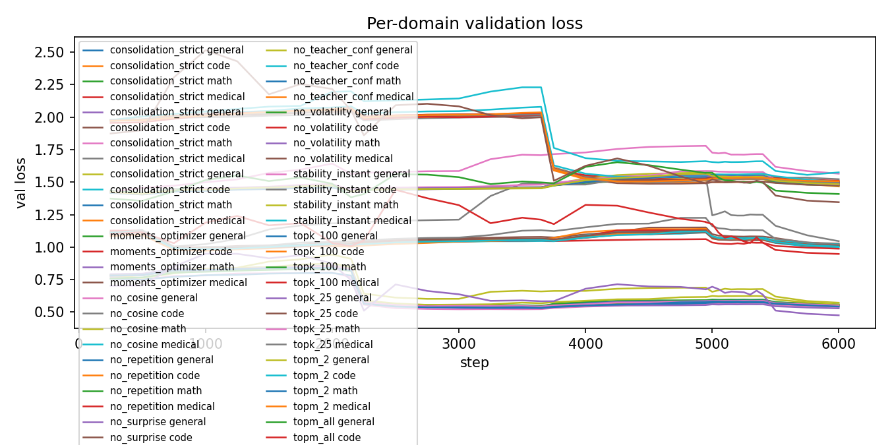
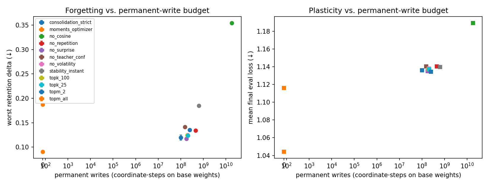
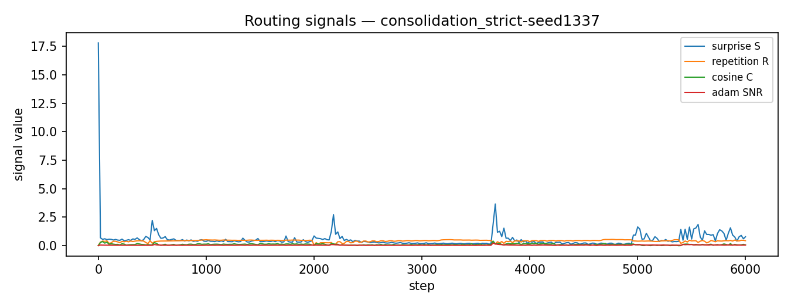

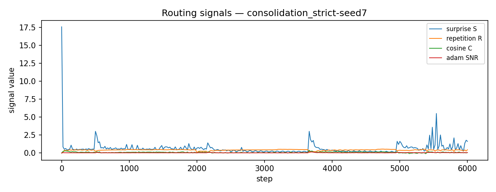
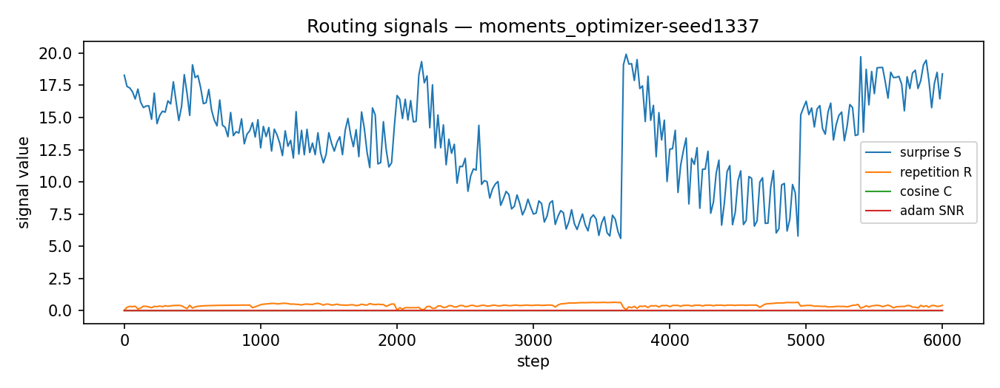
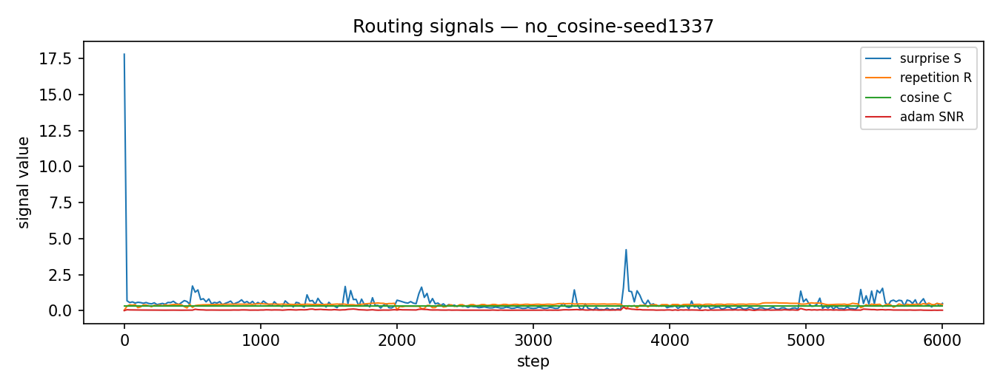
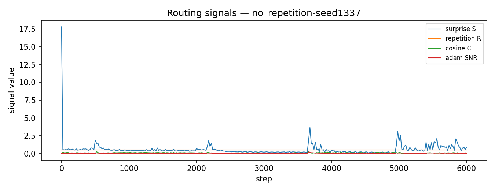
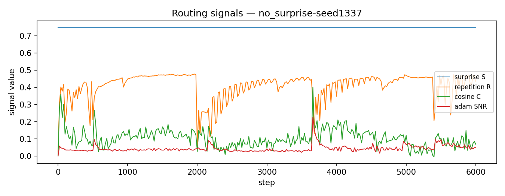
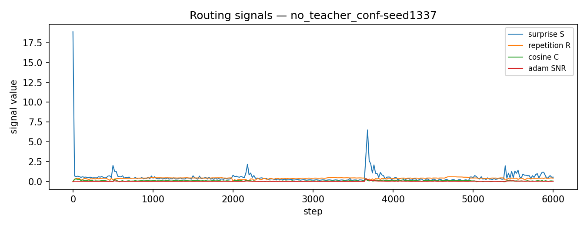
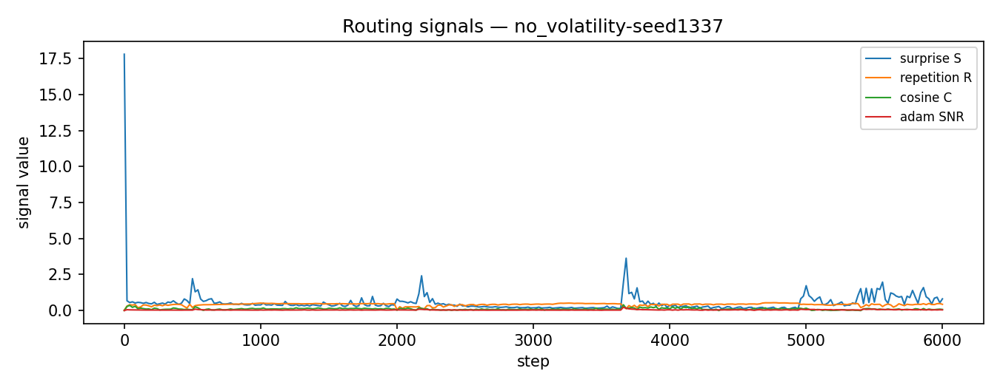
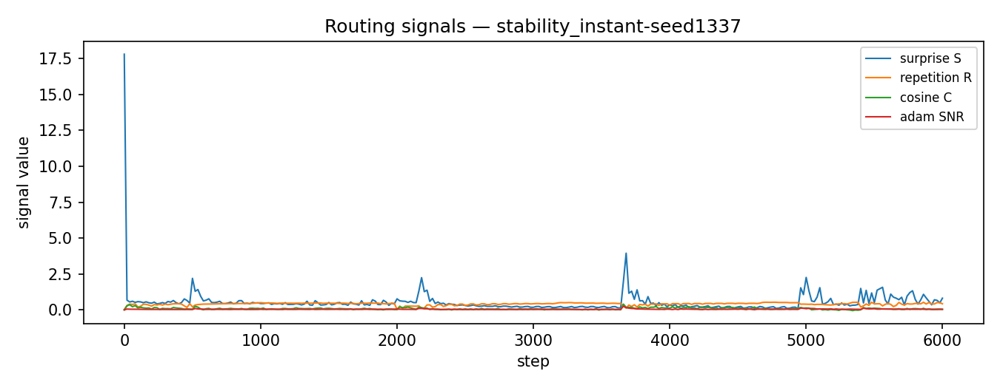
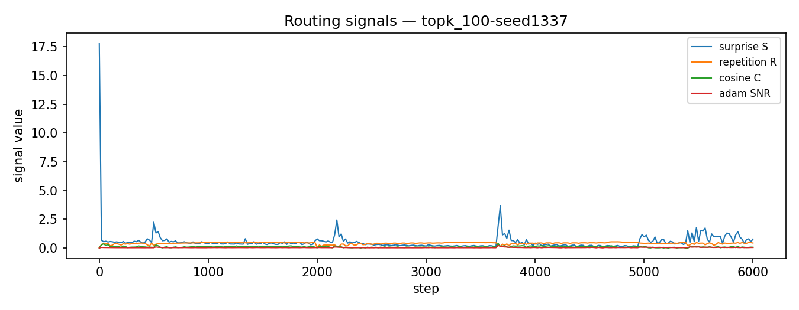

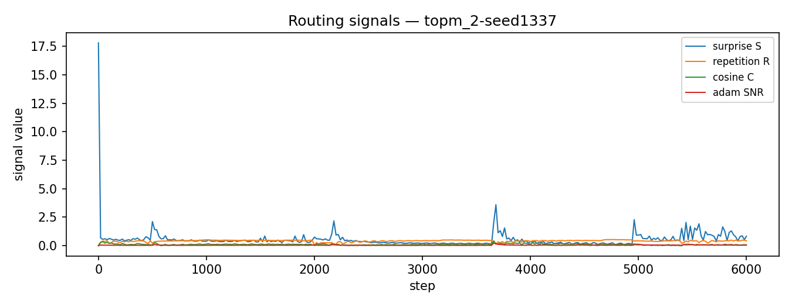
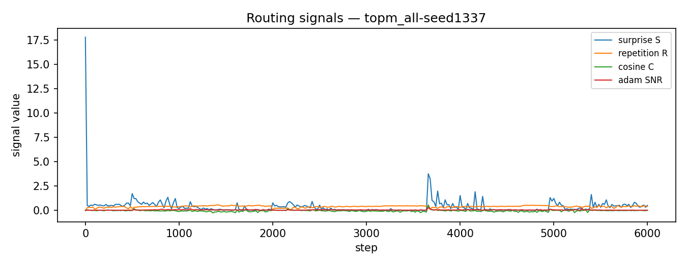
