# Report — budget_sweep_small_v1

24 runs: molf_style_a0p3-seed1337, molf_style_a0p5-seed1337, molf_style_a0p5-seed2024, molf_style_a0p5-seed7, molf_style_a0p7-seed1337, molf_style_epd-seed1337, plateau_trigger_t0p005-seed1337, plateau_trigger_t0p01-seed1337, plateau_trigger_t0p02-seed1337, surprise_gate_s1-seed1337, surprise_gate_s2-seed1337, surprise_gate_s4-seed1337, trihope_no_hash_s1-seed1337, trihope_no_hash_s2-seed1337, trihope_no_hash_s4-seed1337, trihope_s1_r0p2-seed1337, trihope_s1_r0p3-seed1337, trihope_s1_r0p45-seed1337, trihope_s2_r0p2-seed1337, trihope_s2_r0p3-seed1337, trihope_s2_r0p45-seed1337, trihope_s4_r0p2-seed1337, trihope_s4_r0p3-seed1337, trihope_s4_r0p45-seed1337

## forgetting_table

| spec_id                |   final_loss_general_mean |   final_loss_general_std |   final_loss_code_mean |   final_loss_code_std |   final_loss_math_mean |   final_loss_math_std |   final_loss_medical_mean |   final_loss_medical_std |   final_em_code_mean |   final_em_code_std |   final_em_math_mean |   final_em_math_std |   final_em_medical_mean |   final_em_medical_std |   worst_retention_delta_general_mean |   worst_retention_delta_general_std |   worst_retention_delta_code_mean |   worst_retention_delta_code_std |   worst_retention_delta_math_mean |   worst_retention_delta_math_std |   worst_retention_delta_medical_mean |   worst_retention_delta_medical_std |   wall_clock_s_mean |   wall_clock_s_std |   tokens_per_sec_mean |   tokens_per_sec_std |   peak_mem_gb_mean |   peak_mem_gb_std |   controller_fraction_mean |   controller_fraction_std |   r_count_mean |   r_count_std |   f_count_mean |   f_count_std |   p_count_mean |   p_count_std |   consolidations_mean |   consolidations_std |
|:-----------------------|--------------------------:|-------------------------:|-----------------------:|----------------------:|-----------------------:|----------------------:|--------------------------:|-------------------------:|---------------------:|--------------------:|---------------------:|--------------------:|------------------------:|-----------------------:|-------------------------------------:|------------------------------------:|----------------------------------:|---------------------------------:|----------------------------------:|---------------------------------:|-------------------------------------:|------------------------------------:|--------------------:|-------------------:|----------------------:|---------------------:|-------------------:|------------------:|---------------------------:|--------------------------:|---------------:|--------------:|---------------:|--------------:|---------------:|--------------:|----------------------:|---------------------:|
| molf_style_a0p3        |                    1.4769 |                 nan      |                 0.9853 |              nan      |                 0.5285 |              nan      |                    1.4688 |                 nan      |               0.1406 |            nan      |               0.0156 |            nan      |                  0.0156 |                nan     |                               0.0957 |                            nan      |                            0.0732 |                         nan      |                            0.0166 |                          nan     |                               0.0105 |                            nan      |             2971.7  |            nan     |               1569.07 |              nan     |            11.0405 |          nan      |                     0.2254 |                  nan      |              0 |           nan |        35975   |      nan      |        25      |      nan      |                     0 |                  nan |
| molf_style_a0p5        |                    1.468  |                   0.0035 |                 0.9887 |                0.0075 |                 0.5247 |                0.0074 |                    1.4669 |                   0.0179 |               0.151  |              0.0477 |               0.0312 |              0.0156 |                  0.0208 |                  0.009 |                               0.0841 |                              0.0076 |                            0.0393 |                           0.0111 |                            0.0206 |                            0.002 |                               0.0112 |                              0.0031 |             2578.03 |            284.449 |               1807.71 |              176.332 |            11.043  |            0.0033 |                     0.2144 |                    0.0104 |              0 |             0 |        35985.3 |        2.5166 |        14.6667 |        2.5166 |                     0 |                    0 |
| molf_style_a0p7        |                    1.4737 |                 nan      |                 0.9936 |              nan      |                 0.5282 |              nan      |                    1.4743 |                 nan      |               0.1406 |            nan      |               0.0156 |            nan      |                  0.0156 |                nan     |                               0.0933 |                            nan      |                            0.0425 |                         nan      |                            0.0229 |                          nan     |                               0.014  |                            nan      |             2387.55 |            nan     |               1952.96 |              nan     |            11.0405 |          nan      |                     0.2146 |                  nan      |              0 |           nan |        36000   |      nan      |         0      |      nan      |                     0 |                  nan |
| molf_style_epd         |                    1.7561 |                 nan      |                 1.2577 |              nan      |                 0.7312 |              nan      |                    1.7952 |                 nan      |               0.0781 |            nan      |               0.0625 |            nan      |                  0.0156 |                nan     |                               0.5829 |                            nan      |                            0.4646 |                         nan      |                            0.1616 |                          nan     |                               0.1049 |                            nan      |             3117.15 |            nan     |               1495.86 |              nan     |            11.0827 |          nan      |                     0.2256 |                  nan      |              0 |           nan |        57858   |      nan      |    278142      |      nan      |                     0 |                  nan |
| plateau_trigger_t0p005 |                    1.3695 |                 nan      |                 0.9101 |              nan      |                 0.4526 |              nan      |                    1.2429 |                 nan      |               0.1094 |            nan      |               0.0156 |            nan      |                  0.0312 |                nan     |                               0.209  |                            nan      |                            0.1908 |                         nan      |                            0.1243 |                          nan     |                               0.0207 |                            nan      |             2227.41 |            nan     |               2093.38 |              nan     |             7.4353 |          nan      |                     0.0001 |                  nan      |              0 |           nan |            0   |      nan      |         0      |      nan      |                     0 |                  nan |
| plateau_trigger_t0p01  |                    1.3708 |                 nan      |                 0.9119 |              nan      |                 0.4517 |              nan      |                    1.2461 |                 nan      |               0.0938 |            nan      |               0.0469 |            nan      |                  0.0156 |                nan     |                               0.213  |                            nan      |                            0.1957 |                         nan      |                            0.1274 |                          nan     |                               0.0253 |                            nan      |             2221.71 |            nan     |               2098.75 |              nan     |             7.4353 |          nan      |                     0.0001 |                  nan      |              0 |           nan |            0   |      nan      |         0      |      nan      |                     0 |                  nan |
| plateau_trigger_t0p02  |                    1.3693 |                 nan      |                 0.9094 |              nan      |                 0.45   |              nan      |                    1.2431 |                 nan      |               0.125  |            nan      |               0.0469 |            nan      |                  0.0156 |                nan     |                               0.2058 |                            nan      |                            0.1929 |                         nan      |                            0.1205 |                          nan     |                               0.018  |                            nan      |             2208.41 |            nan     |               2111.38 |              nan     |             7.4353 |          nan      |                     0.0001 |                  nan      |              0 |           nan |            0   |      nan      |         0      |      nan      |                     0 |                  nan |
| surprise_gate_s1       |                    1.5006 |                 nan      |                 0.9818 |              nan      |                 0.5339 |              nan      |                    1.5104 |                 nan      |               0.0625 |            nan      |               0      |            nan      |                  0.0312 |                nan     |                               0.258  |                            nan      |                            0.2709 |                         nan      |                            0.1318 |                          nan     |                              -0.088  |                            nan      |             3011.32 |            nan     |               1548.42 |              nan     |            11.5344 |          nan      |                     0.2074 |                  nan      |          10554 |           nan |        33396   |      nan      |         0      |      nan      |                     0 |                  nan |
| surprise_gate_s2       |                    1.5093 |                 nan      |                 1.0082 |              nan      |                 0.5413 |              nan      |                    1.4844 |                 nan      |               0.0625 |            nan      |               0.0156 |            nan      |                  0.0156 |                nan     |                               0.1571 |                            nan      |                            0.085  |                         nan      |                            0.0542 |                          nan     |                               0.0376 |                            nan      |             2971.65 |            nan     |               1569.1  |              nan     |            11.5332 |          nan      |                     0.215  |                  nan      |           5528 |           nan |        35104   |      nan      |         0      |      nan      |                     0 |                  nan |
| surprise_gate_s4       |                    1.5094 |                 nan      |                 0.9966 |              nan      |                 0.5405 |              nan      |                    1.5096 |                 nan      |               0.1094 |            nan      |               0      |            nan      |                  0.0156 |                nan     |                               0.1775 |                            nan      |                            0.1129 |                         nan      |                            0.052  |                          nan     |                               0.0013 |                            nan      |             2898.24 |            nan     |               1608.84 |              nan     |            11.5338 |          nan      |                     0.2137 |                  nan      |           1285 |           nan |        36191   |      nan      |         0      |      nan      |                     0 |                  nan |
| trihope_no_hash_s1     |                    1.4924 |                 nan      |                 1.008  |              nan      |                 0.5516 |              nan      |                    1.4875 |                 nan      |               0.0938 |            nan      |               0.0312 |            nan      |                  0.0312 |                nan     |                               0.1863 |                            nan      |                            0.1832 |                         nan      |                            0.0835 |                          nan     |                               0.0012 |                            nan      |             2936.8  |            nan     |               1587.71 |              nan     |            11.5265 |          nan      |                     0.2118 |                  nan      |           1447 |           nan |        35612   |      nan      |        45      |      nan      |                    13 |                  nan |
| trihope_no_hash_s2     |                    1.4937 |                 nan      |                 1.0248 |              nan      |                 0.5482 |              nan      |                    1.5125 |                 nan      |               0.0781 |            nan      |               0.0312 |            nan      |                  0.0469 |                nan     |                               0.1715 |                            nan      |                            0.1924 |                         nan      |                            0.0726 |                          nan     |                               0.0023 |                            nan      |             2872.55 |            nan     |               1623.23 |              nan     |            11.5216 |          nan      |                     0.2102 |                  nan      |            865 |           nan |        35680   |      nan      |        55      |      nan      |                    19 |                  nan |
| trihope_no_hash_s4     |                    1.5039 |                 nan      |                 1.0247 |              nan      |                 0.5608 |              nan      |                    1.4989 |                 nan      |               0.1094 |            nan      |               0.0312 |            nan      |                  0.0156 |                nan     |                               0.1502 |                            nan      |                            0.156  |                         nan      |                            0.0801 |                          nan     |                               0.0208 |                            nan      |             2899.84 |            nan     |               1607.95 |              nan     |            11.5207 |          nan      |                     0.2137 |                  nan      |            285 |           nan |        35932   |      nan      |        59      |      nan      |                    17 |                  nan |
| trihope_s1_r0p2        |                    1.4984 |                 nan      |                 1.0097 |              nan      |                 0.5428 |              nan      |                    1.4933 |                 nan      |               0.1406 |            nan      |               0.0312 |            nan      |                  0.0156 |                nan     |                               0.132  |                            nan      |                            0.1097 |                         nan      |                            0.046  |                          nan     |                               0.015  |                            nan      |             3169.59 |            nan     |               1471.11 |              nan     |            11.4136 |          nan      |                     0.2529 |                  nan      |            945 |           nan |        35533   |      nan      |         8      |      nan      |                    20 |                  nan |
| trihope_s1_r0p3        |                    1.4956 |                 nan      |                 1.0007 |              nan      |                 0.5476 |              nan      |                    1.4904 |                 nan      |               0.0781 |            nan      |               0.0156 |            nan      |                  0.0312 |                nan     |                               0.1888 |                            nan      |                            0.1811 |                         nan      |                            0.0718 |                          nan     |                               0.0073 |                            nan      |             3236.3  |            nan     |               1440.78 |              nan     |            11.5268 |          nan      |                     0.2555 |                  nan      |           4299 |           nan |        33758   |      nan      |         7      |      nan      |                    16 |                  nan |
| trihope_s1_r0p45       |                    1.5042 |                 nan      |                 1.0068 |              nan      |                 0.5301 |              nan      |                    1.5318 |                 nan      |               0.125  |            nan      |               0      |            nan      |                  0.0156 |                nan     |                               0.2375 |                            nan      |                            0.1747 |                         nan      |                            0.148  |                          nan     |                              -0.0292 |                            nan      |             3277.9  |            nan     |               1422.5  |              nan     |            11.5303 |          nan      |                     0.2477 |                  nan      |           9357 |           nan |        33981   |      nan      |         6      |      nan      |                    12 |                  nan |
| trihope_s2_r0p2        |                    1.4998 |                 nan      |                 1.0281 |              nan      |                 0.5579 |              nan      |                    1.5002 |                 nan      |               0.1406 |            nan      |               0.0312 |            nan      |                  0      |                nan     |                               0.1457 |                            nan      |                            0.1433 |                         nan      |                            0.0522 |                          nan     |                               0.0112 |                            nan      |             2888.99 |            nan     |               1613.99 |              nan     |            11.3614 |          nan      |                     0.208  |                  nan      |            626 |           nan |        35694   |      nan      |        16      |      nan      |                    30 |                  nan |
| trihope_s2_r0p3        |                    1.5101 |                 nan      |                 1.0231 |              nan      |                 0.5513 |              nan      |                    1.5213 |                 nan      |               0.125  |            nan      |               0.0312 |            nan      |                  0.0156 |                nan     |                               0.174  |                            nan      |                            0.1858 |                         nan      |                            0.0613 |                          nan     |                               0.0199 |                            nan      |             2955.04 |            nan     |               1577.92 |              nan     |            11.5249 |          nan      |                     0.2144 |                  nan      |           2544 |           nan |        35157   |      nan      |        15      |      nan      |                    16 |                  nan |
| trihope_s2_r0p45       |                    1.5062 |                 nan      |                 1.0091 |              nan      |                 0.5345 |              nan      |                    1.495  |                 nan      |               0.0938 |            nan      |               0.0156 |            nan      |                  0.0156 |                nan     |                               0.1646 |                            nan      |                            0.1462 |                         nan      |                            0.0666 |                          nan     |                               0.0146 |                            nan      |             3033.44 |            nan     |               1537.14 |              nan     |            11.5295 |          nan      |                     0.2114 |                  nan      |           5134 |           nan |        35258   |      nan      |         6      |      nan      |                    14 |                  nan |
| trihope_s4_r0p2        |                    1.4949 |                 nan      |                 1.0166 |              nan      |                 0.5521 |              nan      |                    1.4961 |                 nan      |               0.1719 |            nan      |               0.0156 |            nan      |                  0.0156 |                nan     |                               0.1302 |                            nan      |                            0.109  |                         nan      |                            0.0437 |                          nan     |                               0.0112 |                            nan      |             2893.77 |            nan     |               1611.33 |              nan     |            11.3152 |          nan      |                     0.2102 |                  nan      |            206 |           nan |        35917   |      nan      |        15      |      nan      |                    10 |                  nan |
| trihope_s4_r0p3        |                    1.4998 |                 nan      |                 1.0182 |              nan      |                 0.5555 |              nan      |                    1.5125 |                 nan      |               0.1406 |            nan      |               0.0156 |            nan      |                  0.0156 |                nan     |                               0.1344 |                            nan      |                            0.1308 |                         nan      |                            0.0483 |                          nan     |                               0.0105 |                            nan      |             2923.31 |            nan     |               1595.04 |              nan     |            11.525  |          nan      |                     0.2094 |                  nan      |            641 |           nan |        35908   |      nan      |        15      |      nan      |                    16 |                  nan |
| trihope_s4_r0p45       |                    1.5095 |                 nan      |                 1.0072 |              nan      |                 0.5584 |              nan      |                    1.517  |                 nan      |               0.0938 |            nan      |               0.0156 |            nan      |                  0.0312 |                nan     |                               0.1794 |                            nan      |                            0.154  |                         nan      |                            0.0597 |                          nan     |                               0.0003 |                            nan      |             2923.26 |            nan     |               1595.07 |              nan     |            11.5274 |          nan      |                     0.2096 |                  nan      |           1300 |           nan |        36153   |      nan      |        11      |      nan      |                    19 |                  nan |

## action_share_by_phase

_no data_

## ablation_deltas

_no data_

## p_selection_stats

_no data_

## replay_timing

_no data_

## adapter_reuse_aulc

| spec_id                | phase          |   aulc_mean |   aulc_std |   final_loss_mean |   final_loss_std |
|:-----------------------|:---------------|------------:|-----------:|------------------:|-----------------:|
| molf_style_a0p3        | math_recurrent |      0.2522 |   nan      |            0.1469 |         nan      |
| molf_style_a0p5        | math_recurrent |      0.2543 |     0.0162 |            0.187  |           0.0415 |
| molf_style_a0p7        | math_recurrent |      0.2492 |   nan      |            0.1439 |         nan      |
| molf_style_epd         | math_recurrent |      0.1362 |   nan      |            0.0666 |         nan      |
| plateau_trigger_t0p005 | math_recurrent |      0.1379 |   nan      |            0.0736 |         nan      |
| plateau_trigger_t0p01  | math_recurrent |      0.1375 |   nan      |            0.0729 |         nan      |
| plateau_trigger_t0p02  | math_recurrent |      0.1378 |   nan      |            0.0737 |         nan      |
| surprise_gate_s1       | math_recurrent |      0.2359 |   nan      |            0.144  |         nan      |
| surprise_gate_s2       | math_recurrent |      0.2502 |   nan      |            0.1564 |         nan      |
| surprise_gate_s4       | math_recurrent |      0.2403 |   nan      |            0.1448 |         nan      |
| trihope_no_hash_s1     | math_recurrent |      0.2389 |   nan      |            0.1344 |         nan      |
| trihope_no_hash_s2     | math_recurrent |      0.2469 |   nan      |            0.1463 |         nan      |
| trihope_no_hash_s4     | math_recurrent |      0.2557 |   nan      |            0.1468 |         nan      |
| trihope_s1_r0p2        | math_recurrent |      0.2411 |   nan      |            0.1353 |         nan      |
| trihope_s1_r0p3        | math_recurrent |      0.2276 |   nan      |            0.1379 |         nan      |
| trihope_s1_r0p45       | math_recurrent |      0.2438 |   nan      |            0.1645 |         nan      |
| trihope_s2_r0p2        | math_recurrent |      0.2392 |   nan      |            0.1476 |         nan      |
| trihope_s2_r0p3        | math_recurrent |      0.2313 |   nan      |            0.1472 |         nan      |
| trihope_s2_r0p45       | math_recurrent |      0.2397 |   nan      |            0.1516 |         nan      |
| trihope_s4_r0p2        | math_recurrent |      0.2398 |   nan      |            0.1428 |         nan      |
| trihope_s4_r0p3        | math_recurrent |      0.2375 |   nan      |            0.142  |         nan      |
| trihope_s4_r0p45       | math_recurrent |      0.2479 |   nan      |            0.14   |         nan      |

## damage_recovery

_no data_

## budget_curve

| spec_id                | threshold_tag   |   permanent_writes_mean |   permanent_writes_std |   p_action_coords_mean |   p_action_coords_std |   merged_coords_mean |   merged_coords_std |   active_fraction_mean_mean |   active_fraction_mean_std |   replayed_total_mean |   replayed_total_std |   worst_retention_delta_mean |   worst_retention_delta_std |   mean_retention_delta_mean |   mean_retention_delta_std |   final_loss_general_mean |   final_loss_general_std |   final_loss_code_mean |   final_loss_code_std |   final_loss_math_mean |   final_loss_math_std |   final_loss_medical_mean |   final_loss_medical_std |   steps_to_recover_code_mean |   steps_to_recover_code_std |
|:-----------------------|:----------------|------------------------:|-----------------------:|-----------------------:|----------------------:|---------------------:|--------------------:|----------------------------:|---------------------------:|----------------------:|---------------------:|-----------------------------:|----------------------------:|----------------------------:|---------------------------:|--------------------------:|-------------------------:|-----------------------:|----------------------:|-----------------------:|----------------------:|--------------------------:|-------------------------:|-----------------------------:|----------------------------:|
| molf_style_a0p3        |                 |             1.98181e+08 |          nan           |            1.98181e+08 |         nan           |          0           |                 nan |                      0.0001 |                        nan |                     0 |                  nan |                       0.0957 |                    nan      |                      0.0425 |                   nan      |                    1.4769 |                 nan      |                 0.9853 |              nan      |                 0.5285 |              nan      |                    1.4688 |                 nan      |                          nan |                         nan |
| molf_style_a0p5        |                 |             1.0276e+08  |            1.89615e+07 |            1.0276e+08  |           1.89615e+07 |          0           |                   0 |                      0      |                          0 |                     0 |                    0 |                       0.0841 |                      0.0076 |                      0.035  |                     0.0039 |                    1.468  |                   0.0035 |                 0.9887 |                0.0075 |                 0.5247 |                0.0074 |                    1.4669 |                   0.0179 |                          nan |                         nan |
| molf_style_a0p7        |                 |             0           |          nan           |            0           |         nan           |          0           |                 nan |                      0      |                        nan |                     0 |                  nan |                       0.0933 |                    nan      |                      0.0402 |                   nan      |                    1.4737 |                 nan      |                 0.9936 |              nan      |                 0.5282 |              nan      |                    1.4743 |                 nan      |                          nan |                         nan |
| molf_style_epd         |                 |             2.22057e+12 |          nan           |            2.22057e+12 |         nan           |          0           |                 nan |                      0.8253 |                        nan |                     0 |                  nan |                       0.5829 |                    nan      |                      0.2986 |                   nan      |                    1.7561 |                 nan      |                 1.2577 |              nan      |                 0.7312 |              nan      |                    1.7952 |                 nan      |                          nan |                         nan |
| plateau_trigger_t0p005 |                 |             0           |          nan           |            0           |         nan           |          0           |                 nan |                      0.0224 |                        nan |                     0 |                  nan |                       0.209  |                    nan      |                      0.1133 |                   nan      |                    1.3695 |                 nan      |                 0.9101 |              nan      |                 0.4526 |              nan      |                    1.2429 |                 nan      |                          nan |                         nan |
| plateau_trigger_t0p01  |                 |             0           |          nan           |            0           |         nan           |          0           |                 nan |                      0.0224 |                        nan |                     0 |                  nan |                       0.213  |                    nan      |                      0.1153 |                   nan      |                    1.3708 |                 nan      |                 0.9119 |              nan      |                 0.4517 |              nan      |                    1.2461 |                 nan      |                          nan |                         nan |
| plateau_trigger_t0p02  |                 |             0           |          nan           |            0           |         nan           |          0           |                 nan |                      0.0224 |                        nan |                     0 |                  nan |                       0.2058 |                    nan      |                      0.1108 |                   nan      |                    1.3693 |                 nan      |                 0.9094 |              nan      |                 0.45   |              nan      |                    1.2431 |                 nan      |                          nan |                         nan |
| surprise_gate_s1       |                 |             0           |          nan           |            0           |         nan           |          0           |                 nan |                      0.0003 |                        nan |                  1325 |                  nan |                       0.2709 |                    nan      |                      0.0994 |                   nan      |                    1.5006 |                 nan      |                 0.9818 |              nan      |                 0.5339 |              nan      |                    1.5104 |                 nan      |                          nan |                         nan |
| surprise_gate_s2       |                 |             0           |          nan           |            0           |         nan           |          0           |                 nan |                      0.0002 |                        nan |                   772 |                  nan |                       0.1571 |                    nan      |                      0.0587 |                   nan      |                    1.5093 |                 nan      |                 1.0082 |              nan      |                 0.5413 |              nan      |                    1.4844 |                 nan      |                          nan |                         nan |
| surprise_gate_s4       |                 |             0           |          nan           |            0           |         nan           |          0           |                 nan |                      0      |                        nan |                   246 |                  nan |                       0.1775 |                    nan      |                      0.0629 |                   nan      |                    1.5094 |                 nan      |                 0.9966 |              nan      |                 0.5405 |              nan      |                    1.5096 |                 nan      |                          nan |                         nan |
| trihope_no_hash_s1     |                 |             4.62422e+08 |          nan           |            3.71196e+08 |         nan           |          9.12261e+07 |                 nan |                      0.0002 |                        nan |                   184 |                  nan |                       0.1863 |                    nan      |                      0.0833 |                   nan      |                    1.4924 |                 nan      |                 1.008  |              nan      |                 0.5516 |              nan      |                    1.4875 |                 nan      |                          nan |                         nan |
| trihope_no_hash_s2     |                 |             5.8196e+08  |          nan           |            4.49839e+08 |         nan           |          1.32121e+08 |                 nan |                      0.0002 |                        nan |                   100 |                  nan |                       0.1924 |                    nan      |                      0.0791 |                   nan      |                    1.4937 |                 nan      |                 1.0248 |              nan      |                 0.5482 |              nan      |                    1.5125 |                 nan      |                          nan |                         nan |
| trihope_no_hash_s4     |                 |             6.22854e+08 |          nan           |            5.00171e+08 |         nan           |          1.22683e+08 |                 nan |                      0.0002 |                        nan |                    46 |                  nan |                       0.156  |                    nan      |                      0.0744 |                   nan      |                    1.5039 |                 nan      |                 1.0247 |              nan      |                 0.5608 |              nan      |                    1.4989 |                 nan      |                          nan |                         nan |
| trihope_s1_r0p2        |                 |             1.91889e+08 |          nan           |            5.34774e+07 |         nan           |          1.38412e+08 |                 nan |                      0      |                        nan |                    81 |                  nan |                       0.132  |                    nan      |                      0.0583 |                   nan      |                    1.4984 |                 nan      |                 1.0097 |              nan      |                 0.5428 |              nan      |                    1.4933 |                 nan      |                          nan |                         nan |
| trihope_s1_r0p3        |                 |             1.63578e+08 |          nan           |            4.40402e+07 |         nan           |          1.19538e+08 |                 nan |                      0.0001 |                        nan |                   344 |                  nan |                       0.1888 |                    nan      |                      0.0786 |                   nan      |                    1.4956 |                 nan      |                 1.0007 |              nan      |                 0.5476 |              nan      |                    1.4904 |                 nan      |                          nan |                         nan |
| trihope_s1_r0p45       |                 |             1.28975e+08 |          nan           |            4.08945e+07 |         nan           |          8.80804e+07 |                 nan |                      0.0003 |                        nan |                  1224 |                  nan |                       0.2375 |                    nan      |                      0.0909 |                   nan      |                    1.5042 |                 nan      |                 1.0068 |              nan      |                 0.5301 |              nan      |                    1.5318 |                 nan      |                          nan |                         nan |
| trihope_s2_r0p2        |                 |             3.14573e+08 |          nan           |            1.00663e+08 |         nan           |          2.1391e+08  |                 nan |                      0      |                        nan |                    56 |                  nan |                       0.1457 |                    nan      |                      0.068  |                   nan      |                    1.4998 |                 nan      |                 1.0281 |              nan      |                 0.5579 |              nan      |                    1.5002 |                 nan      |                          nan |                         nan |
| trihope_s2_r0p3        |                 |             2.07618e+08 |          nan           |            9.43718e+07 |         nan           |          1.13246e+08 |                 nan |                      0.0001 |                        nan |                   286 |                  nan |                       0.1858 |                    nan      |                      0.0753 |                   nan      |                    1.5101 |                 nan      |                 1.0231 |              nan      |                 0.5513 |              nan      |                    1.5213 |                 nan      |                          nan |                         nan |
| trihope_s2_r0p45       |                 |             1.41558e+08 |          nan           |            3.77487e+07 |         nan           |          1.03809e+08 |                 nan |                      0.0002 |                        nan |                   733 |                  nan |                       0.1646 |                    nan      |                      0.0705 |                   nan      |                    1.5062 |                 nan      |                 1.0091 |              nan      |                 0.5345 |              nan      |                    1.495  |                 nan      |                          nan |                         nan |
| trihope_s4_r0p2        |                 |             1.69869e+08 |          nan           |            9.75176e+07 |         nan           |          7.23517e+07 |                 nan |                      0      |                        nan |                    23 |                  nan |                       0.1302 |                    nan      |                      0.0581 |                   nan      |                    1.4949 |                 nan      |                 1.0166 |              nan      |                 0.5521 |              nan      |                    1.4961 |                 nan      |                          nan |                         nan |
| trihope_s4_r0p3        |                 |             2.04472e+08 |          nan           |            9.43718e+07 |         nan           |          1.101e+08   |                 nan |                      0.0001 |                        nan |                    94 |                  nan |                       0.1344 |                    nan      |                      0.0636 |                   nan      |                    1.4998 |                 nan      |                 1.0182 |              nan      |                 0.5555 |              nan      |                    1.5125 |                 nan      |                          nan |                         nan |
| trihope_s4_r0p45       |                 |             2.01327e+08 |          nan           |            6.9206e+07  |         nan           |          1.32121e+08 |                 nan |                      0.0001 |                        nan |                   244 |                  nan |                       0.1794 |                    nan      |                      0.0713 |                   nan      |                    1.5095 |                 nan      |                 1.0072 |              nan      |                 0.5584 |              nan      |                    1.517  |                 nan      |                          nan |                         nan |

## teacher_attribution

_no data_

## containment

_no data_

## Figures

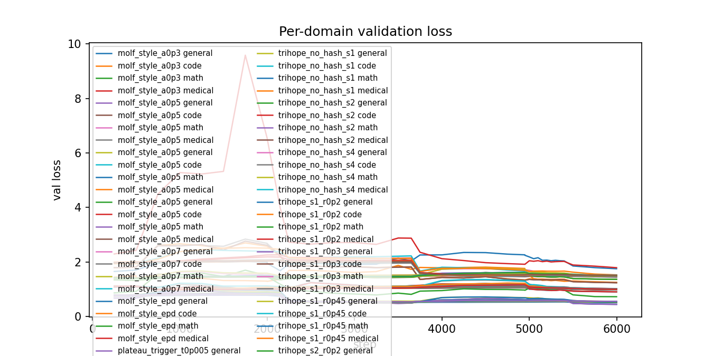
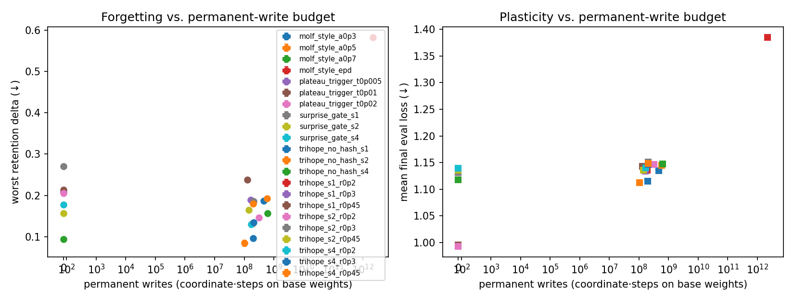
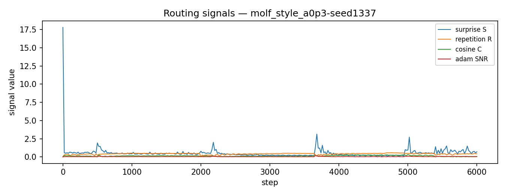

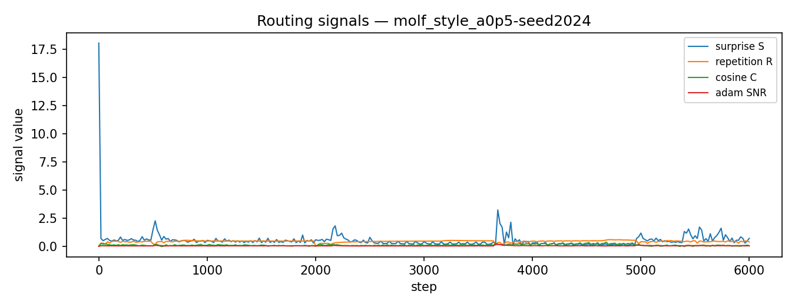
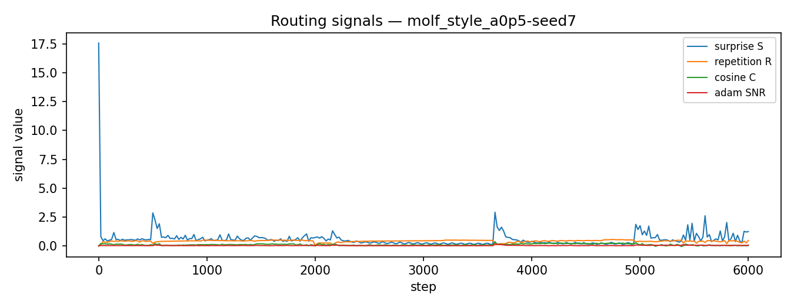

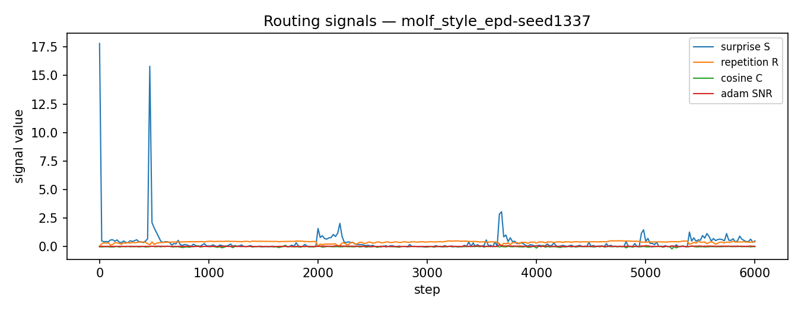
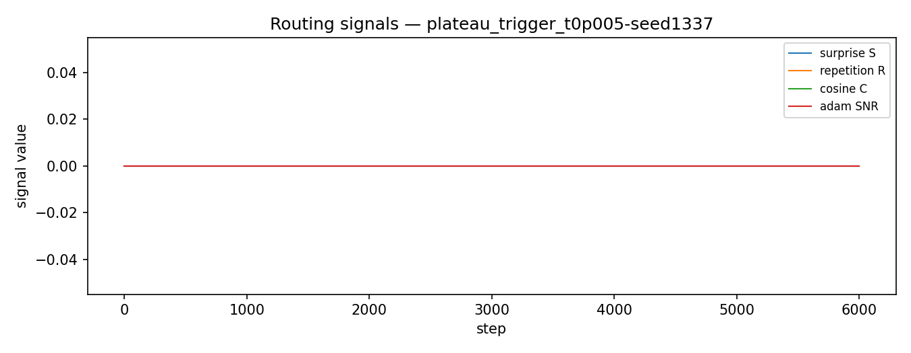

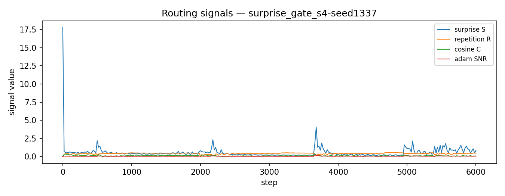
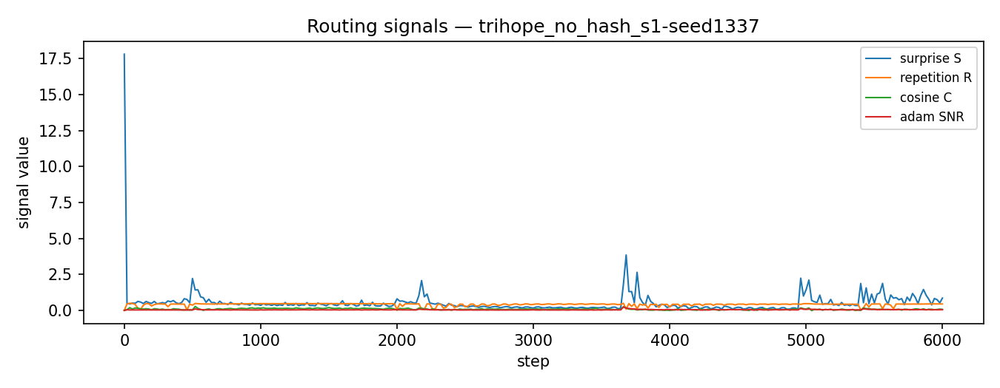
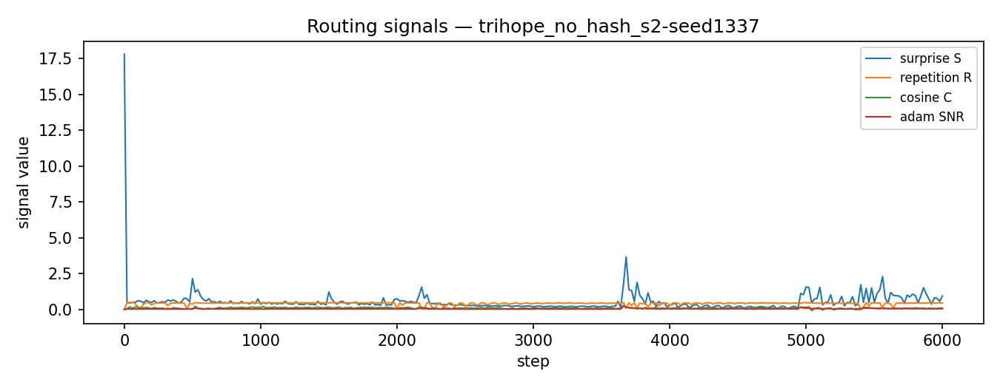
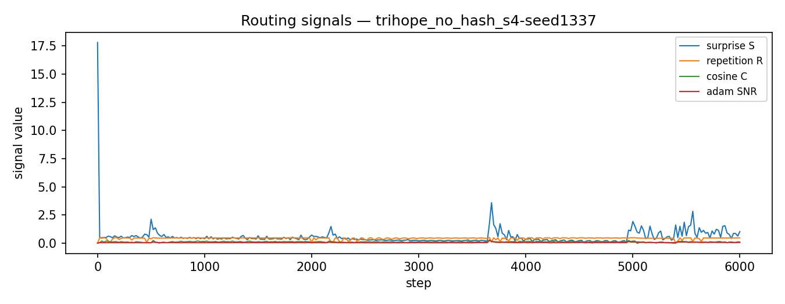
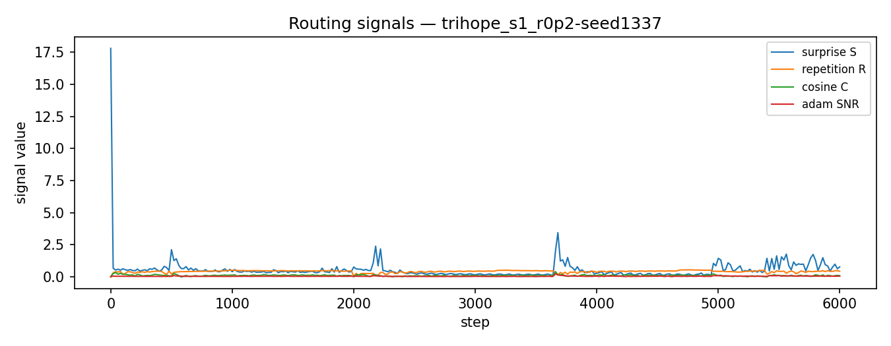

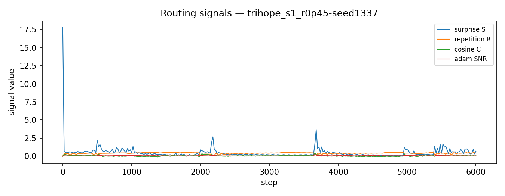

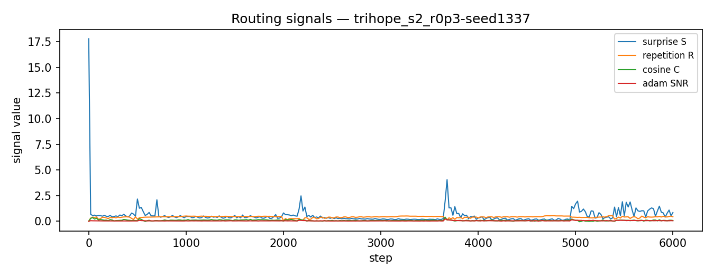
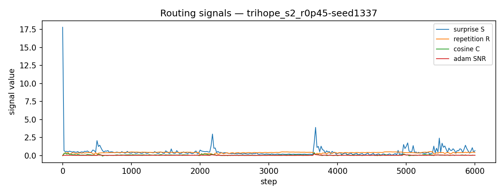
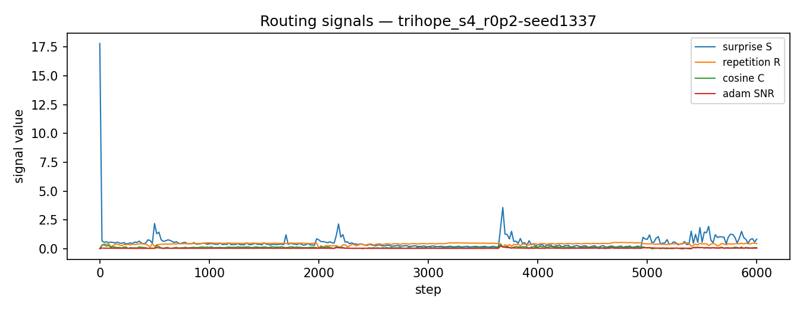
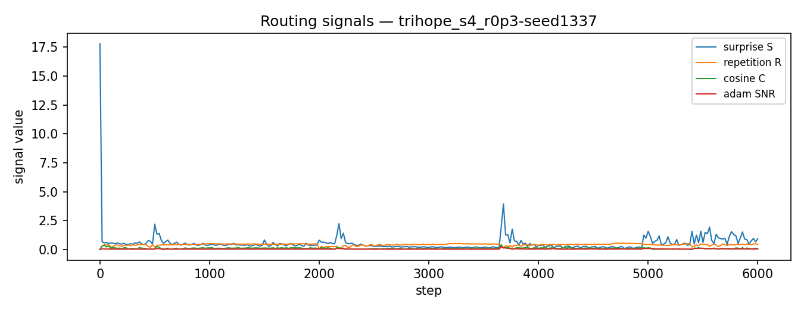

