# Report — p_study_small_v1

5 runs: p_forced_bad-seed1337, p_forced_lowconf-seed1337, p_forced_plausible-seed1337, p_off_control-seed1337, p_study-seed1337

## forgetting_table

| spec_id            |   final_loss_general_mean |   final_loss_general_std |   final_loss_code_mean |   final_loss_code_std |   final_loss_math_mean |   final_loss_math_std |   final_loss_medical_mean |   final_loss_medical_std |   final_em_code_mean |   final_em_code_std |   final_em_math_mean |   final_em_math_std |   final_em_medical_mean |   final_em_medical_std |   worst_retention_delta_general_mean |   worst_retention_delta_general_std |   worst_retention_delta_code_mean |   worst_retention_delta_code_std |   worst_retention_delta_math_mean |   worst_retention_delta_math_std |   worst_retention_delta_medical_mean |   worst_retention_delta_medical_std |   wall_clock_s_mean |   wall_clock_s_std |   tokens_per_sec_mean |   tokens_per_sec_std |   peak_mem_gb_mean |   peak_mem_gb_std |   controller_fraction_mean |   controller_fraction_std |   r_count_mean |   r_count_std |   f_count_mean |   f_count_std |   p_count_mean |   p_count_std |   consolidations_mean |   consolidations_std |
|:-------------------|--------------------------:|-------------------------:|-----------------------:|----------------------:|-----------------------:|----------------------:|--------------------------:|-------------------------:|---------------------:|--------------------:|---------------------:|--------------------:|------------------------:|-----------------------:|-------------------------------------:|------------------------------------:|----------------------------------:|---------------------------------:|----------------------------------:|---------------------------------:|-------------------------------------:|------------------------------------:|--------------------:|-------------------:|----------------------:|---------------------:|-------------------:|------------------:|---------------------------:|--------------------------:|---------------:|--------------:|---------------:|--------------:|---------------:|--------------:|----------------------:|---------------------:|
| p_forced_bad       |                    1.5139 |                      nan |                 1.0192 |                   nan |                 0.547  |                   nan |                    1.5201 |                      nan |               0.0625 |                 nan |               0.0312 |                 nan |                  0.0156 |                    nan |                               0.1608 |                                 nan |                            0.1355 |                              nan |                            0.0413 |                              nan |                               0.0194 |                                 nan |             4595.82 |                nan |              1014.58  |                  nan |            11.5276 |               nan |                     0.2296 |                       nan |           2193 |           nan |          34983 |           nan |              0 |           nan |                    60 |                  nan |
| p_forced_lowconf   |                    1.5186 |                      nan |                 1.0244 |                   nan |                 0.5538 |                   nan |                    1.5142 |                      nan |               0.125  |                 nan |               0      |                 nan |                  0.0312 |                    nan |                               0.1504 |                                 nan |                            0.1193 |                              nan |                            0.0566 |                              nan |                               0.0423 |                                 nan |             4664.17 |                nan |               999.707 |                  nan |            11.5241 |               nan |                     0.2277 |                       nan |           2317 |           nan |          35255 |           nan |              0 |           nan |                    58 |                  nan |
| p_forced_plausible |                    1.5143 |                      nan |                 1.0152 |                   nan |                 0.5457 |                   nan |                    1.5166 |                      nan |               0.1094 |                 nan |               0.0312 |                 nan |                  0.0156 |                    nan |                               0.1629 |                                 nan |                            0.1204 |                              nan |                            0.0482 |                              nan |                               0.0256 |                                 nan |             4666.12 |                nan |               999.29  |                  nan |            11.5304 |               nan |                     0.2277 |                       nan |           2205 |           nan |          35091 |           nan |              0 |           nan |                    60 |                  nan |
| p_off_control      |                    1.5097 |                      nan |                 1.0078 |                   nan |                 0.5468 |                   nan |                    1.5219 |                      nan |               0.0625 |                 nan |               0.0312 |                 nan |                  0.0312 |                    nan |                               0.1693 |                                 nan |                            0.1329 |                              nan |                            0.0483 |                              nan |                               0.0239 |                                 nan |             4596.68 |                nan |              1014.38  |                  nan |            11.5265 |               nan |                     0.2235 |                       nan |           2356 |           nan |          35192 |           nan |              0 |           nan |                     0 |                  nan |
| p_study            |                    1.5034 |                      nan |                 1.0181 |                   nan |                 0.5538 |                   nan |                    1.5142 |                      nan |               0.1094 |                 nan |               0.0156 |                 nan |                  0.0312 |                    nan |                               0.1662 |                                 nan |                            0.1918 |                              nan |                            0.0699 |                              nan |                               0.0112 |                                 nan |             4665.87 |                nan |               999.343 |                  nan |            11.5272 |               nan |                     0.2279 |                       nan |           2592 |           nan |          35224 |           nan |             20 |           nan |                     3 |                  nan |

## action_share_by_phase

| spec_id            | phase             |   r_share_mean |   r_share_std |   f_share_mean |   f_share_std |   p_share_mean |   p_share_std |   mean_coords_opened_mean |   mean_coords_opened_std |
|:-------------------|:------------------|---------------:|--------------:|---------------:|--------------:|---------------:|--------------:|--------------------------:|-------------------------:|
| p_forced_bad       | code_recurrent    |         4.7    |           nan |        95.3    |           nan |         0      |           nan |                    0      |                      nan |
| p_forced_bad       | code_revisit      |         3      |           nan |        97      |           nan |         0      |           nan |                    0      |                      nan |
| p_forced_bad       | general_warm      |         0.7667 |           nan |        99.2333 |           nan |         0      |           nan |                    0      |                      nan |
| p_forced_bad       | math_recurrent    |         4.7889 |           nan |        95.2111 |           nan |         0      |           nan |                    0      |                      nan |
| p_forced_bad       | medical_recurrent |        13.359  |           nan |        86.641  |           nan |         0      |           nan |                    0      |                      nan |
| p_forced_bad       | mixed_tail        |         5.1944 |           nan |        94.8056 |           nan |         0      |           nan |                    0      |                      nan |
| p_forced_bad       | novel_inject      |         0.6667 |           nan |        99.3333 |           nan |         0      |           nan |                    0      |                      nan |
| p_forced_lowconf   | code_recurrent    |         4.5556 |           nan |        95.4444 |           nan |         0      |           nan |                    0      |                      nan |
| p_forced_lowconf   | code_revisit      |         9.9259 |           nan |        90.0741 |           nan |         0      |           nan |                    0      |                      nan |
| p_forced_lowconf   | general_warm      |         0.6667 |           nan |        99.3333 |           nan |         0      |           nan |                    0      |                      nan |
| p_forced_lowconf   | math_recurrent    |         4.8    |           nan |        95.2    |           nan |         0      |           nan |                    0      |                      nan |
| p_forced_lowconf   | medical_recurrent |        13.1026 |           nan |        86.8974 |           nan |         0      |           nan |                    0      |                      nan |
| p_forced_lowconf   | mixed_tail        |         4.4167 |           nan |        95.5833 |           nan |         0      |           nan |                    0      |                      nan |
| p_forced_lowconf   | novel_inject      |         0.6667 |           nan |        99.3333 |           nan |         0      |           nan |                    0      |                      nan |
| p_forced_plausible | code_recurrent    |         4.6111 |           nan |        95.3889 |           nan |         0      |           nan |                    0      |                      nan |
| p_forced_plausible | code_revisit      |         3.3704 |           nan |        96.6296 |           nan |         0      |           nan |                    0      |                      nan |
| p_forced_plausible | general_warm      |         0.7333 |           nan |        99.2667 |           nan |         0      |           nan |                    0      |                      nan |
| p_forced_plausible | math_recurrent    |         4.6444 |           nan |        95.3556 |           nan |         0      |           nan |                    0      |                      nan |
| p_forced_plausible | medical_recurrent |        13.4872 |           nan |        86.5128 |           nan |         0      |           nan |                    0      |                      nan |
| p_forced_plausible | mixed_tail        |         5.5833 |           nan |        94.4167 |           nan |         0      |           nan |                    0      |                      nan |
| p_forced_plausible | novel_inject      |         0.6667 |           nan |        99.3333 |           nan |         0      |           nan |                    0      |                      nan |
| p_off_control      | code_recurrent    |         4.4667 |           nan |        95.5333 |           nan |         0      |           nan |                    9.1022 |                      nan |
| p_off_control      | code_revisit      |         9.5926 |           nan |        90.4074 |           nan |         0      |           nan |                    0      |                      nan |
| p_off_control      | general_warm      |         0.7333 |           nan |        99.2667 |           nan |         0      |           nan |                    0      |                      nan |
| p_off_control      | math_recurrent    |         4.8667 |           nan |        95.1333 |           nan |         0      |           nan |                    0      |                      nan |
| p_off_control      | medical_recurrent |        13.3205 |           nan |        86.6795 |           nan |         0      |           nan |                    0      |                      nan |
| p_off_control      | mixed_tail        |         5.25   |           nan |        94.75   |           nan |         0      |           nan |                    0      |                      nan |
| p_off_control      | novel_inject      |         0.7778 |           nan |        99.2222 |           nan |         0      |           nan |                    0      |                      nan |
| p_study            | code_recurrent    |         4.7222 |           nan |        95.2111 |           nan |         0.0667 |           nan |                 4203.41   |                      nan |
| p_study            | code_revisit      |        14.7778 |           nan |        85.0741 |           nan |         0.1481 |           nan |                13981      |                      nan |
| p_study            | general_warm      |         0.7    |           nan |        99.1    |           nan |         0.2    |           nan |                15728.6    |                      nan |
| p_study            | math_recurrent    |         5.1778 |           nan |        94.8222 |           nan |         0      |           nan |                    0      |                      nan |
| p_study            | medical_recurrent |        13.6667 |           nan |        86.2821 |           nan |         0.0513 |           nan |                 3629.69   |                      nan |
| p_study            | mixed_tail        |         5.75   |           nan |        94.25   |           nan |         0      |           nan |                    0      |                      nan |
| p_study            | novel_inject      |         0.8889 |           nan |        99.1111 |           nan |         0      |           nan |                    0      |                      nan |

## ablation_deltas

_no data_

## p_selection_stats

| spec_id            |   seed |   p_decisions |   consolidations |   forced_consolidations |   first_p_step |   first_merge_step |   mean_S_at_P |   mean_C_at_P |   mean_V_at_P |   mean_R_at_P |
|:-------------------|-------:|--------------:|-----------------:|------------------------:|---------------:|-------------------:|--------------:|--------------:|--------------:|--------------:|
| p_forced_bad       |   1337 |             0 |               60 |                      56 |            nan |                250 |      nan      |      nan      |      nan      |      nan      |
| p_forced_lowconf   |   1337 |             0 |               58 |                      56 |            nan |                250 |      nan      |      nan      |      nan      |      nan      |
| p_forced_plausible |   1337 |             0 |               60 |                      56 |            nan |                250 |      nan      |      nan      |      nan      |      nan      |
| p_off_control      |   1337 |             0 |                0 |                       0 |            nan |                nan |      nan      |      nan      |      nan      |      nan      |
| p_study            |   1337 |            20 |                3 |                       0 |             21 |                750 |        1.1478 |        0.4736 |        0.0986 |        0.4405 |

## replay_timing

| spec_id            |   seed |   replays |   delay_median_steps |   delay_p90_steps |   cross_phase_share |   cross_phase_replays |   replays_in_medical_recurrent |   replays_in_mixed_tail |   replays_in_code_revisit |   replays_in_math_recurrent |   replays_in_code_recurrent |   replays_in_general_warm |
|:-------------------|-------:|----------:|---------------------:|------------------:|--------------------:|----------------------:|-------------------------------:|------------------------:|--------------------------:|----------------------------:|----------------------------:|--------------------------:|
| p_forced_bad       |   1337 |       196 |                   50 |             550   |              0.0816 |                    16 |                             78 |                      46 |                        34 |                          28 |                           7 |                         3 |
| p_forced_lowconf   |   1337 |       262 |                   30 |             338.5 |              0.0534 |                    14 |                             77 |                      47 |                        98 |                          32 |                           6 |                         2 |
| p_forced_plausible |   1337 |       216 |                   40 |             497.5 |              0.0694 |                    15 |                             81 |                      52 |                        45 |                          29 |                           7 |                         2 |
| p_off_control      |   1337 |       258 |                   30 |             329.5 |              0.0581 |                    15 |                             76 |                      51 |                        87 |                          34 |                           8 |                         2 |
| p_study            |   1337 |       306 |                   20 |             295   |              0.049  |                    15 |                             77 |                      63 |                       120 |                          35 |                           8 |                         3 |

## adapter_reuse_aulc

| spec_id            | phase          |   aulc_mean |   aulc_std |   final_loss_mean |   final_loss_std |
|:-------------------|:---------------|------------:|-----------:|------------------:|-----------------:|
| p_forced_bad       | math_recurrent |      0.2407 |        nan |            0.1452 |              nan |
| p_forced_lowconf   | math_recurrent |      0.2427 |        nan |            0.1468 |              nan |
| p_forced_plausible | math_recurrent |      0.2403 |        nan |            0.1404 |              nan |
| p_off_control      | math_recurrent |      0.2398 |        nan |            0.145  |              nan |
| p_study            | math_recurrent |      0.2342 |        nan |            0.1399 |              nan |

## damage_recovery

| spec_id            |   seed |   forced_step |   pre_merge_loss |   post_merge_loss |   damage |   recovery_steps |
|:-------------------|-------:|--------------:|-----------------:|------------------:|---------:|-----------------:|
| p_forced_bad       |   1337 |          2075 |           1.3419 |            1.3282 |  -0.0138 |                0 |
| p_forced_lowconf   |   1337 |          3850 |           1.1869 |            1.191  |   0.0041 |             1150 |
| p_forced_plausible |   1337 |          2350 |           1.2532 |            1.2525 |  -0.0006 |                0 |

## budget_curve

| spec_id            | threshold_tag   |   permanent_writes_mean |   permanent_writes_std |   p_action_coords_mean |   p_action_coords_std |   merged_coords_mean |   merged_coords_std |   active_fraction_mean_mean |   active_fraction_mean_std |   replayed_total_mean |   replayed_total_std |   worst_retention_delta_mean |   worst_retention_delta_std |   mean_retention_delta_mean |   mean_retention_delta_std |   final_loss_general_mean |   final_loss_general_std |   final_loss_code_mean |   final_loss_code_std |   final_loss_math_mean |   final_loss_math_std |   final_loss_medical_mean |   final_loss_medical_std |   steps_to_recover_code_mean |   steps_to_recover_code_std |
|:-------------------|:----------------|------------------------:|-----------------------:|-----------------------:|----------------------:|---------------------:|--------------------:|----------------------------:|---------------------------:|----------------------:|---------------------:|-----------------------------:|----------------------------:|----------------------------:|---------------------------:|--------------------------:|-------------------------:|-----------------------:|----------------------:|-----------------------:|----------------------:|--------------------------:|-------------------------:|-----------------------------:|----------------------------:|
| p_forced_bad       | rfp_S2.0_R0.3   |             4.68713e+08 |                    nan |            0           |                   nan |          4.68713e+08 |                 nan |                      0      |                        nan |                   196 |                  nan |                       0.1608 |                         nan |                      0.0656 |                        nan |                    1.5139 |                      nan |                 1.0192 |                   nan |                 0.547  |                   nan |                    1.5201 |                      nan |                          100 |                         nan |
| p_forced_lowconf   | rfp_S2.0_R0.3   |             4.52985e+08 |                    nan |            0           |                   nan |          4.52985e+08 |                 nan |                      0.0001 |                        nan |                   262 |                  nan |                       0.1504 |                         nan |                      0.0669 |                        nan |                    1.5186 |                      nan |                 1.0244 |                   nan |                 0.5538 |                   nan |                    1.5142 |                      nan |                          100 |                         nan |
| p_forced_plausible | rfp_S2.0_R0.3   |             4.68713e+08 |                    nan |            0           |                   nan |          4.68713e+08 |                 nan |                      0      |                        nan |                   216 |                  nan |                       0.1629 |                         nan |                      0.0656 |                        nan |                    1.5143 |                      nan |                 1.0152 |                   nan |                 0.5457 |                   nan |                    1.5166 |                      nan |                          100 |                         nan |
| p_off_control      | rfp_S2.0_R0.3   |             0           |                    nan |            0           |                   nan |          0           |                 nan |                      0      |                        nan |                   258 |                  nan |                       0.1693 |                         nan |                      0.067  |                        nan |                    1.5097 |                      nan |                 1.0078 |                   nan |                 0.5468 |                   nan |                    1.5219 |                      nan |                           50 |                         nan |
| p_study            | rfp_S2.0_R0.3   |             1.69869e+08 |                    nan |            1.50995e+08 |                   nan |          1.88744e+07 |                 nan |                      0.0001 |                        nan |                   306 |                  nan |                       0.1918 |                         nan |                      0.0755 |                        nan |                    1.5034 |                      nan |                 1.0181 |                   nan |                 0.5538 |                   nan |                    1.5142 |                      nan |                          100 |                         nan |

## teacher_attribution

| run                         | spec_id            |   seed | teacher                                       | phase             |   R_count |   F_count |   P_count |   replay_count |   coords_opened_F |   coords_opened_P |   consolidations_attributed |   merged_coords_attributed |
|:----------------------------|:-------------------|-------:|:----------------------------------------------|:------------------|----------:|----------:|----------:|---------------:|------------------:|------------------:|----------------------------:|---------------------------:|
| p_forced_bad-seed1337       | p_forced_bad       |   1337 | general_teacher_deepseek_r1_distill_llama_70b | general_warm      |        23 |      2977 |         0 |             18 |           1540096 |                 0 |                      0      |                0           |
| p_forced_bad-seed1337       | p_forced_bad       |   1337 | code_teacher_deepseek_r1                      | code_recurrent    |       423 |      8577 |         0 |             42 |           3571712 |                 0 |                      0      |                0           |
| p_forced_bad-seed1337       | p_forced_bad       |   1337 | general_teacher_deepseek_r1_distill_llama_70b | novel_inject      |         6 |       894 |         0 |              0 |                 0 |                 0 |                      4.0413 |                2.95149e+07 |
| p_forced_bad-seed1337       | p_forced_bad       |   1337 | math_teacher_deepseek_r1_distill_qwen_1p5b    | math_recurrent    |       431 |      8569 |         0 |            168 |          14368768 |                 0 |                      0      |                0           |
| p_forced_bad-seed1337       | p_forced_bad       |   1337 | medical_teacher_qwen2p5_1p5b_instruct_clean   | medical_recurrent |      1042 |      6758 |         0 |            468 |          40517632 |                 0 |                      0.6543 |                6.17495e+06 |
| p_forced_bad-seed1337       | p_forced_bad       |   1337 | code_teacher_deepseek_r1                      | code_revisit      |        81 |      2619 |         0 |            204 |          18169856 |                 0 |                      0      |                0           |
| p_forced_bad-seed1337       | p_forced_bad       |   1337 | medical_teacher_qwen2p5_1p5b_instruct_clean   | mixed_tail        |       160 |       758 |         0 |            234 |          20152320 |                 0 |                      1.8235 |                1.14727e+07 |
| p_forced_bad-seed1337       | p_forced_bad       |   1337 | general_teacher_deepseek_r1_distill_llama_70b | mixed_tail        |         0 |       822 |         0 |              0 |                 0 |                 0 |                      0      |                0           |
| p_forced_bad-seed1337       | p_forced_bad       |   1337 | math_teacher_deepseek_r1_distill_qwen_1p5b    | mixed_tail        |        20 |       958 |         0 |             18 |           1556480 |                 0 |                      0      |                0           |
| p_forced_bad-seed1337       | p_forced_bad       |   1337 | code_teacher_deepseek_r1                      | mixed_tail        |         7 |       875 |         0 |             24 |           2146304 |                 0 |                      0.1765 |                1.11026e+06 |
| p_forced_bad-seed1337       | p_forced_bad       |   1337 | code_teacher_deepseek_r1                      | novel_inject      |         0 |         0 |         0 |              0 |                 0 |                 0 |                      7.9587 |                5.54197e+07 |
| p_forced_bad-seed1337       | p_forced_bad       |   1337 | math_teacher_deepseek_r1_distill_qwen_1p5b    | medical_recurrent |         0 |         0 |         0 |              0 |                 0 |                 0 |                      0.3457 |                3.26224e+06 |
| p_forced_lowconf-seed1337   | p_forced_lowconf   |   1337 | general_teacher_deepseek_r1_distill_llama_70b | general_warm      |        20 |      2980 |         0 |             12 |           1032192 |                 0 |                      0      |                0           |
| p_forced_lowconf-seed1337   | p_forced_lowconf   |   1337 | code_teacher_deepseek_r1                      | code_recurrent    |       410 |      8590 |         0 |             36 |           3063808 |                 0 |                      0      |                0           |
| p_forced_lowconf-seed1337   | p_forced_lowconf   |   1337 | general_teacher_deepseek_r1_distill_llama_70b | novel_inject      |         6 |       894 |         0 |              0 |                 0 |                 0 |                      0      |                0           |
| p_forced_lowconf-seed1337   | p_forced_lowconf   |   1337 | math_teacher_deepseek_r1_distill_qwen_1p5b    | math_recurrent    |       432 |      8568 |         0 |            192 |          16400384 |                 0 |                      0      |                0           |
| p_forced_lowconf-seed1337   | p_forced_lowconf   |   1337 | medical_teacher_qwen2p5_1p5b_instruct_clean   | medical_recurrent |      1022 |      6778 |         0 |            462 |          40189952 |                 0 |                     13.63   |                9.87253e+07 |
| p_forced_lowconf-seed1337   | p_forced_lowconf   |   1337 | code_teacher_deepseek_r1                      | code_revisit      |       268 |      2432 |         0 |            588 |          52625408 |                 0 |                      0      |                0           |
| p_forced_lowconf-seed1337   | p_forced_lowconf   |   1337 | medical_teacher_qwen2p5_1p5b_instruct_clean   | mixed_tail        |       136 |       782 |         0 |            252 |          22265856 |                 0 |                      0.6667 |                4.1943e+06  |
| p_forced_lowconf-seed1337   | p_forced_lowconf   |   1337 | general_teacher_deepseek_r1_distill_llama_70b | mixed_tail        |         0 |       822 |         0 |              0 |                 0 |                 0 |                      0      |                0           |
| p_forced_lowconf-seed1337   | p_forced_lowconf   |   1337 | math_teacher_deepseek_r1_distill_qwen_1p5b    | mixed_tail        |        23 |       955 |         0 |             30 |           2539520 |                 0 |                      0      |                0           |
| p_forced_lowconf-seed1337   | p_forced_lowconf   |   1337 | code_teacher_deepseek_r1                      | mixed_tail        |         0 |       882 |         0 |              0 |                 0 |                 0 |                      0.3333 |                2.09715e+06 |
| p_forced_lowconf-seed1337   | p_forced_lowconf   |   1337 | math_teacher_deepseek_r1_distill_qwen_1p5b    | medical_recurrent |         0 |         0 |         0 |              0 |                 0 |                 0 |                      7.1108 |                4.995e+07   |
| p_forced_lowconf-seed1337   | p_forced_lowconf   |   1337 | code_teacher_deepseek_r1                      | medical_recurrent |         0 |         0 |         0 |              0 |                 0 |                 0 |                      1.0526 |                7.15406e+06 |
| p_forced_lowconf-seed1337   | p_forced_lowconf   |   1337 | general_teacher_deepseek_r1_distill_llama_70b | medical_recurrent |         0 |         0 |         0 |              0 |                 0 |                 0 |                      0.2066 |                1.45703e+06 |
| p_forced_plausible-seed1337 | p_forced_plausible |   1337 | general_teacher_deepseek_r1_distill_llama_70b | general_warm      |        22 |      2978 |         0 |             12 |           1032192 |                 0 |                      0      |                0           |
| p_forced_plausible-seed1337 | p_forced_plausible |   1337 | code_teacher_deepseek_r1                      | code_recurrent    |       415 |      8585 |         0 |             42 |           3588096 |                 0 |                      0      |                0           |
| p_forced_plausible-seed1337 | p_forced_plausible |   1337 | general_teacher_deepseek_r1_distill_llama_70b | novel_inject      |         6 |       894 |         0 |              0 |                 0 |                 0 |                      0      |                0           |
| p_forced_plausible-seed1337 | p_forced_plausible |   1337 | math_teacher_deepseek_r1_distill_qwen_1p5b    | math_recurrent    |       418 |      8582 |         0 |            174 |          14893056 |                 0 |                      8.9928 |                6.26331e+07 |
| p_forced_plausible-seed1337 | p_forced_plausible |   1337 | medical_teacher_qwen2p5_1p5b_instruct_clean   | medical_recurrent |      1052 |      6748 |         0 |            486 |          42352640 |                 0 |                      0.7971 |                7.52239e+06 |
| p_forced_plausible-seed1337 | p_forced_plausible |   1337 | code_teacher_deepseek_r1                      | code_revisit      |        91 |      2609 |         0 |            270 |          24166400 |                 0 |                      0      |                0           |
| p_forced_plausible-seed1337 | p_forced_plausible |   1337 | medical_teacher_qwen2p5_1p5b_instruct_clean   | mixed_tail        |       170 |       748 |         0 |            258 |          22593536 |                 0 |                      1.7895 |                1.12584e+07 |
| p_forced_plausible-seed1337 | p_forced_plausible |   1337 | general_teacher_deepseek_r1_distill_llama_70b | mixed_tail        |         0 |       822 |         0 |              0 |                 0 |                 0 |                      0      |                0           |
| p_forced_plausible-seed1337 | p_forced_plausible |   1337 | math_teacher_deepseek_r1_distill_qwen_1p5b    | mixed_tail        |        21 |       957 |         0 |             30 |           2555904 |                 0 |                      0      |                0           |
| p_forced_plausible-seed1337 | p_forced_plausible |   1337 | code_teacher_deepseek_r1                      | mixed_tail        |        10 |       872 |         0 |             24 |           2146304 |                 0 |                      0.2105 |                1.32452e+06 |
| p_forced_plausible-seed1337 | p_forced_plausible |   1337 | code_teacher_deepseek_r1                      | math_recurrent    |         0 |         0 |         0 |              0 |                 0 |                 0 |                      4.2498 |                2.92279e+07 |
| p_forced_plausible-seed1337 | p_forced_plausible |   1337 | general_teacher_deepseek_r1_distill_llama_70b | math_recurrent    |         0 |         0 |         0 |              0 |                 0 |                 0 |                      0.7574 |                5.6565e+06  |
| p_forced_plausible-seed1337 | p_forced_plausible |   1337 | math_teacher_deepseek_r1_distill_qwen_1p5b    | medical_recurrent |         0 |         0 |         0 |              0 |                 0 |                 0 |                      0.2029 |                1.91479e+06 |
| p_off_control-seed1337      | p_off_control      |   1337 | general_teacher_deepseek_r1_distill_llama_70b | general_warm      |        22 |      2978 |         0 |             12 |           1032192 |                 0 |                      0      |                0           |
| p_off_control-seed1337      | p_off_control      |   1337 | code_teacher_deepseek_r1                      | code_recurrent    |       402 |      8598 |         0 |             48 |           4194304 |                 0 |                      0      |                0           |
| p_off_control-seed1337      | p_off_control      |   1337 | general_teacher_deepseek_r1_distill_llama_70b | novel_inject      |         7 |       893 |         0 |              0 |                 0 |                 0 |                      0      |                0           |
| p_off_control-seed1337      | p_off_control      |   1337 | math_teacher_deepseek_r1_distill_qwen_1p5b    | math_recurrent    |       438 |      8562 |         0 |            204 |          17465344 |                 0 |                      0      |                0           |
| p_off_control-seed1337      | p_off_control      |   1337 | medical_teacher_qwen2p5_1p5b_instruct_clean   | medical_recurrent |      1039 |      6761 |         0 |            456 |          39403520 |                 0 |                      0      |                0           |
| p_off_control-seed1337      | p_off_control      |   1337 | code_teacher_deepseek_r1                      | code_revisit      |       259 |      2441 |         0 |            522 |          45563904 |                 0 |                      0      |                0           |
| p_off_control-seed1337      | p_off_control      |   1337 | medical_teacher_qwen2p5_1p5b_instruct_clean   | mixed_tail        |       162 |       756 |         0 |            276 |          23609344 |                 0 |                      0      |                0           |
| p_off_control-seed1337      | p_off_control      |   1337 | general_teacher_deepseek_r1_distill_llama_70b | mixed_tail        |         1 |       821 |         0 |              0 |                 0 |                 0 |                      0      |                0           |
| p_off_control-seed1337      | p_off_control      |   1337 | math_teacher_deepseek_r1_distill_qwen_1p5b    | mixed_tail        |        21 |       957 |         0 |             18 |           1523712 |                 0 |                      0      |                0           |
| p_off_control-seed1337      | p_off_control      |   1337 | code_teacher_deepseek_r1                      | mixed_tail        |         5 |       877 |         0 |             12 |           1032192 |                 0 |                      0      |                0           |
| p_study-seed1337            | p_study            |   1337 | general_teacher_deepseek_r1_distill_llama_70b | general_warm      |        21 |      2973 |         6 |             18 |           1540096 |          47185920 |                      0      |                0           |
| p_study-seed1337            | p_study            |   1337 | code_teacher_deepseek_r1                      | code_recurrent    |       425 |      8569 |         6 |             48 |           4161536 |          37748736 |                      0      |                0           |
| p_study-seed1337            | p_study            |   1337 | general_teacher_deepseek_r1_distill_llama_70b | novel_inject      |         8 |       892 |         0 |              0 |                 0 |                 0 |                      0      |                0           |
| p_study-seed1337            | p_study            |   1337 | math_teacher_deepseek_r1_distill_qwen_1p5b    | math_recurrent    |       466 |      8534 |         0 |            210 |          17940480 |                 0 |                      0      |                0           |
| p_study-seed1337            | p_study            |   1337 | medical_teacher_qwen2p5_1p5b_instruct_clean   | medical_recurrent |      1066 |      6730 |         4 |            462 |          39976960 |          28311552 |                      0      |                0           |
| p_study-seed1337            | p_study            |   1337 | code_teacher_deepseek_r1                      | code_revisit      |       399 |      2297 |         4 |            720 |          62799872 |          37748736 |                      0      |                0           |
| p_study-seed1337            | p_study            |   1337 | medical_teacher_qwen2p5_1p5b_instruct_clean   | mixed_tail        |       143 |       775 |         0 |            246 |          21020672 |                 0 |                      0      |                0           |
| p_study-seed1337            | p_study            |   1337 | general_teacher_deepseek_r1_distill_llama_70b | mixed_tail        |         0 |       822 |         0 |              0 |                 0 |                 0 |                      0      |                0           |
| p_study-seed1337            | p_study            |   1337 | math_teacher_deepseek_r1_distill_qwen_1p5b    | mixed_tail        |        21 |       957 |         0 |             12 |           1015808 |                 0 |                      0      |                0           |
| p_study-seed1337            | p_study            |   1337 | code_teacher_deepseek_r1                      | mixed_tail        |        43 |       839 |         0 |            120 |          10518528 |                 0 |                      0      |                0           |

## containment

_no data_

## Figures

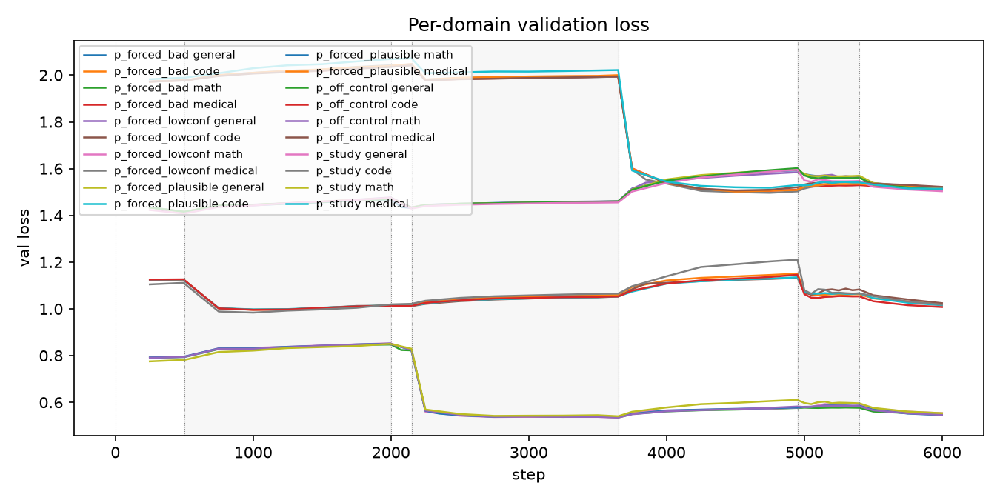
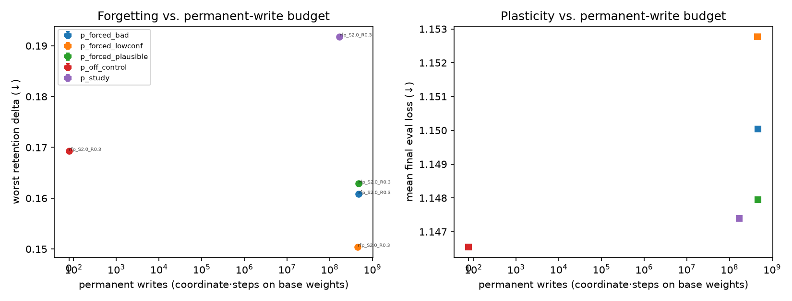
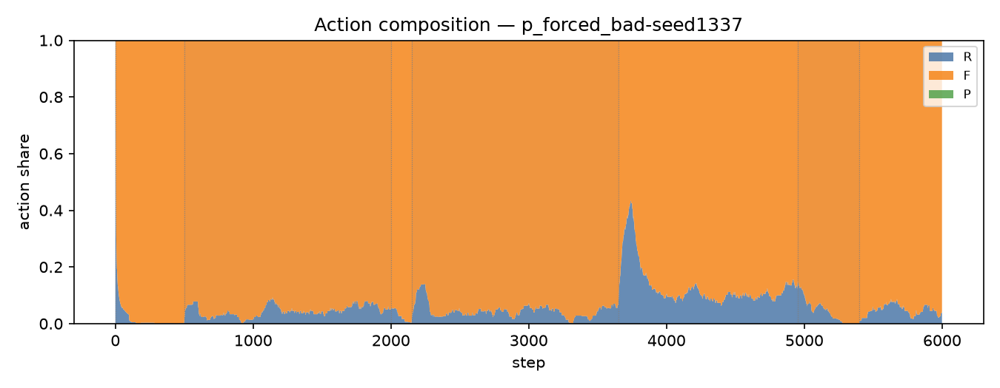
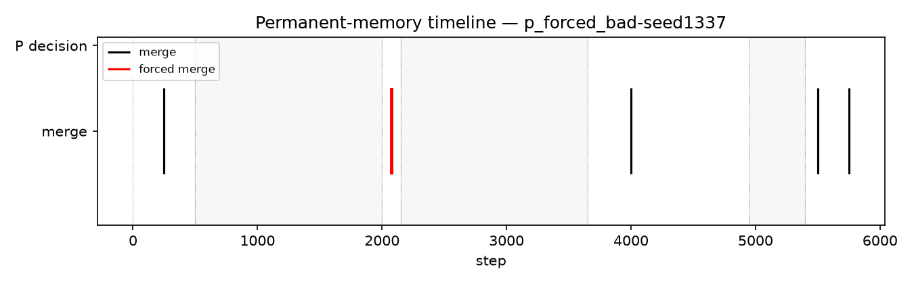
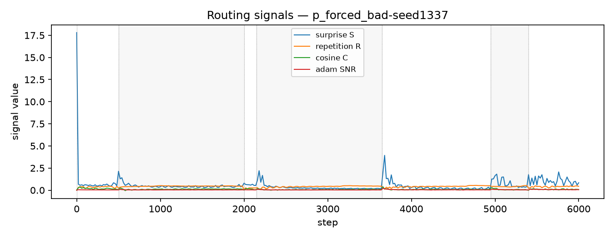
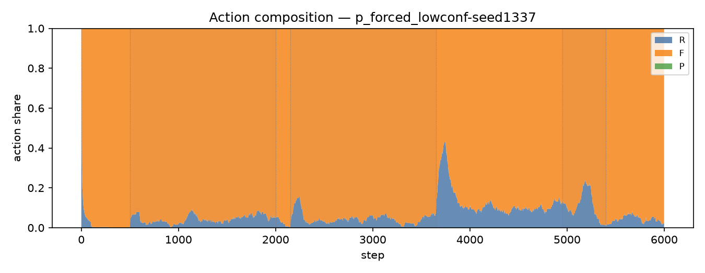
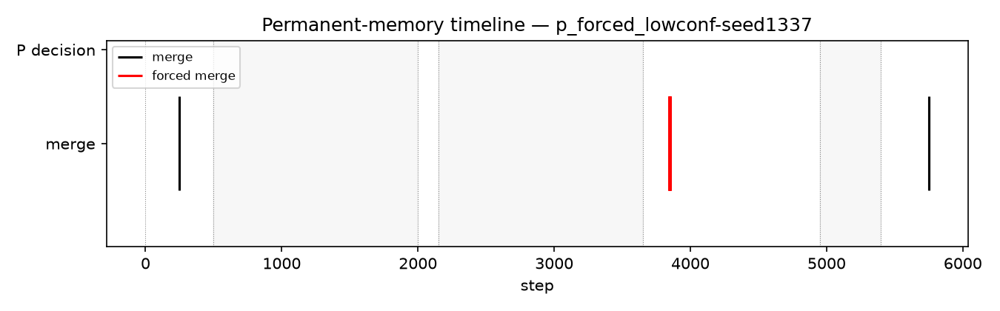
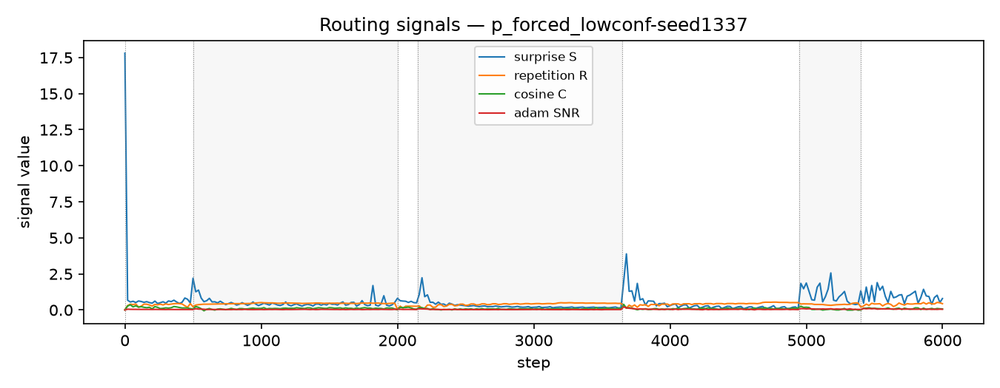
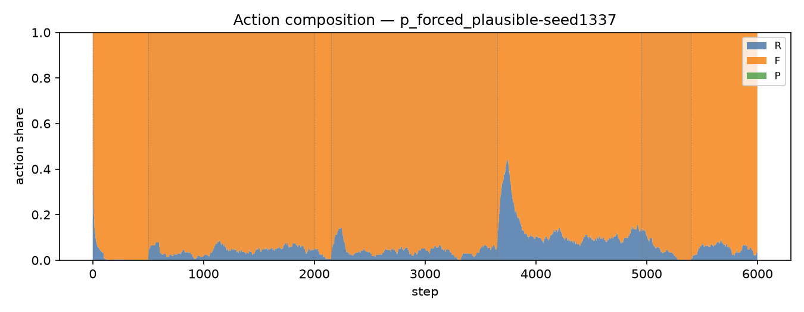
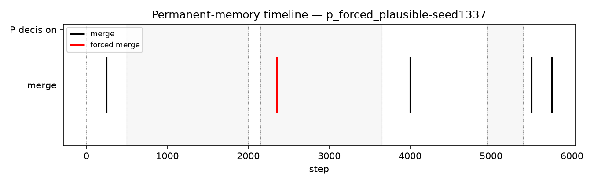

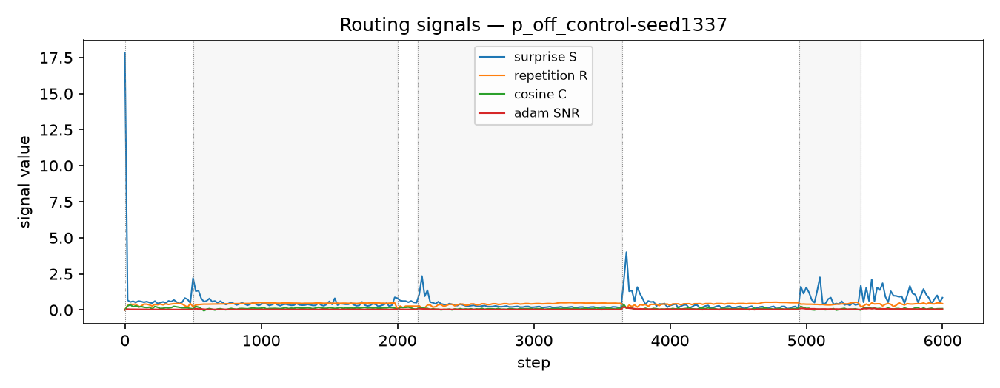
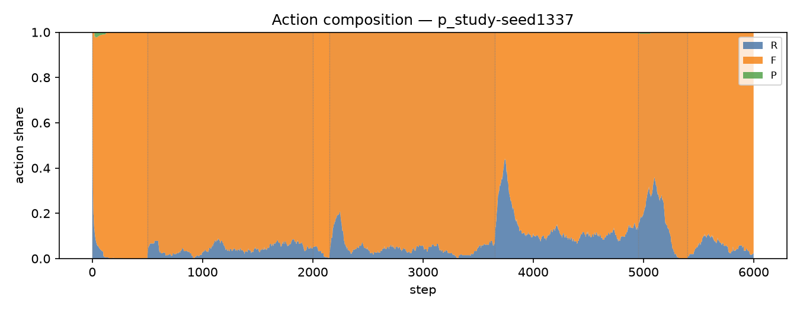
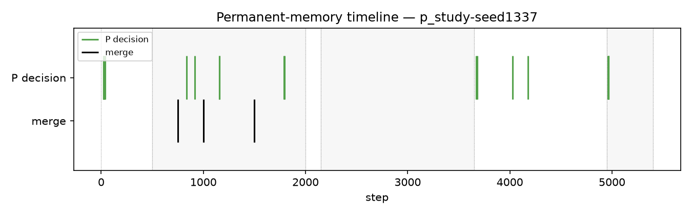
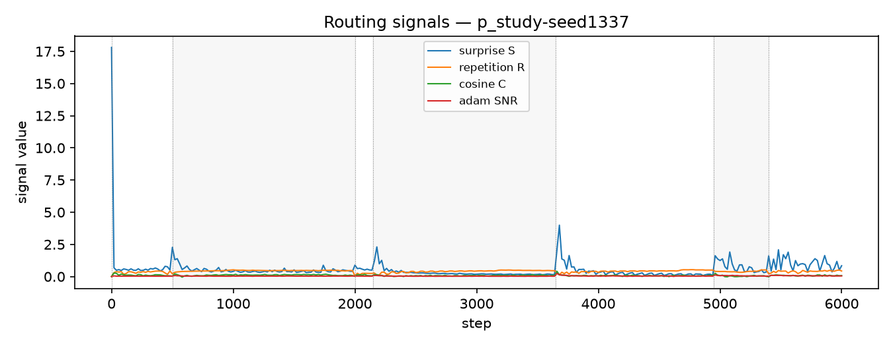
