# Report — p_study_small_v1

5 runs: p_forced_bad-seed1337, p_forced_lowconf-seed1337, p_forced_plausible-seed1337, p_off_control-seed1337, p_study-seed1337

## forgetting_table

| spec_id            |   final_loss_general_mean |   final_loss_general_std |   final_loss_code_mean |   final_loss_code_std |   final_loss_math_mean |   final_loss_math_std |   final_loss_medical_mean |   final_loss_medical_std |   final_em_code_mean |   final_em_code_std |   final_em_math_mean |   final_em_math_std |   final_em_medical_mean |   final_em_medical_std |   worst_retention_delta_general_mean |   worst_retention_delta_general_std |   worst_retention_delta_code_mean |   worst_retention_delta_code_std |   worst_retention_delta_math_mean |   worst_retention_delta_math_std |   worst_retention_delta_medical_mean |   worst_retention_delta_medical_std |   wall_clock_s_mean |   wall_clock_s_std |   tokens_per_sec_mean |   tokens_per_sec_std |   peak_mem_gb_mean |   peak_mem_gb_std |   controller_fraction_mean |   controller_fraction_std |   r_count_mean |   r_count_std |   f_count_mean |   f_count_std |   p_count_mean |   p_count_std |   consolidations_mean |   consolidations_std |
|:-------------------|--------------------------:|-------------------------:|-----------------------:|----------------------:|-----------------------:|----------------------:|--------------------------:|-------------------------:|---------------------:|--------------------:|---------------------:|--------------------:|------------------------:|-----------------------:|-------------------------------------:|------------------------------------:|----------------------------------:|---------------------------------:|----------------------------------:|---------------------------------:|-------------------------------------:|------------------------------------:|--------------------:|-------------------:|----------------------:|---------------------:|-------------------:|------------------:|---------------------------:|--------------------------:|---------------:|--------------:|---------------:|--------------:|---------------:|--------------:|----------------------:|---------------------:|
| p_forced_bad       |                    1.4895 |                      nan |                 1.0059 |                   nan |                 0.5482 |                   nan |                    1.4977 |                      nan |               0.0781 |                 nan |               0.0156 |                 nan |                  0      |                    nan |                               0.1202 |                                 nan |                            0.1059 |                              nan |                            0.0459 |                              nan |                               0.0102 |                                 nan |             3042    |                nan |               1532.81 |                  nan |            11.0474 |               nan |                     0.2223 |                       nan |           4712 |           nan |          31275 |           nan |             13 |           nan |                    76 |                  nan |
| p_forced_lowconf   |                    1.4917 |                      nan |                 1.0197 |                   nan |                 0.5519 |                   nan |                    1.494  |                      nan |               0.1094 |                 nan |               0.0156 |                 nan |                  0      |                    nan |                               0.1288 |                                 nan |                            0.1289 |                              nan |                            0.0504 |                              nan |                               0.0125 |                                 nan |             2708.46 |                nan |               1721.57 |                  nan |            11.0405 |               nan |                     0.2302 |                       nan |           4729 |           nan |          31254 |           nan |             17 |           nan |                    69 |                  nan |
| p_forced_plausible |                    1.4929 |                      nan |                 1.0169 |                   nan |                 0.5601 |                   nan |                    1.5086 |                      nan |               0.1094 |                 nan |               0.0156 |                 nan |                  0.0156 |                    nan |                               0.1207 |                                 nan |                            0.1125 |                              nan |                            0.0501 |                              nan |                               0.0128 |                                 nan |             2717.96 |                nan |               1715.56 |                  nan |            11.0405 |               nan |                     0.2319 |                       nan |           4791 |           nan |          31195 |           nan |             14 |           nan |                    78 |                  nan |
| p_off_control      |                    1.4761 |                      nan |                 0.9881 |                   nan |                 0.5284 |                   nan |                    1.4764 |                      nan |               0.0781 |                 nan |               0.0312 |                 nan |                  0.0312 |                    nan |                               0.0913 |                                 nan |                            0.0439 |                              nan |                            0.0222 |                              nan |                               0.0132 |                                 nan |             3051.63 |                nan |               1527.97 |                  nan |            11.0405 |               nan |                     0.2158 |                       nan |           4596 |           nan |          31404 |           nan |              0 |           nan |                     0 |                  nan |
| p_study            |                    1.4785 |                      nan |                 1.0082 |                   nan |                 0.5478 |                   nan |                    1.4832 |                      nan |               0.125  |                 nan |               0.0156 |                 nan |                  0.0156 |                    nan |                               0.0943 |                                 nan |                            0.0936 |                              nan |                            0.037  |                              nan |                               0.0197 |                                 nan |             3041.85 |                nan |               1532.89 |                  nan |            11.0425 |               nan |                     0.2231 |                       nan |           4664 |           nan |          31315 |           nan |             21 |           nan |                    25 |                  nan |

## action_share_by_phase

| spec_id            | phase             |   r_share_mean |   r_share_std |   f_share_mean |   f_share_std |   p_share_mean |   p_share_std |   mean_coords_opened_mean |   mean_coords_opened_std |
|:-------------------|:------------------|---------------:|--------------:|---------------:|--------------:|---------------:|--------------:|--------------------------:|-------------------------:|
| p_forced_bad       | code_recurrent    |        11.4444 |           nan |        88.5222 |           nan |         0.0333 |           nan |                  2097.15  |                      nan |
| p_forced_bad       | code_revisit      |         2.7037 |           nan |        97.2963 |           nan |         0      |           nan |                     0     |                      nan |
| p_forced_bad       | general_warm      |         7.8667 |           nan |        92      |           nan |         0.1333 |           nan |                  8388.61  |                      nan |
| p_forced_bad       | math_recurrent    |        15.5667 |           nan |        84.4333 |           nan |         0      |           nan |                     0     |                      nan |
| p_forced_bad       | medical_recurrent |        16.2308 |           nan |        83.6923 |           nan |         0.0769 |           nan |                  5677.69  |                      nan |
| p_forced_bad       | mixed_tail        |         8.9167 |           nan |        91.0833 |           nan |         0      |           nan |                     0     |                      nan |
| p_forced_bad       | novel_inject      |        42.7778 |           nan |        57.2222 |           nan |         0      |           nan |                     0     |                      nan |
| p_forced_lowconf   | code_recurrent    |        11.4556 |           nan |        88.4889 |           nan |         0.0556 |           nan |                  3495.25  |                      nan |
| p_forced_lowconf   | code_revisit      |         5.1481 |           nan |        94.8519 |           nan |         0      |           nan |                     0     |                      nan |
| p_forced_lowconf   | general_warm      |         7.5667 |           nan |        92.3    |           nan |         0.1333 |           nan |                  8388.61  |                      nan |
| p_forced_lowconf   | math_recurrent    |        15.3889 |           nan |        84.6    |           nan |         0.0111 |           nan |                   699.051 |                      nan |
| p_forced_lowconf   | medical_recurrent |        16.7692 |           nan |        83.141  |           nan |         0.0897 |           nan |                  6452.78  |                      nan |
| p_forced_lowconf   | mixed_tail        |         8.8889 |           nan |        91.1111 |           nan |         0      |           nan |                     0     |                      nan |
| p_forced_lowconf   | novel_inject      |        35.4444 |           nan |        64.5556 |           nan |         0      |           nan |                     0     |                      nan |
| p_forced_plausible | code_recurrent    |        11.4222 |           nan |        88.5333 |           nan |         0.0444 |           nan |                  2796.2   |                      nan |
| p_forced_plausible | code_revisit      |         4.6667 |           nan |        95.3333 |           nan |         0      |           nan |                     0     |                      nan |
| p_forced_plausible | general_warm      |         7.7333 |           nan |        92.1333 |           nan |         0.1333 |           nan |                  8388.61  |                      nan |
| p_forced_plausible | math_recurrent    |        15.5556 |           nan |        84.4444 |           nan |         0      |           nan |                     0     |                      nan |
| p_forced_plausible | medical_recurrent |        16.4744 |           nan |        83.4487 |           nan |         0.0769 |           nan |                  5646.18  |                      nan |
| p_forced_plausible | mixed_tail        |         8.75   |           nan |        91.25   |           nan |         0      |           nan |                     0     |                      nan |
| p_forced_plausible | novel_inject      |        45      |           nan |        55      |           nan |         0      |           nan |                     0     |                      nan |
| p_off_control      | code_recurrent    |        11.3556 |           nan |        88.6444 |           nan |         0      |           nan |                     0     |                      nan |
| p_off_control      | code_revisit      |         0.7778 |           nan |        99.2222 |           nan |         0      |           nan |                     0     |                      nan |
| p_off_control      | general_warm      |         7.5333 |           nan |        92.4667 |           nan |         0      |           nan |                     0     |                      nan |
| p_off_control      | math_recurrent    |        15.3111 |           nan |        84.6889 |           nan |         0      |           nan |                     0     |                      nan |
| p_off_control      | medical_recurrent |        15.6026 |           nan |        84.3974 |           nan |         0      |           nan |                     0     |                      nan |
| p_off_control      | mixed_tail        |         8.5833 |           nan |        91.4167 |           nan |         0      |           nan |                     0     |                      nan |
| p_off_control      | novel_inject      |        47      |           nan |        53      |           nan |         0      |           nan |                     0     |                      nan |
| p_study            | code_recurrent    |        11.3444 |           nan |        88.6222 |           nan |         0.0333 |           nan |                  2097.15  |                      nan |
| p_study            | code_revisit      |         1.9259 |           nan |        98      |           nan |         0.0741 |           nan |                  6990.51  |                      nan |
| p_study            | general_warm      |         7.7667 |           nan |        92.0333 |           nan |         0.2    |           nan |                 15728.6   |                      nan |
| p_study            | math_recurrent    |        15.5111 |           nan |        84.4889 |           nan |         0      |           nan |                     0     |                      nan |
| p_study            | medical_recurrent |        16.1667 |           nan |        83.7051 |           nan |         0.1282 |           nan |                 10082.5   |                      nan |
| p_study            | mixed_tail        |         9.1667 |           nan |        90.8333 |           nan |         0      |           nan |                     0     |                      nan |
| p_study            | novel_inject      |        41.2222 |           nan |        58.7778 |           nan |         0      |           nan |                     0     |                      nan |

## ablation_deltas

_no data_

## p_selection_stats

| spec_id            |   seed |   p_decisions |   consolidations |   forced_consolidations |   first_p_step |   first_merge_step |   mean_S_at_P |   mean_C_at_P |   mean_V_at_P |   mean_R_at_P |
|:-------------------|-------:|--------------:|-----------------:|------------------------:|---------------:|-------------------:|--------------:|--------------:|--------------:|--------------:|
| p_forced_bad       |   1337 |            13 |               76 |                      56 |             83 |                250 |        0.4022 |        0.4868 |        0.0911 |        0.512  |
| p_forced_lowconf   |   1337 |            17 |               69 |                      56 |             83 |                250 |        0.467  |        0.531  |        0.0876 |        0.5131 |
| p_forced_plausible |   1337 |            14 |               78 |                      56 |             83 |                250 |        0.4141 |        0.4949 |        0.1078 |        0.5218 |
| p_off_control      |   1337 |             0 |                0 |                       0 |            nan |                nan |      nan      |      nan      |      nan      |      nan      |
| p_study            |   1337 |            21 |               25 |                       0 |             21 |                250 |        0.9344 |        0.4498 |        0.0889 |        0.438  |

## adapter_reuse_aulc

| spec_id            | phase          |   aulc_mean |   aulc_std |   final_loss_mean |   final_loss_std |
|:-------------------|:---------------|------------:|-----------:|------------------:|-----------------:|
| p_forced_bad       | math_recurrent |      0.2432 |        nan |            0.1409 |              nan |
| p_forced_lowconf   | math_recurrent |      0.2482 |        nan |            0.1405 |              nan |
| p_forced_plausible | math_recurrent |      0.2446 |        nan |            0.14   |              nan |
| p_off_control      | math_recurrent |      0.2468 |        nan |            0.1435 |              nan |
| p_study            | math_recurrent |      0.2482 |        nan |            0.139  |              nan |

## damage_recovery

| spec_id            |   seed |   forced_step |   pre_merge_loss |   post_merge_loss |   damage |   recovery_steps |
|:-------------------|-------:|--------------:|-----------------:|------------------:|---------:|-----------------:|
| p_forced_bad       |   1337 |          2075 |           1.3507 |            1.3343 |  -0.0165 |                0 |
| p_forced_lowconf   |   1337 |          3850 |           1.171  |            1.1608 |  -0.0102 |                0 |
| p_forced_plausible |   1337 |          2350 |           1.2639 |            1.2637 |  -0.0002 |                0 |

## budget_curve

| spec_id            | threshold_tag   |   permanent_writes_mean |   permanent_writes_std |   p_action_coords_mean |   p_action_coords_std |   merged_coords_mean |   merged_coords_std |   active_fraction_mean_mean |   active_fraction_mean_std |   replayed_total_mean |   replayed_total_std |   worst_retention_delta_mean |   worst_retention_delta_std |   mean_retention_delta_mean |   mean_retention_delta_std |   final_loss_general_mean |   final_loss_general_std |   final_loss_code_mean |   final_loss_code_std |   final_loss_math_mean |   final_loss_math_std |   final_loss_medical_mean |   final_loss_medical_std |   steps_to_recover_code_mean |   steps_to_recover_code_std |
|:-------------------|:----------------|------------------------:|-----------------------:|-----------------------:|----------------------:|---------------------:|--------------------:|----------------------------:|---------------------------:|----------------------:|---------------------:|-----------------------------:|----------------------------:|----------------------------:|---------------------------:|--------------------------:|-------------------------:|-----------------------:|----------------------:|-----------------------:|----------------------:|--------------------------:|-------------------------:|-----------------------------:|----------------------------:|
| p_forced_bad       | rfp_S0.75_R0.3  |             6.66894e+08 |                    nan |            8.80804e+07 |                   nan |          5.78814e+08 |                 nan |                      0      |                        nan |                     0 |                  nan |                       0.1202 |                         nan |                      0.0576 |                        nan |                    1.4895 |                      nan |                 1.0059 |                   nan |                 0.5482 |                   nan |                    1.4977 |                      nan |                          100 |                         nan |
| p_forced_lowconf   | rfp_S0.75_R0.3  |             6.44874e+08 |                    nan |            1.13246e+08 |                   nan |          5.31628e+08 |                 nan |                      0      |                        nan |                     0 |                  nan |                       0.1289 |                         nan |                      0.0622 |                        nan |                    1.4917 |                      nan |                 1.0197 |                   nan |                 0.5519 |                   nan |                    1.494  |                      nan |                          nan |                         nan |
| p_forced_plausible | rfp_S0.75_R0.3  |             6.82623e+08 |                    nan |            9.43718e+07 |                   nan |          5.88251e+08 |                 nan |                      0      |                        nan |                     0 |                  nan |                       0.1207 |                         nan |                      0.0593 |                        nan |                    1.4929 |                      nan |                 1.0169 |                   nan |                 0.5601 |                   nan |                    1.5086 |                      nan |                          200 |                         nan |
| p_off_control      | rfp_S0.75_R0.3  |             0           |                    nan |            0           |                   nan |          0           |                 nan |                      0      |                        nan |                     0 |                  nan |                       0.0913 |                         nan |                      0.0394 |                        nan |                    1.4761 |                      nan |                 0.9881 |                   nan |                 0.5284 |                   nan |                    1.4764 |                      nan |                            0 |                         nan |
| p_study            | rfp_S0.75_R0.3  |             3.36593e+08 |                    nan |            1.63578e+08 |                   nan |          1.73015e+08 |                 nan |                      0.0001 |                        nan |                     0 |                  nan |                       0.0943 |                         nan |                      0.0502 |                        nan |                    1.4785 |                      nan |                 1.0082 |                   nan |                 0.5478 |                   nan |                    1.4832 |                      nan |                          100 |                         nan |

## teacher_attribution

| run                         | spec_id            |   seed | teacher                                       | phase             |   R_count |   F_count |   P_count |   replay_count |   coords_opened_F |   coords_opened_P |   consolidations_attributed |   merged_coords_attributed |
|:----------------------------|:-------------------|-------:|:----------------------------------------------|:------------------|----------:|----------:|----------:|---------------:|------------------:|------------------:|----------------------------:|---------------------------:|
| p_forced_bad-seed1337       | p_forced_bad       |   1337 | general_teacher_deepseek_r1_distill_llama_70b | general_warm      |       236 |      2760 |         4 |              0 |                 0 |          25165824 |                           0 |                          0 |
| p_forced_bad-seed1337       | p_forced_bad       |   1337 | code_teacher_deepseek_r1                      | code_recurrent    |      1030 |      7967 |         3 |              0 |                 0 |          18874368 |                           0 |                          0 |
| p_forced_bad-seed1337       | p_forced_bad       |   1337 | general_teacher_deepseek_r1_distill_llama_70b | novel_inject      |       385 |       515 |         0 |              0 |                 0 |                 0 |                           0 |                          0 |
| p_forced_bad-seed1337       | p_forced_bad       |   1337 | math_teacher_deepseek_r1_distill_qwen_1p5b    | math_recurrent    |      1401 |      7599 |         0 |              0 |                 0 |                 0 |                           0 |                          0 |
| p_forced_bad-seed1337       | p_forced_bad       |   1337 | medical_teacher_qwen2p5_1p5b_instruct_clean   | medical_recurrent |      1266 |      6528 |         6 |              0 |            245760 |          44040192 |                           0 |                          0 |
| p_forced_bad-seed1337       | p_forced_bad       |   1337 | code_teacher_deepseek_r1                      | code_revisit      |        73 |      2627 |         0 |              0 |                 0 |                 0 |                           0 |                          0 |
| p_forced_bad-seed1337       | p_forced_bad       |   1337 | medical_teacher_qwen2p5_1p5b_instruct_clean   | mixed_tail        |       209 |       709 |         0 |              0 |                 0 |                 0 |                           0 |                          0 |
| p_forced_bad-seed1337       | p_forced_bad       |   1337 | general_teacher_deepseek_r1_distill_llama_70b | mixed_tail        |        23 |       799 |         0 |              0 |                 0 |                 0 |                           0 |                          0 |
| p_forced_bad-seed1337       | p_forced_bad       |   1337 | math_teacher_deepseek_r1_distill_qwen_1p5b    | mixed_tail        |        88 |       890 |         0 |              0 |                 0 |                 0 |                           0 |                          0 |
| p_forced_bad-seed1337       | p_forced_bad       |   1337 | code_teacher_deepseek_r1                      | mixed_tail        |         1 |       881 |         0 |              0 |                 0 |                 0 |                           0 |                          0 |
| p_forced_lowconf-seed1337   | p_forced_lowconf   |   1337 | general_teacher_deepseek_r1_distill_llama_70b | general_warm      |       227 |      2769 |         4 |              0 |                 0 |          25165824 |                           0 |                          0 |
| p_forced_lowconf-seed1337   | p_forced_lowconf   |   1337 | code_teacher_deepseek_r1                      | code_recurrent    |      1031 |      7964 |         5 |              0 |                 0 |          31457280 |                           0 |                          0 |
| p_forced_lowconf-seed1337   | p_forced_lowconf   |   1337 | general_teacher_deepseek_r1_distill_llama_70b | novel_inject      |       319 |       581 |         0 |              0 |                 0 |                 0 |                           0 |                          0 |
| p_forced_lowconf-seed1337   | p_forced_lowconf   |   1337 | math_teacher_deepseek_r1_distill_qwen_1p5b    | math_recurrent    |      1385 |      7614 |         1 |              0 |                 0 |           6291456 |                           0 |                          0 |
| p_forced_lowconf-seed1337   | p_forced_lowconf   |   1337 | medical_teacher_qwen2p5_1p5b_instruct_clean   | medical_recurrent |      1308 |      6485 |         7 |              0 |                 0 |          50331648 |                           0 |                          0 |
| p_forced_lowconf-seed1337   | p_forced_lowconf   |   1337 | code_teacher_deepseek_r1                      | code_revisit      |       139 |      2561 |         0 |              0 |                 0 |                 0 |                           0 |                          0 |
| p_forced_lowconf-seed1337   | p_forced_lowconf   |   1337 | medical_teacher_qwen2p5_1p5b_instruct_clean   | mixed_tail        |       204 |       714 |         0 |              0 |                 0 |                 0 |                           0 |                          0 |
| p_forced_lowconf-seed1337   | p_forced_lowconf   |   1337 | general_teacher_deepseek_r1_distill_llama_70b | mixed_tail        |        24 |       798 |         0 |              0 |                 0 |                 0 |                           0 |                          0 |
| p_forced_lowconf-seed1337   | p_forced_lowconf   |   1337 | math_teacher_deepseek_r1_distill_qwen_1p5b    | mixed_tail        |        79 |       899 |         0 |              0 |                 0 |                 0 |                           0 |                          0 |
| p_forced_lowconf-seed1337   | p_forced_lowconf   |   1337 | code_teacher_deepseek_r1                      | mixed_tail        |        13 |       869 |         0 |              0 |                 0 |                 0 |                           0 |                          0 |
| p_forced_plausible-seed1337 | p_forced_plausible |   1337 | general_teacher_deepseek_r1_distill_llama_70b | general_warm      |       232 |      2764 |         4 |              0 |                 0 |          25165824 |                           0 |                          0 |
| p_forced_plausible-seed1337 | p_forced_plausible |   1337 | code_teacher_deepseek_r1                      | code_recurrent    |      1028 |      7968 |         4 |              0 |                 0 |          25165824 |                           0 |                          0 |
| p_forced_plausible-seed1337 | p_forced_plausible |   1337 | general_teacher_deepseek_r1_distill_llama_70b | novel_inject      |       405 |       495 |         0 |              0 |                 0 |                 0 |                           0 |                          0 |
| p_forced_plausible-seed1337 | p_forced_plausible |   1337 | math_teacher_deepseek_r1_distill_qwen_1p5b    | math_recurrent    |      1400 |      7600 |         0 |              0 |                 0 |                 0 |                           0 |                          0 |
| p_forced_plausible-seed1337 | p_forced_plausible |   1337 | medical_teacher_qwen2p5_1p5b_instruct_clean   | medical_recurrent |      1285 |      6509 |         6 |              0 |                 0 |          44040192 |                           0 |                          0 |
| p_forced_plausible-seed1337 | p_forced_plausible |   1337 | code_teacher_deepseek_r1                      | code_revisit      |       126 |      2574 |         0 |              0 |                 0 |                 0 |                           0 |                          0 |
| p_forced_plausible-seed1337 | p_forced_plausible |   1337 | medical_teacher_qwen2p5_1p5b_instruct_clean   | mixed_tail        |       186 |       732 |         0 |              0 |                 0 |                 0 |                           0 |                          0 |
| p_forced_plausible-seed1337 | p_forced_plausible |   1337 | general_teacher_deepseek_r1_distill_llama_70b | mixed_tail        |        26 |       796 |         0 |              0 |                 0 |                 0 |                           0 |                          0 |
| p_forced_plausible-seed1337 | p_forced_plausible |   1337 | math_teacher_deepseek_r1_distill_qwen_1p5b    | mixed_tail        |        89 |       889 |         0 |              0 |                 0 |                 0 |                           0 |                          0 |
| p_forced_plausible-seed1337 | p_forced_plausible |   1337 | code_teacher_deepseek_r1                      | mixed_tail        |        14 |       868 |         0 |              0 |                 0 |                 0 |                           0 |                          0 |
| p_off_control-seed1337      | p_off_control      |   1337 | general_teacher_deepseek_r1_distill_llama_70b | general_warm      |       226 |      2774 |         0 |              0 |                 0 |                 0 |                           0 |                          0 |
| p_off_control-seed1337      | p_off_control      |   1337 | code_teacher_deepseek_r1                      | code_recurrent    |      1022 |      7978 |         0 |              0 |                 0 |                 0 |                           0 |                          0 |
| p_off_control-seed1337      | p_off_control      |   1337 | general_teacher_deepseek_r1_distill_llama_70b | novel_inject      |       423 |       477 |         0 |              0 |                 0 |                 0 |                           0 |                          0 |
| p_off_control-seed1337      | p_off_control      |   1337 | math_teacher_deepseek_r1_distill_qwen_1p5b    | math_recurrent    |      1378 |      7622 |         0 |              0 |                 0 |                 0 |                           0 |                          0 |
| p_off_control-seed1337      | p_off_control      |   1337 | medical_teacher_qwen2p5_1p5b_instruct_clean   | medical_recurrent |      1217 |      6583 |         0 |              0 |                 0 |                 0 |                           0 |                          0 |
| p_off_control-seed1337      | p_off_control      |   1337 | code_teacher_deepseek_r1                      | code_revisit      |        21 |      2679 |         0 |              0 |                 0 |                 0 |                           0 |                          0 |
| p_off_control-seed1337      | p_off_control      |   1337 | medical_teacher_qwen2p5_1p5b_instruct_clean   | mixed_tail        |       193 |       725 |         0 |              0 |                 0 |                 0 |                           0 |                          0 |
| p_off_control-seed1337      | p_off_control      |   1337 | general_teacher_deepseek_r1_distill_llama_70b | mixed_tail        |        32 |       790 |         0 |              0 |                 0 |                 0 |                           0 |                          0 |
| p_off_control-seed1337      | p_off_control      |   1337 | math_teacher_deepseek_r1_distill_qwen_1p5b    | mixed_tail        |        84 |       894 |         0 |              0 |                 0 |                 0 |                           0 |                          0 |
| p_off_control-seed1337      | p_off_control      |   1337 | code_teacher_deepseek_r1                      | mixed_tail        |         0 |       882 |         0 |              0 |                 0 |                 0 |                           0 |                          0 |
| p_study-seed1337            | p_study            |   1337 | general_teacher_deepseek_r1_distill_llama_70b | general_warm      |       233 |      2761 |         6 |              0 |                 0 |          47185920 |                           0 |                          0 |
| p_study-seed1337            | p_study            |   1337 | code_teacher_deepseek_r1                      | code_recurrent    |      1021 |      7976 |         3 |              0 |                 0 |          18874368 |                           0 |                          0 |
| p_study-seed1337            | p_study            |   1337 | general_teacher_deepseek_r1_distill_llama_70b | novel_inject      |       371 |       529 |         0 |              0 |                 0 |                 0 |                           0 |                          0 |
| p_study-seed1337            | p_study            |   1337 | math_teacher_deepseek_r1_distill_qwen_1p5b    | math_recurrent    |      1396 |      7604 |         0 |              0 |                 0 |                 0 |                           0 |                          0 |
| p_study-seed1337            | p_study            |   1337 | medical_teacher_qwen2p5_1p5b_instruct_clean   | medical_recurrent |      1261 |      6529 |        10 |              0 |                 0 |          78643200 |                           0 |                          0 |
| p_study-seed1337            | p_study            |   1337 | code_teacher_deepseek_r1                      | code_revisit      |        52 |      2646 |         2 |              0 |                 0 |          18874368 |                           0 |                          0 |
| p_study-seed1337            | p_study            |   1337 | medical_teacher_qwen2p5_1p5b_instruct_clean   | mixed_tail        |       207 |       711 |         0 |              0 |                 0 |                 0 |                           0 |                          0 |
| p_study-seed1337            | p_study            |   1337 | general_teacher_deepseek_r1_distill_llama_70b | mixed_tail        |        28 |       794 |         0 |              0 |                 0 |                 0 |                           0 |                          0 |
| p_study-seed1337            | p_study            |   1337 | math_teacher_deepseek_r1_distill_qwen_1p5b    | mixed_tail        |        91 |       887 |         0 |              0 |                 0 |                 0 |                           0 |                          0 |
| p_study-seed1337            | p_study            |   1337 | code_teacher_deepseek_r1                      | mixed_tail        |         4 |       878 |         0 |              0 |                 0 |                 0 |                           0 |                          0 |

## containment

_no data_

## Figures

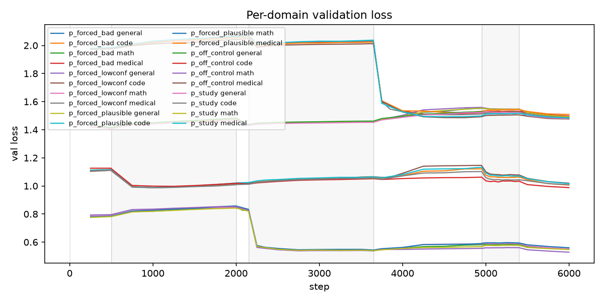
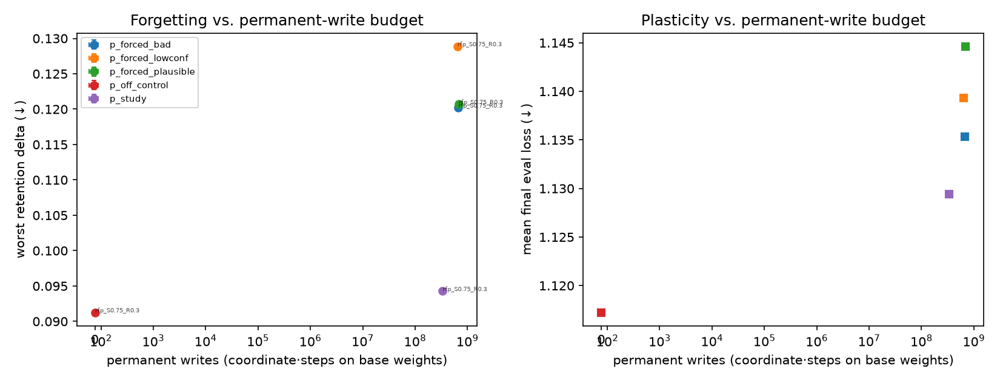
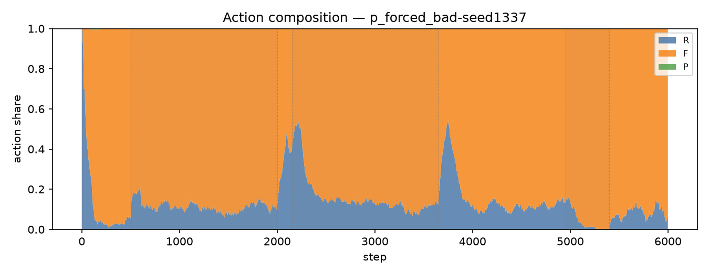
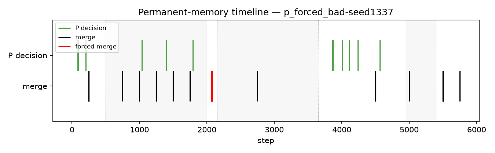
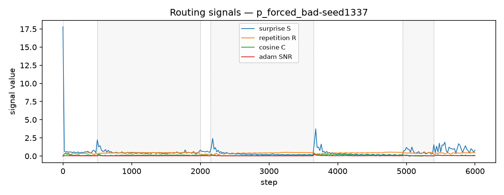
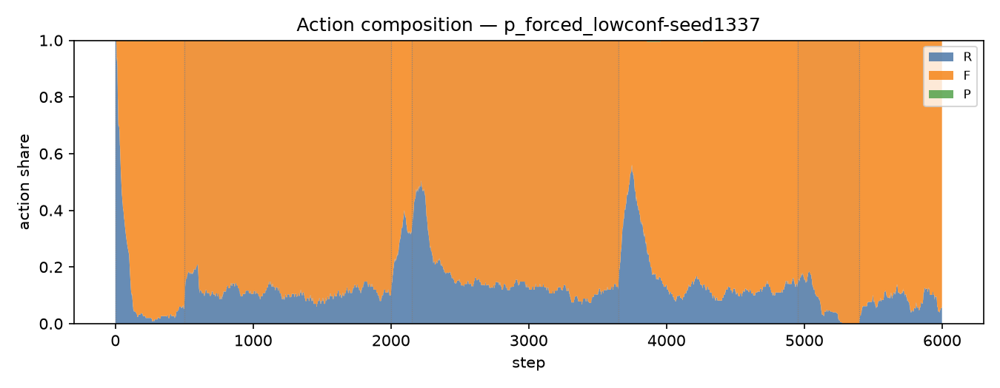
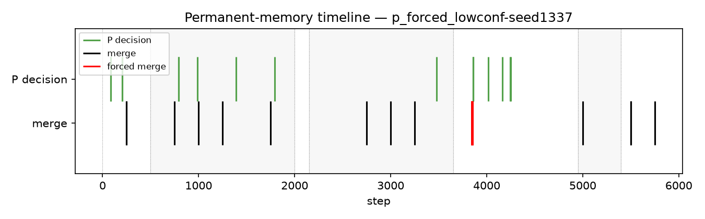
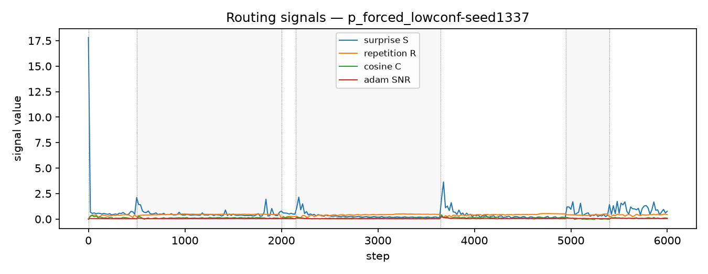
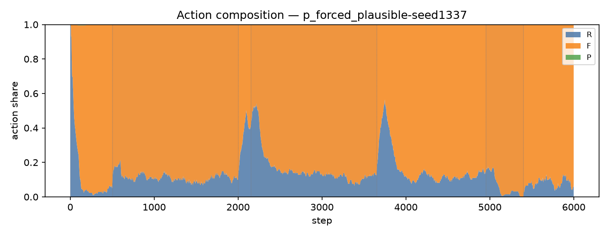
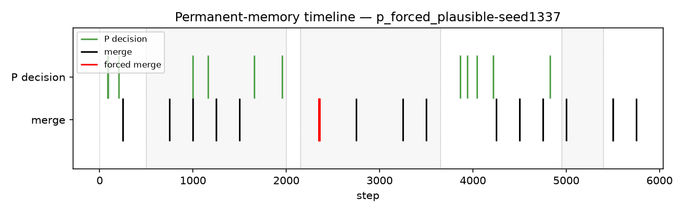
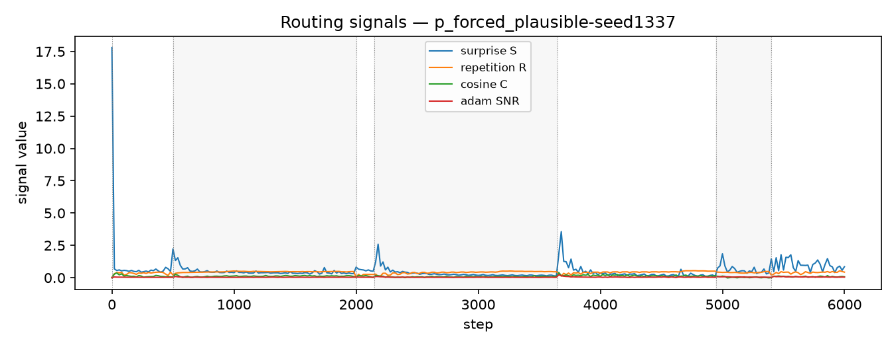
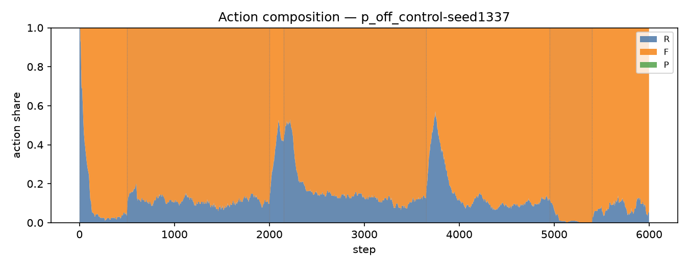
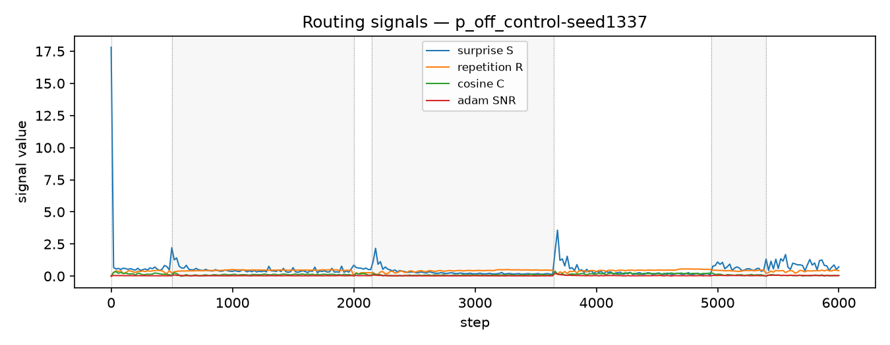
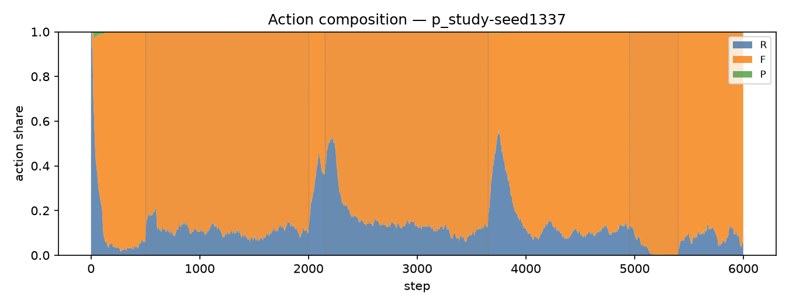
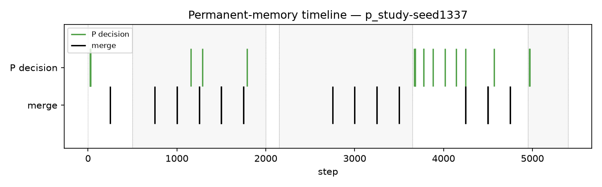
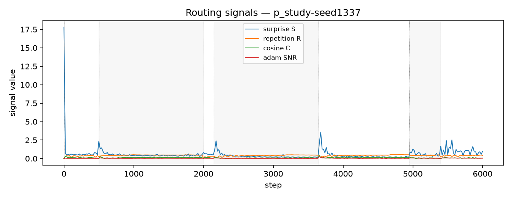
