# Report — p_study_small_v1_live

5 runs: p_forced_bad-seed1337, p_forced_lowconf-seed1337, p_forced_plausible-seed1337, p_off_control-seed1337, p_study-seed1337

## forgetting_table

| spec_id            |   final_loss_general_mean |   final_loss_general_std |   final_loss_code_mean |   final_loss_code_std |   final_loss_math_mean |   final_loss_math_std |   final_loss_medical_mean |   final_loss_medical_std |   final_em_code_mean |   final_em_code_std |   final_em_math_mean |   final_em_math_std |   final_em_medical_mean |   final_em_medical_std |   worst_retention_delta_general_mean |   worst_retention_delta_general_std |   worst_retention_delta_code_mean |   worst_retention_delta_code_std |   worst_retention_delta_math_mean |   worst_retention_delta_math_std |   worst_retention_delta_medical_mean |   worst_retention_delta_medical_std |   wall_clock_s_mean |   wall_clock_s_std |   tokens_per_sec_mean |   tokens_per_sec_std |   peak_mem_gb_mean |   peak_mem_gb_std |   controller_fraction_mean |   controller_fraction_std |   r_count_mean |   r_count_std |   f_count_mean |   f_count_std |   p_count_mean |   p_count_std |   consolidations_mean |   consolidations_std |
|:-------------------|--------------------------:|-------------------------:|-----------------------:|----------------------:|-----------------------:|----------------------:|--------------------------:|-------------------------:|---------------------:|--------------------:|---------------------:|--------------------:|------------------------:|-----------------------:|-------------------------------------:|------------------------------------:|----------------------------------:|---------------------------------:|----------------------------------:|---------------------------------:|-------------------------------------:|------------------------------------:|--------------------:|-------------------:|----------------------:|---------------------:|-------------------:|------------------:|---------------------------:|--------------------------:|---------------:|--------------:|---------------:|--------------:|---------------:|--------------:|----------------------:|---------------------:|
| p_forced_bad       |                    1.6709 |                      nan |                 1.147  |                   nan |                 0.6185 |                   nan |                    1.5406 |                      nan |               0.0938 |                 nan |               0      |                 nan |                  0      |                    nan |                               0.1299 |                                 nan |                            0.1494 |                              nan |                            0.0481 |                              nan |                               0.0134 |                                 nan |             3736.39 |                nan |               1247.94 |                  nan |            29.297  |               nan |                     0.3877 |                       nan |           2477 |           nan |          35119 |           nan |             60 |           nan |                   154 |                  nan |
| p_forced_lowconf   |                    1.6919 |                      nan |                 1.2232 |                   nan |                 0.7374 |                   nan |                    1.5948 |                      nan |               0.0938 |                 nan |               0.0156 |                 nan |                  0.0156 |                    nan |                               0.1445 |                                 nan |                            0.2567 |                              nan |                            0.0413 |                              nan |                               0.0285 |                                 nan |             2405.26 |                nan |               1938.59 |                  nan |            29.3017 |               nan |                     0.2289 |                       nan |           2426 |           nan |          35255 |           nan |             77 |           nan |                   169 |                  nan |
| p_forced_plausible |                    1.6915 |                      nan |                 1.1417 |                   nan |                 0.6337 |                   nan |                    1.5755 |                      nan |               0.0625 |                 nan |               0.0469 |                 nan |                  0      |                    nan |                               0.1225 |                                 nan |                            0.1649 |                              nan |                            0.0734 |                              nan |                               0.0201 |                                 nan |             3747.99 |                nan |               1244.08 |                  nan |            29.3006 |               nan |                     0.3935 |                       nan |           2365 |           nan |          35144 |           nan |             87 |           nan |                   181 |                  nan |
| p_off_control      |                    1.6662 |                      nan |                 1.1791 |                   nan |                 0.6323 |                   nan |                    1.5614 |                      nan |               0.0938 |                 nan |               0.0625 |                 nan |                  0      |                    nan |                               0.1787 |                                 nan |                            0.2229 |                              nan |                            0.0416 |                              nan |                               0.0169 |                                 nan |             3733.68 |                nan |               1248.85 |                  nan |            29.2995 |               nan |                     0.3817 |                       nan |           2163 |           nan |          35475 |           nan |              0 |           nan |                     0 |                  nan |
| p_study            |                    1.6544 |                      nan |                 1.1374 |                   nan |                 0.6029 |                   nan |                    1.5745 |                      nan |               0.0625 |                 nan |               0.0156 |                 nan |                  0      |                    nan |                               0.1041 |                                 nan |                            0.1907 |                              nan |                            0.0755 |                              nan |                               0.0347 |                                 nan |             3908.32 |                nan |               1193.05 |                  nan |            29.3036 |               nan |                     0.3858 |                       nan |           2499 |           nan |          34708 |           nan |            695 |           nan |                    53 |                  nan |

## action_share_by_phase

| spec_id            | phase             |   r_share_mean |   r_share_std |   f_share_mean |   f_share_std |   p_share_mean |   p_share_std |   mean_coords_opened_mean |   mean_coords_opened_std |
|:-------------------|:------------------|---------------:|--------------:|---------------:|--------------:|---------------:|--------------:|--------------------------:|-------------------------:|
| p_forced_bad       | code_recurrent    |         0.7444 |           nan |        99.0222 |           nan |         0.2333 |           nan |                  14680.1  |                      nan |
| p_forced_bad       | code_revisit      |         1.4444 |           nan |        98.1111 |           nan |         0.4444 |           nan |                  34952.5  |                      nan |
| p_forced_bad       | general_warm      |         4.8    |           nan |        94.7333 |           nan |         0.4667 |           nan |                  33554.4  |                      nan |
| p_forced_bad       | math_recurrent    |         3.1444 |           nan |        96.8333 |           nan |         0.0222 |           nan |                   1398.1  |                      nan |
| p_forced_bad       | medical_recurrent |        11.1026 |           nan |        88.7564 |           nan |         0.141  |           nan |                  10889.1  |                      nan |
| p_forced_bad       | mixed_tail        |        15.6389 |           nan |        84.3611 |           nan |         0      |           nan |                      0    |                      nan |
| p_forced_bad       | novel_inject      |        57.2222 |           nan |        42.7778 |           nan |         0      |           nan |                      0    |                      nan |
| p_forced_lowconf   | code_recurrent    |         0.6667 |           nan |        99.0778 |           nan |         0.2556 |           nan |                  18874.4  |                      nan |
| p_forced_lowconf   | code_revisit      |         2.2963 |           nan |        97.2222 |           nan |         0.4815 |           nan |                  41943    |                      nan |
| p_forced_lowconf   | general_warm      |         5.0667 |           nan |        94.3667 |           nan |         0.5667 |           nan |                  40894.5  |                      nan |
| p_forced_lowconf   | math_recurrent    |         5.4889 |           nan |        94.4778 |           nan |         0.0333 |           nan |                   2097.15 |                      nan |
| p_forced_lowconf   | medical_recurrent |         8.0513 |           nan |        91.6923 |           nan |         0.2564 |           nan |                  19358.3  |                      nan |
| p_forced_lowconf   | mixed_tail        |        17.5556 |           nan |        82.4167 |           nan |         0.0278 |           nan |                   2621.44 |                      nan |
| p_forced_lowconf   | novel_inject      |        44.2222 |           nan |        55.7778 |           nan |         0      |           nan |                      0    |                      nan |
| p_forced_plausible | code_recurrent    |         0.8778 |           nan |        98.9778 |           nan |         0.1444 |           nan |                   9437.18 |                      nan |
| p_forced_plausible | code_revisit      |         0.5926 |           nan |        98.4444 |           nan |         0.963  |           nan |                  72235.2  |                      nan |
| p_forced_plausible | general_warm      |         5      |           nan |        94.4333 |           nan |         0.5667 |           nan |                  40894.5  |                      nan |
| p_forced_plausible | math_recurrent    |         3.5222 |           nan |        96.3889 |           nan |         0.0889 |           nan |                   7340.03 |                      nan |
| p_forced_plausible | medical_recurrent |         9.9487 |           nan |        89.859  |           nan |         0.1923 |           nan |                  14518.7  |                      nan |
| p_forced_plausible | mixed_tail        |        13.6944 |           nan |        86.0833 |           nan |         0.2222 |           nan |                  16602.5  |                      nan |
| p_forced_plausible | novel_inject      |        59.3333 |           nan |        40.6667 |           nan |         0      |           nan |                      0    |                      nan |
| p_off_control      | code_recurrent    |         0.8667 |           nan |        99.1333 |           nan |         0      |           nan |                      0    |                      nan |
| p_off_control      | code_revisit      |         0.7407 |           nan |        99.2593 |           nan |         0      |           nan |                      0    |                      nan |
| p_off_control      | general_warm      |         5.0667 |           nan |        94.9333 |           nan |         0      |           nan |                      0    |                      nan |
| p_off_control      | math_recurrent    |         2.8556 |           nan |        97.1444 |           nan |         0      |           nan |                      0    |                      nan |
| p_off_control      | medical_recurrent |         9.6282 |           nan |        90.3718 |           nan |         0      |           nan |                      0    |                      nan |
| p_off_control      | mixed_tail        |        14.3056 |           nan |        85.6944 |           nan |         0      |           nan |                      0    |                      nan |
| p_off_control      | novel_inject      |        43.3333 |           nan |        56.6667 |           nan |         0      |           nan |                      0    |                      nan |
| p_study            | code_recurrent    |         0.7    |           nan |        98.0889 |           nan |         1.2111 |           nan |                  86332.8  |                      nan |
| p_study            | code_revisit      |         0.7037 |           nan |        96.1852 |           nan |         3.1111 |           nan |                 234182    |                      nan |
| p_study            | general_warm      |         4.7667 |           nan |        87.8    |           nan |         7.4333 |           nan |                 571474    |                      nan |
| p_study            | math_recurrent    |         2      |           nan |        96.7333 |           nan |         1.2667 |           nan |                  93323.3  |                      nan |
| p_study            | medical_recurrent |        13.9872 |           nan |        85.2821 |           nan |         0.7308 |           nan |                  61704.7  |                      nan |
| p_study            | mixed_tail        |        15.6944 |           nan |        83.4444 |           nan |         0.8611 |           nan |                  64662.2  |                      nan |
| p_study            | novel_inject      |        48.6667 |           nan |        42.7778 |           nan |         8.5556 |           nan |                 678079    |                      nan |

## ablation_deltas

_no data_

## p_selection_stats

| spec_id            |   seed |   p_decisions |   consolidations |   forced_consolidations |   first_p_step |   first_merge_step |   mean_S_at_P |   mean_C_at_P |   mean_V_at_P |   mean_R_at_P |
|:-------------------|-------:|--------------:|-----------------:|------------------------:|---------------:|-------------------:|--------------:|--------------:|--------------:|--------------:|
| p_forced_bad       |   1337 |            60 |              154 |                      56 |             36 |                250 |        0.4245 |        0.6626 |        0.1801 |        0.5377 |
| p_forced_lowconf   |   1337 |            77 |              169 |                      56 |             36 |                250 |        0.4469 |        0.6416 |        0.1704 |        0.5516 |
| p_forced_plausible |   1337 |            87 |              181 |                      56 |             36 |                250 |        0.6292 |        0.6663 |        0.1642 |        0.5335 |
| p_off_control      |   1337 |             0 |                0 |                       0 |            nan |                nan |      nan      |      nan      |      nan      |      nan      |
| p_study            |   1337 |           695 |               53 |                       0 |             16 |                250 |        1.0579 |        0.5364 |        0.2194 |        0.459  |

## replay_timing

| spec_id            |   seed |   replays |   delay_median_steps |   delay_p90_steps |   cross_phase_share |   cross_phase_replays |   replays_in_medical_recurrent |   replays_in_mixed_tail |   replays_in_general_warm |   replays_in_math_recurrent |   replays_in_code_revisit |   replays_in_code_recurrent |
|:-------------------|-------:|----------:|---------------------:|------------------:|--------------------:|----------------------:|-------------------------------:|------------------------:|--------------------------:|----------------------------:|--------------------------:|----------------------------:|
| p_forced_bad       |   1337 |       276 |                   90 |             470.5 |              0.0725 |                    20 |                            118 |                      67 |                        42 |                          34 |                         9 |                           6 |
| p_forced_lowconf   |   1337 |       293 |                   90 |            1146.8 |              0.099  |                    29 |                             83 |                      76 |                        42 |                          68 |                        18 |                           6 |
| p_forced_plausible |   1337 |       266 |                   98 |             450   |              0.0752 |                    20 |                            106 |                      74 |                        44 |                          33 |                         3 |                           6 |
| p_off_control      |   1337 |       273 |                  103 |             523.8 |              0.0879 |                    24 |                            105 |                      88 |                        44 |                          25 |                         4 |                           7 |
| p_study            |   1337 |       317 |                   90 |             420.2 |              0.0726 |                    23 |                            137 |                     106 |                        39 |                          24 |                         3 |                           8 |

## adapter_reuse_aulc

| spec_id            | phase          |   aulc_mean |   aulc_std |   final_loss_mean |   final_loss_std |
|:-------------------|:---------------|------------:|-----------:|------------------:|-----------------:|
| p_forced_bad       | math_recurrent |      1.6184 |        nan |            1.6003 |              nan |
| p_forced_lowconf   | math_recurrent |      1.6724 |        nan |            1.5919 |              nan |
| p_forced_plausible | math_recurrent |      1.6513 |        nan |            1.5931 |              nan |
| p_off_control      | math_recurrent |      1.6806 |        nan |            1.6471 |              nan |
| p_study            | math_recurrent |      1.5676 |        nan |            1.5543 |              nan |

## damage_recovery

| spec_id            |   seed |   forced_step |   pre_merge_loss |   post_merge_loss |   damage |   recovery_steps |
|:-------------------|-------:|--------------:|-----------------:|------------------:|---------:|-----------------:|
| p_forced_bad       |   1337 |          2075 |           1.5072 |            1.504  |  -0.0032 |                0 |
| p_forced_lowconf   |   1337 |          3850 |           1.442  |            1.4204 |  -0.0216 |                0 |
| p_forced_plausible |   1337 |          2350 |           1.439  |            1.4444 |   0.0054 |             1400 |

## budget_curve

| spec_id            | threshold_tag   |   permanent_writes_mean |   permanent_writes_std |   p_action_coords_mean |   p_action_coords_std |   merged_coords_mean |   merged_coords_std |   active_fraction_mean_mean |   active_fraction_mean_std |   replayed_total_mean |   replayed_total_std |   worst_retention_delta_mean |   worst_retention_delta_std |   mean_retention_delta_mean |   mean_retention_delta_std |   final_loss_general_mean |   final_loss_general_std |   final_loss_code_mean |   final_loss_code_std |   final_loss_math_mean |   final_loss_math_std |   final_loss_medical_mean |   final_loss_medical_std |   steps_to_recover_code_mean |   steps_to_recover_code_std |
|:-------------------|:----------------|------------------------:|-----------------------:|-----------------------:|----------------------:|---------------------:|--------------------:|----------------------------:|---------------------------:|----------------------:|---------------------:|-----------------------------:|----------------------------:|----------------------------:|---------------------------:|--------------------------:|-------------------------:|-----------------------:|----------------------:|-----------------------:|----------------------:|--------------------------:|-------------------------:|-----------------------------:|----------------------------:|
| p_forced_bad       | rfp_S1.25_R0.4  |             1.60432e+09 |                    nan |            4.24673e+08 |                   nan |          1.17965e+09 |                 nan |                      0.0002 |                        nan |                   276 |                  nan |                       0.1494 |                         nan |                      0.0734 |                        nan |                    1.6709 |                      nan |                 1.147  |                   nan |                 0.6185 |                   nan |                    1.5406 |                      nan |                           50 |                         nan |
| p_forced_lowconf   | rfp_S1.25_R0.4  |             1.88744e+09 |                    nan |            5.85105e+08 |                   nan |          1.30233e+09 |                 nan |                      0.0003 |                        nan |                   293 |                  nan |                       0.2567 |                         nan |                      0.1    |                        nan |                    1.6919 |                      nan |                 1.2232 |                   nan |                 0.7374 |                   nan |                    1.5948 |                      nan |                          nan |                         nan |
| p_forced_plausible | rfp_S1.25_R0.4  |             2.02899e+09 |                    nan |            6.41729e+08 |                   nan |          1.38727e+09 |                 nan |                      0.0003 |                        nan |                   266 |                  nan |                       0.1649 |                         nan |                      0.0933 |                        nan |                    1.6915 |                      nan |                 1.1417 |                   nan |                 0.6337 |                   nan |                    1.5755 |                      nan |                          200 |                         nan |
| p_off_control      | rfp_S1.25_R0.4  |             0           |                    nan |            0           |                   nan |          0           |                 nan |                      0.0001 |                        nan |                   273 |                  nan |                       0.2229 |                         nan |                      0.0909 |                        nan |                    1.6662 |                      nan |                 1.1791 |                   nan |                 0.6323 |                   nan |                    1.5614 |                      nan |                          300 |                         nan |
| p_study            | rfp_S1.25_R0.4  |             5.67489e+09 |                    nan |            5.28797e+09 |                   nan |          3.86925e+08 |                 nan |                      0.002  |                        nan |                   317 |                  nan |                       0.1907 |                         nan |                      0.0879 |                        nan |                    1.6544 |                      nan |                 1.1374 |                   nan |                 0.6029 |                   nan |                    1.5745 |                      nan |                          100 |                         nan |

## teacher_attribution

| run                         | spec_id            |   seed | teacher            | phase             |   R_count |   F_count |   P_count |   replay_count |   coords_opened_F |   coords_opened_P |   consolidations_attributed |   merged_coords_attributed |
|:----------------------------|:-------------------|-------:|:-------------------|:------------------|----------:|----------:|----------:|---------------:|------------------:|------------------:|----------------------------:|---------------------------:|
| p_forced_bad-seed1337       | p_forced_bad       |   1337 | general_teacher_hf | general_warm      |       144 |      2842 |        14 |            252 |          21757952 |         100663296 |                      1      |                6.29146e+06 |
| p_forced_bad-seed1337       | p_forced_bad       |   1337 | code_teacher_hf    | code_recurrent    |        67 |      8912 |        21 |             36 |           3145728 |         132120576 |                      0.15   |           943718           |
| p_forced_bad-seed1337       | p_forced_bad       |   1337 | general_teacher_hf | novel_inject      |       515 |       385 |         0 |              0 |                 0 |                 0 |                      7.2693 |                5.10238e+07 |
| p_forced_bad-seed1337       | p_forced_bad       |   1337 | math_teacher_hf    | math_recurrent    |       283 |      8715 |         2 |            204 |          17448960 |          12582912 |                      5      |                4.08945e+07 |
| p_forced_bad-seed1337       | p_forced_bad       |   1337 | medical_teacher_hf | medical_recurrent |       866 |      6923 |        11 |            708 |          60637184 |          84934656 |                      0.7447 |                7.02769e+06 |
| p_forced_bad-seed1337       | p_forced_bad       |   1337 | code_teacher_hf    | code_revisit      |        39 |      2649 |        12 |             54 |           4669440 |          94371840 |                      0.7029 |                5.39064e+06 |
| p_forced_bad-seed1337       | p_forced_bad       |   1337 | medical_teacher_hf | mixed_tail        |       132 |       786 |         0 |            234 |          20086784 |                 0 |                      0      |                0           |
| p_forced_bad-seed1337       | p_forced_bad       |   1337 | general_teacher_hf | mixed_tail        |       409 |       413 |         0 |            120 |          10207232 |                 0 |                      0      |                0           |
| p_forced_bad-seed1337       | p_forced_bad       |   1337 | math_teacher_hf    | mixed_tail        |        22 |       956 |         0 |             48 |           4145152 |                 0 |                      0      |                0           |
| p_forced_bad-seed1337       | p_forced_bad       |   1337 | code_teacher_hf    | mixed_tail        |         0 |       882 |         0 |              0 |                 0 |                 0 |                      0      |                0           |
| p_forced_bad-seed1337       | p_forced_bad       |   1337 | general_teacher_hf | code_recurrent    |         0 |         0 |         0 |              0 |                 0 |                 0 |                      4.85   |                3.36593e+07 |
| p_forced_bad-seed1337       | p_forced_bad       |   1337 | code_teacher_hf    | novel_inject      |         0 |         0 |         0 |              0 |                 0 |                 0 |                      0.7307 |                5.5993e+06  |
| p_forced_bad-seed1337       | p_forced_bad       |   1337 | math_teacher_hf    | medical_recurrent |         0 |         0 |         0 |              0 |                 0 |                 0 |                      0.2553 |                2.40949e+06 |
| p_forced_bad-seed1337       | p_forced_bad       |   1337 | medical_teacher_hf | code_revisit      |         0 |         0 |         0 |              0 |                 0 |                 0 |                      4.0872 |                3.09587e+07 |
| p_forced_bad-seed1337       | p_forced_bad       |   1337 | math_teacher_hf    | code_revisit      |         0 |         0 |         0 |              0 |                 0 |                 0 |                      0.2099 |                1.39942e+06 |
| p_forced_lowconf-seed1337   | p_forced_lowconf   |   1337 | general_teacher_hf | general_warm      |       152 |      2831 |        17 |            252 |          21807104 |         122683392 |                      2      |                1.57286e+07 |
| p_forced_lowconf-seed1337   | p_forced_lowconf   |   1337 | code_teacher_hf    | code_recurrent    |        60 |      8917 |        23 |             36 |           3145728 |         169869312 |                      0.6518 |                5.28027e+06 |
| p_forced_lowconf-seed1337   | p_forced_lowconf   |   1337 | general_teacher_hf | novel_inject      |       398 |       502 |         0 |              0 |                 0 |                 0 |                      0      |                0           |
| p_forced_lowconf-seed1337   | p_forced_lowconf   |   1337 | math_teacher_hf    | math_recurrent    |       494 |      8503 |         3 |            408 |          35192832 |          18874368 |                      2.1351 |                1.70039e+07 |
| p_forced_lowconf-seed1337   | p_forced_lowconf   |   1337 | medical_teacher_hf | medical_recurrent |       628 |      7152 |        20 |            498 |          42631168 |         150994944 |                      5.5564 |                4.13004e+07 |
| p_forced_lowconf-seed1337   | p_forced_lowconf   |   1337 | code_teacher_hf    | code_revisit      |        62 |      2625 |        13 |            108 |           9420800 |         113246208 |                      1.7667 |                1.37363e+07 |
| p_forced_lowconf-seed1337   | p_forced_lowconf   |   1337 | medical_teacher_hf | mixed_tail        |       115 |       803 |         0 |            204 |          17596416 |                 0 |                      0      |                0           |
| p_forced_lowconf-seed1337   | p_forced_lowconf   |   1337 | general_teacher_hf | mixed_tail        |       398 |       424 |         0 |             96 |           8273920 |                 0 |                      0      |                0           |
| p_forced_lowconf-seed1337   | p_forced_lowconf   |   1337 | math_teacher_hf    | mixed_tail        |       113 |       864 |         1 |            144 |          12517376 |           9437184 |                      0      |                0           |
| p_forced_lowconf-seed1337   | p_forced_lowconf   |   1337 | code_teacher_hf    | mixed_tail        |         6 |       876 |         0 |             12 |           1048576 |                 0 |                      0      |                0           |
| p_forced_lowconf-seed1337   | p_forced_lowconf   |   1337 | general_teacher_hf | code_recurrent    |         0 |         0 |         0 |              0 |                 0 |                 0 |                      5.3482 |                3.87599e+07 |
| p_forced_lowconf-seed1337   | p_forced_lowconf   |   1337 | general_teacher_hf | math_recurrent    |         0 |         0 |         0 |              0 |                 0 |                 0 |                      0.7027 |                6.63153e+06 |
| p_forced_lowconf-seed1337   | p_forced_lowconf   |   1337 | code_teacher_hf    | math_recurrent    |         0 |         0 |         0 |              0 |                 0 |                 0 |                      0.1622 |                1.53035e+06 |
| p_forced_lowconf-seed1337   | p_forced_lowconf   |   1337 | general_teacher_hf | medical_recurrent |         0 |         0 |         0 |              0 |                 0 |                 0 |                      1.3037 |                8.41214e+06 |
| p_forced_lowconf-seed1337   | p_forced_lowconf   |   1337 | code_teacher_hf    | medical_recurrent |         0 |         0 |         0 |              0 |                 0 |                 0 |                      0.1151 |           723982           |
| p_forced_lowconf-seed1337   | p_forced_lowconf   |   1337 | math_teacher_hf    | medical_recurrent |         0 |         0 |         0 |              0 |                 0 |                 0 |                     12.0248 |                8.79755e+07 |
| p_forced_lowconf-seed1337   | p_forced_lowconf   |   1337 | medical_teacher_hf | code_revisit      |         0 |         0 |         0 |              0 |                 0 |                 0 |                      2.2333 |                1.45752e+07 |
| p_forced_plausible-seed1337 | p_forced_plausible |   1337 | general_teacher_hf | general_warm      |       150 |      2833 |        17 |            264 |          22806528 |         122683392 |                      2      |                1.25829e+07 |
| p_forced_plausible-seed1337 | p_forced_plausible |   1337 | code_teacher_hf    | code_recurrent    |        79 |      8908 |        13 |             36 |           3145728 |          84934656 |                      0.7612 |                5.75619e+06 |
| p_forced_plausible-seed1337 | p_forced_plausible |   1337 | general_teacher_hf | novel_inject      |       534 |       366 |         0 |              0 |                 0 |                 0 |                      0      |                0           |
| p_forced_plausible-seed1337 | p_forced_plausible |   1337 | math_teacher_hf    | math_recurrent    |       317 |      8675 |         8 |            198 |          16941056 |          66060288 |                     17.6298 |                1.29267e+08 |
| p_forced_plausible-seed1337 | p_forced_plausible |   1337 | medical_teacher_hf | medical_recurrent |       776 |      7009 |        15 |            636 |          54296576 |         113246208 |                      0      |                0           |
| p_forced_plausible-seed1337 | p_forced_plausible |   1337 | code_teacher_hf    | code_revisit      |        16 |      2658 |        26 |             18 |           1556480 |         195035136 |                      0.4058 |                2.85294e+06 |
| p_forced_plausible-seed1337 | p_forced_plausible |   1337 | medical_teacher_hf | mixed_tail        |       124 |       791 |         3 |            264 |          22544384 |          18874368 |                      0      |                0           |
| p_forced_plausible-seed1337 | p_forced_plausible |   1337 | general_teacher_hf | mixed_tail        |       339 |       481 |         2 |            114 |           9748480 |          18874368 |                      0      |                0           |
| p_forced_plausible-seed1337 | p_forced_plausible |   1337 | math_teacher_hf    | mixed_tail        |        30 |       946 |         2 |             66 |           5701632 |          15728640 |                      0      |                0           |
| p_forced_plausible-seed1337 | p_forced_plausible |   1337 | code_teacher_hf    | mixed_tail        |         0 |       881 |         1 |              0 |                 0 |           6291456 |                      0      |                0           |
| p_forced_plausible-seed1337 | p_forced_plausible |   1337 | general_teacher_hf | code_recurrent    |         0 |         0 |         0 |              0 |                 0 |                 0 |                      6.2388 |                4.77212e+07 |
| p_forced_plausible-seed1337 | p_forced_plausible |   1337 | general_teacher_hf | math_recurrent    |         0 |         0 |         0 |              0 |                 0 |                 0 |                      3.2226 |                2.07993e+07 |
| p_forced_plausible-seed1337 | p_forced_plausible |   1337 | code_teacher_hf    | math_recurrent    |         0 |         0 |         0 |              0 |                 0 |                 0 |                      0.1476 |           928739           |
| p_forced_plausible-seed1337 | p_forced_plausible |   1337 | math_teacher_hf    | code_revisit      |         0 |         0 |         0 |              0 |                 0 |                 0 |                      0.3203 |                2.16524e+06 |
| p_forced_plausible-seed1337 | p_forced_plausible |   1337 | medical_teacher_hf | code_revisit      |         0 |         0 |         0 |              0 |                 0 |                 0 |                      3.2738 |                2.32934e+07 |
| p_off_control-seed1337      | p_off_control      |   1337 | general_teacher_hf | general_warm      |       152 |      2848 |         0 |            264 |          22691840 |                 0 |                      0      |                0           |
| p_off_control-seed1337      | p_off_control      |   1337 | code_teacher_hf    | code_recurrent    |        78 |      8922 |         0 |             42 |           3670016 |                 0 |                      0      |                0           |
| p_off_control-seed1337      | p_off_control      |   1337 | general_teacher_hf | novel_inject      |       390 |       510 |         0 |              0 |                 0 |                 0 |                      0      |                0           |
| p_off_control-seed1337      | p_off_control      |   1337 | math_teacher_hf    | math_recurrent    |       257 |      8743 |         0 |            150 |          12943360 |                 0 |                      0      |                0           |
| p_off_control-seed1337      | p_off_control      |   1337 | medical_teacher_hf | medical_recurrent |       751 |      7049 |         0 |            630 |          54083584 |                 0 |                      0      |                0           |
| p_off_control-seed1337      | p_off_control      |   1337 | code_teacher_hf    | code_revisit      |        20 |      2680 |         0 |             24 |           2097152 |                 0 |                      0      |                0           |
| p_off_control-seed1337      | p_off_control      |   1337 | medical_teacher_hf | mixed_tail        |       125 |       793 |         0 |            234 |          20283392 |                 0 |                      0      |                0           |
| p_off_control-seed1337      | p_off_control      |   1337 | general_teacher_hf | mixed_tail        |       329 |       493 |         0 |            192 |          16384000 |                 0 |                      0      |                0           |
| p_off_control-seed1337      | p_off_control      |   1337 | math_teacher_hf    | mixed_tail        |        61 |       917 |         0 |            102 |           8814592 |                 0 |                      0      |                0           |
| p_off_control-seed1337      | p_off_control      |   1337 | code_teacher_hf    | mixed_tail        |         0 |       882 |         0 |              0 |                 0 |                 0 |                      0      |                0           |
| p_study-seed1337            | p_study            |   1337 | general_teacher_hf | general_warm      |       143 |      2634 |       223 |            234 |          20480000 |        1714421760 |                      6      |                4.71859e+07 |
| p_study-seed1337            | p_study            |   1337 | code_teacher_hf    | code_recurrent    |        63 |      8828 |       109 |             48 |           4194304 |         776994816 |                      0      |                0           |
| p_study-seed1337            | p_study            |   1337 | general_teacher_hf | novel_inject      |       438 |       385 |        77 |              0 |                 0 |         610271232 |                      0      |                0           |
| p_study-seed1337            | p_study            |   1337 | math_teacher_hf    | math_recurrent    |       180 |      8706 |       114 |            144 |          12533760 |         839909376 |                      2.193  |                1.37971e+07 |
| p_study-seed1337            | p_study            |   1337 | medical_teacher_hf | medical_recurrent |      1091 |      6652 |        57 |            822 |          71483392 |         481296384 |                      0      |                0           |
| p_study-seed1337            | p_study            |   1337 | code_teacher_hf    | code_revisit      |        19 |      2597 |        84 |             18 |           1572864 |         632291328 |                      1.1754 |                7.82608e+06 |
| p_study-seed1337            | p_study            |   1337 | medical_teacher_hf | mixed_tail        |       226 |       688 |         4 |            342 |          29196288 |          31457280 |                      0      |                0           |
| p_study-seed1337            | p_study            |   1337 | general_teacher_hf | mixed_tail        |       314 |       493 |        15 |            228 |          19906560 |         106954752 |                      0      |                0           |
| p_study-seed1337            | p_study            |   1337 | math_teacher_hf    | mixed_tail        |        25 |       944 |         9 |             66 |           5718016 |          69206016 |                      0      |                0           |
| p_study-seed1337            | p_study            |   1337 | code_teacher_hf    | mixed_tail        |         0 |       879 |         3 |              0 |                 0 |          25165824 |                      0      |                0           |
| p_study-seed1337            | p_study            |   1337 | general_teacher_hf | code_recurrent    |         0 |         0 |         0 |              0 |                 0 |                 0 |                      1      |                9.43718e+06 |
| p_study-seed1337            | p_study            |   1337 | general_teacher_hf | math_recurrent    |         0 |         0 |         0 |              0 |                 0 |                 0 |                      0.6667 |                4.1943e+06  |
| p_study-seed1337            | p_study            |   1337 | code_teacher_hf    | math_recurrent    |         0 |         0 |         0 |              0 |                 0 |                 0 |                      0.1404 |           883011           |
| p_study-seed1337            | p_study            |   1337 | general_teacher_hf | code_revisit      |         0 |         0 |         0 |              0 |                 0 |                 0 |                      0.1559 |                1.22881e+06 |
| p_study-seed1337            | p_study            |   1337 | math_teacher_hf    | code_revisit      |         0 |         0 |         0 |              0 |                 0 |                 0 |                      0.6105 |                4.6727e+06  |
| p_study-seed1337            | p_study            |   1337 | medical_teacher_hf | code_revisit      |         0 |         0 |         0 |              0 |                 0 |                 0 |                      2.0582 |                1.77297e+07 |

## containment

_no data_

## Figures

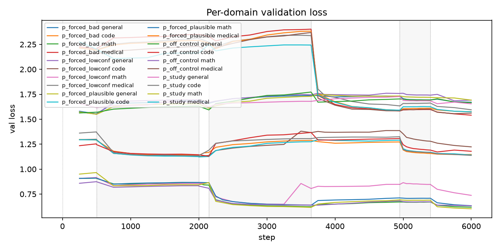
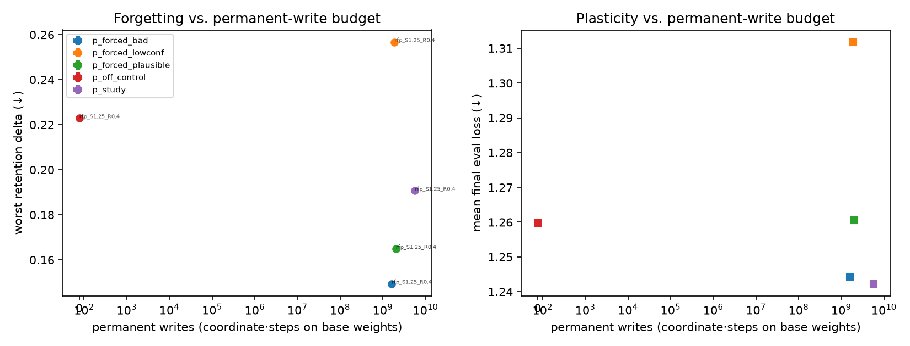
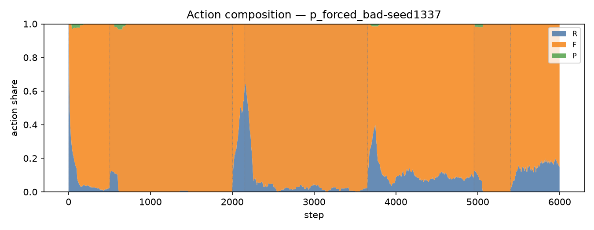
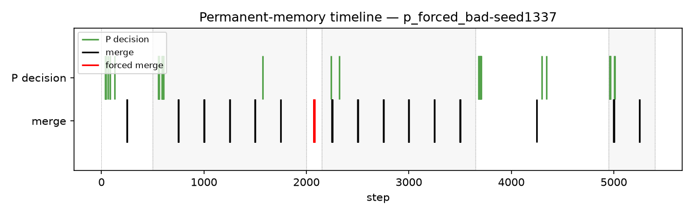
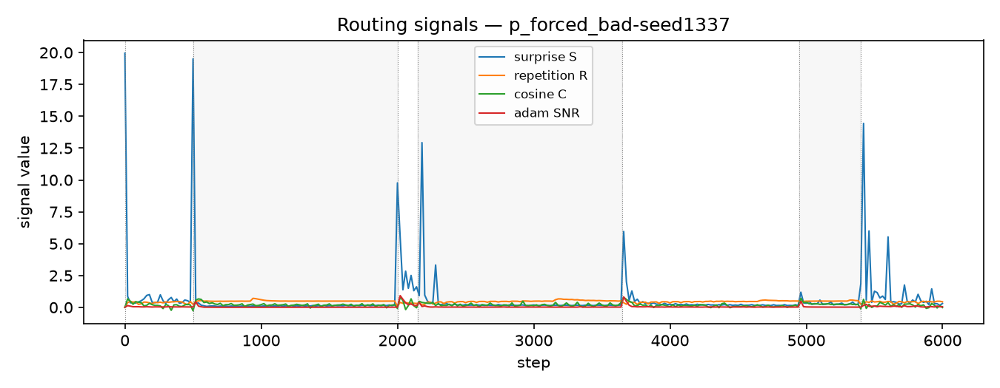
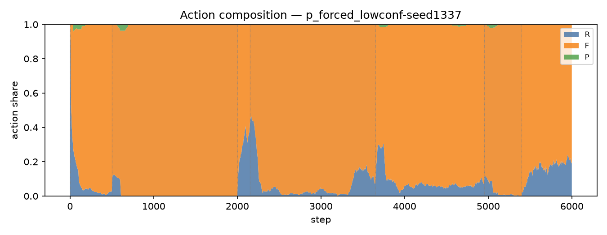
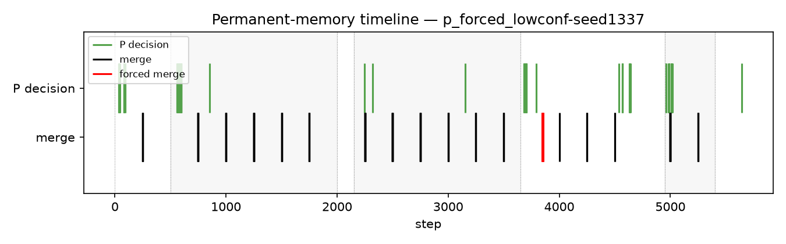
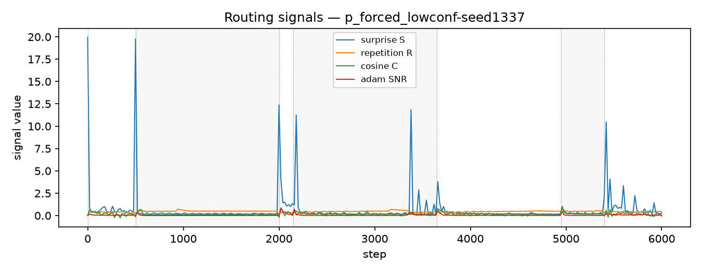
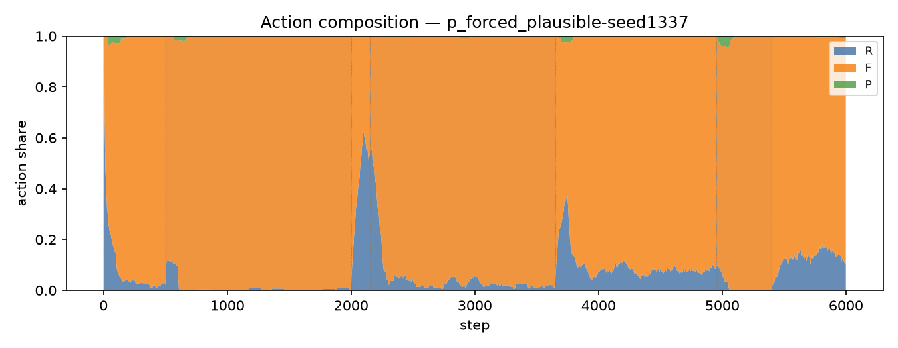
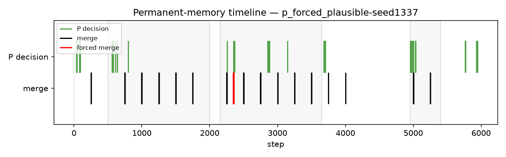
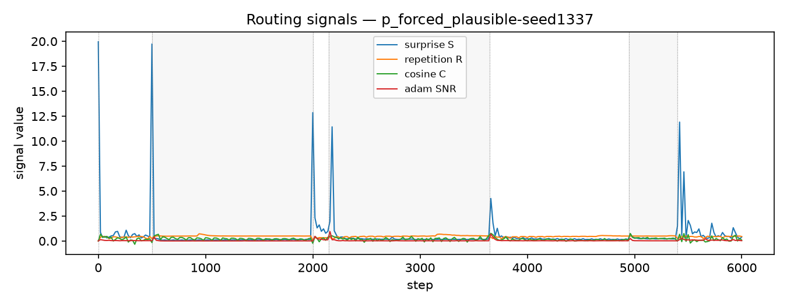
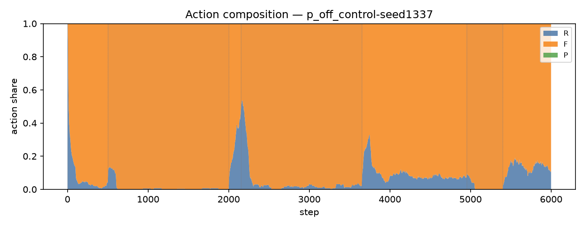
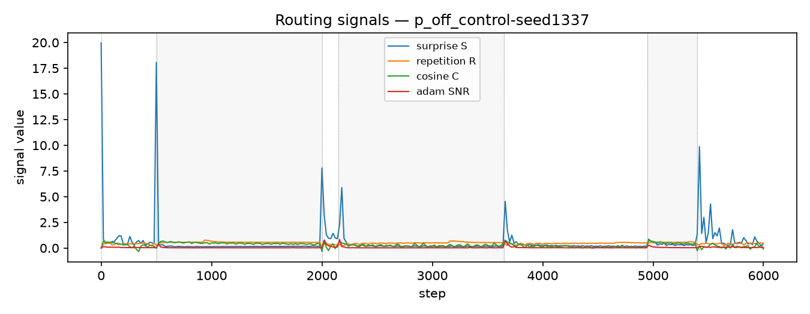
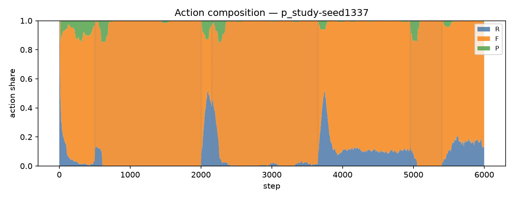
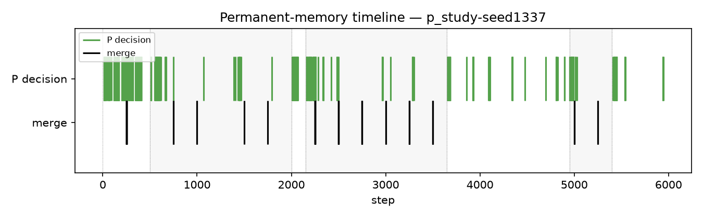
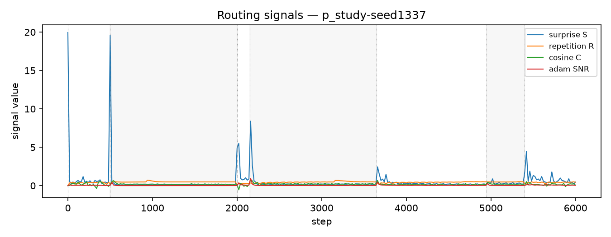
