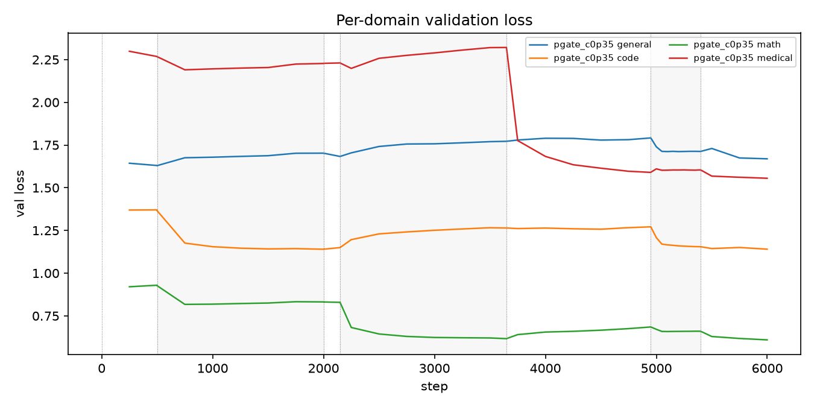
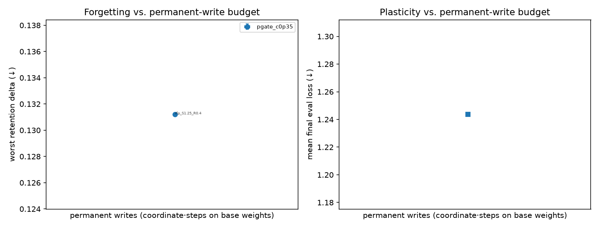
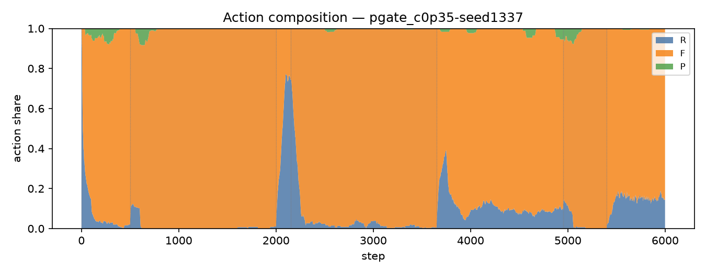
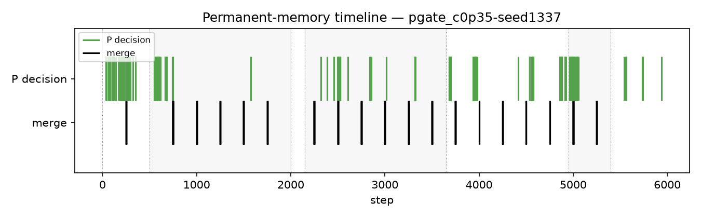
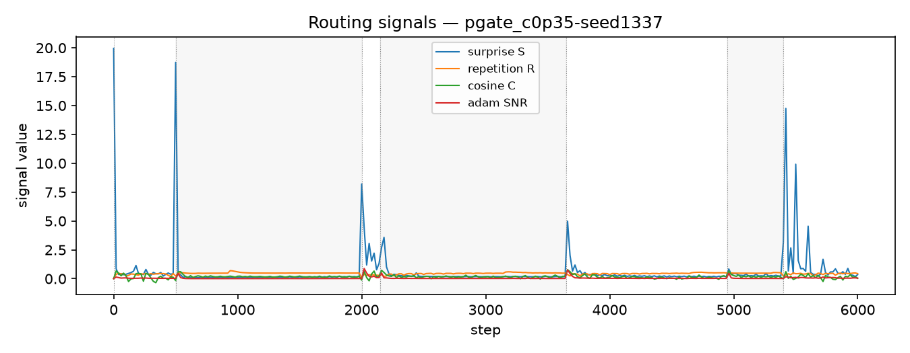

# Report — priority_s1_v1_live

1 runs: pgate_c0p35-seed1337

## forgetting_table

| spec_id     |   final_loss_general_mean |   final_loss_general_std |   final_loss_code_mean |   final_loss_code_std |   final_loss_math_mean |   final_loss_math_std |   final_loss_medical_mean |   final_loss_medical_std |   final_em_code_mean |   final_em_code_std |   final_em_math_mean |   final_em_math_std |   final_em_medical_mean |   final_em_medical_std |   worst_retention_delta_general_mean |   worst_retention_delta_general_std |   worst_retention_delta_code_mean |   worst_retention_delta_code_std |   worst_retention_delta_math_mean |   worst_retention_delta_math_std |   worst_retention_delta_medical_mean |   worst_retention_delta_medical_std |   wall_clock_s_mean |   wall_clock_s_std |   tokens_per_sec_mean |   tokens_per_sec_std |   peak_mem_gb_mean |   peak_mem_gb_std |   controller_fraction_mean |   controller_fraction_std |   r_count_mean |   r_count_std |   f_count_mean |   f_count_std |   p_count_mean |   p_count_std |   consolidations_mean |   consolidations_std |
|:------------|--------------------------:|-------------------------:|-----------------------:|----------------------:|-----------------------:|----------------------:|--------------------------:|-------------------------:|---------------------:|--------------------:|---------------------:|--------------------:|------------------------:|-----------------------:|-------------------------------------:|------------------------------------:|----------------------------------:|---------------------------------:|----------------------------------:|---------------------------------:|-------------------------------------:|------------------------------------:|--------------------:|-------------------:|----------------------:|---------------------:|-------------------:|------------------:|---------------------------:|--------------------------:|---------------:|--------------:|---------------:|--------------:|---------------:|--------------:|----------------------:|---------------------:|
| pgate_c0p35 |                    1.6693 |                      nan |                 1.1404 |                   nan |                 0.6094 |                   nan |                    1.5554 |                      nan |               0.0938 |                 nan |               0.0625 |                 nan |                  0.0156 |                    nan |                               0.1084 |                                 nan |                            0.1312 |                              nan |                            0.0683 |                              nan |                               0.0146 |                                 nan |              2327.6 |                nan |               2003.27 |                  nan |            29.3007 |               nan |                     0.1981 |                       nan |           2611 |           nan |          34841 |           nan |            312 |           nan |                   239 |                  nan |

## action_share_by_phase

| spec_id     | phase             |   r_share_mean |   r_share_std |   f_share_mean |   f_share_std |   p_share_mean |   p_share_std |   mean_coords_opened_mean |   mean_coords_opened_std |
|:------------|:------------------|---------------:|--------------:|---------------:|--------------:|---------------:|--------------:|--------------------------:|-------------------------:|
| pgate_c0p35 | code_recurrent    |         0.8444 |           nan |        98.5    |           nan |         0.6556 |           nan |                   48933.5 |                      nan |
| pgate_c0p35 | code_revisit      |         1.7037 |           nan |        96.5556 |           nan |         1.7407 |           nan |                  140975   |                      nan |
| pgate_c0p35 | general_warm      |         4.7333 |           nan |        92.2    |           nan |         3.0667 |           nan |                  223347   |                      nan |
| pgate_c0p35 | math_recurrent    |         2.5    |           nan |        97.2778 |           nan |         0.2222 |           nan |                   19223.9 |                      nan |
| pgate_c0p35 | medical_recurrent |        11.6282 |           nan |        87.2692 |           nan |         1.1026 |           nan |                  100018   |                      nan |
| pgate_c0p35 | mixed_tail        |        15.5    |           nan |        84.2778 |           nan |         0.2222 |           nan |                   20971.5 |                      nan |
| pgate_c0p35 | novel_inject      |        73      |           nan |        27      |           nan |         0      |           nan |                       0   |                      nan |

## ablation_deltas

_no data_

## p_selection_stats

| spec_id     |   seed |   p_decisions |   consolidations |   forced_consolidations |   first_p_step |   first_merge_step |   mean_S_at_P |   mean_C_at_P |   mean_V_at_P |   mean_R_at_P |
|:------------|-------:|--------------:|-----------------:|------------------------:|---------------:|-------------------:|--------------:|--------------:|--------------:|--------------:|
| pgate_c0p35 |   1337 |           312 |              239 |                       0 |             36 |                250 |        0.3832 |        0.5593 |        0.1577 |        0.5324 |

## replay_timing

| spec_id     |   seed |   replays |   delay_median_steps |   delay_p90_steps |   cross_phase_share |   cross_phase_replays |   replays_in_medical_recurrent |   replays_in_mixed_tail |   replays_in_general_warm |   replays_in_math_recurrent |   replays_in_code_revisit |   replays_in_code_recurrent |
|:------------|-------:|----------:|---------------------:|------------------:|--------------------:|----------------------:|-------------------------------:|------------------------:|--------------------------:|----------------------------:|--------------------------:|----------------------------:|
| pgate_c0p35 |   1337 |       294 |                   89 |             413.5 |              0.0612 |                    18 |                            123 |                      84 |                        42 |                          28 |                        10 |                           7 |

## adapter_reuse_aulc

| spec_id     | phase          |   aulc_mean |   aulc_std |   final_loss_mean |   final_loss_std |
|:------------|:---------------|------------:|-----------:|------------------:|-----------------:|
| pgate_c0p35 | math_recurrent |      1.5677 |        nan |            1.5315 |              nan |

## damage_recovery

_no data_

## budget_curve

| spec_id     | threshold_tag   |   permanent_writes_mean |   permanent_writes_std |   p_action_coords_mean |   p_action_coords_std |   merged_coords_mean |   merged_coords_std |   active_fraction_mean_mean |   active_fraction_mean_std |   replayed_total_mean |   replayed_total_std |   worst_retention_delta_mean |   worst_retention_delta_std |   mean_retention_delta_mean |   mean_retention_delta_std |   final_loss_general_mean |   final_loss_general_std |   final_loss_code_mean |   final_loss_code_std |   final_loss_math_mean |   final_loss_math_std |   final_loss_medical_mean |   final_loss_medical_std |   steps_to_recover_code_mean |   steps_to_recover_code_std |
|:------------|:----------------|------------------------:|-----------------------:|-----------------------:|----------------------:|---------------------:|--------------------:|----------------------------:|---------------------------:|----------------------:|---------------------:|-----------------------------:|----------------------------:|----------------------------:|---------------------------:|--------------------------:|-------------------------:|-----------------------:|----------------------:|-----------------------:|----------------------:|--------------------------:|-------------------------:|-----------------------------:|----------------------------:|
| pgate_c0p35 | rfp_S1.25_R0.4  |             4.35054e+09 |                    nan |            2.51973e+09 |                   nan |          1.83081e+09 |                 nan |                       0.001 |                        nan |                   294 |                  nan |                       0.1312 |                         nan |                       0.069 |                        nan |                    1.6693 |                      nan |                 1.1404 |                   nan |                 0.6094 |                   nan |                    1.5554 |                      nan |                          100 |                         nan |

## teacher_attribution

| run                  | spec_id     |   seed | teacher            | phase             |   R_count |   F_count |   P_count |   replay_count |   coords_opened_F |   coords_opened_P |   consolidations_attributed |   merged_coords_attributed |
|:---------------------|:------------|-------:|:-------------------|:------------------|----------:|----------:|----------:|---------------:|------------------:|------------------:|----------------------------:|---------------------------:|
| pgate_c0p35-seed1337 | pgate_c0p35 |   1337 | general_teacher_hf | general_warm      |       142 |      2766 |        92 |            252 |          21921792 |         670040064 |                      3      |                1.88744e+07 |
| pgate_c0p35-seed1337 | pgate_c0p35 |   1337 | code_teacher_hf    | code_recurrent    |        76 |      8865 |        59 |             42 |           3670016 |         440401920 |                      2.0178 |                1.37395e+07 |
| pgate_c0p35-seed1337 | pgate_c0p35 |   1337 | general_teacher_hf | novel_inject      |       657 |       243 |         0 |              0 |                 0 |                 0 |                      0      |                0           |
| pgate_c0p35-seed1337 | pgate_c0p35 |   1337 | math_teacher_hf    | math_recurrent    |       225 |      8755 |        20 |            168 |          14417920 |         173015040 |                     13      |                1.06955e+08 |
| pgate_c0p35-seed1337 | pgate_c0p35 |   1337 | medical_teacher_hf | medical_recurrent |       907 |      6807 |        86 |            738 |          63094784 |         780140544 |                      8.5944 |                6.03628e+07 |
| pgate_c0p35-seed1337 | pgate_c0p35 |   1337 | code_teacher_hf    | code_revisit      |        46 |      2607 |        47 |             60 |           5210112 |         380633088 |                      1.4368 |                1.05868e+07 |
| pgate_c0p35-seed1337 | pgate_c0p35 |   1337 | medical_teacher_hf | mixed_tail        |       141 |       777 |         0 |            264 |          23117824 |                 0 |                      0      |                0           |
| pgate_c0p35-seed1337 | pgate_c0p35 |   1337 | general_teacher_hf | mixed_tail        |       397 |       424 |         1 |            198 |          17252352 |           9437184 |                      0      |                0           |
| pgate_c0p35-seed1337 | pgate_c0p35 |   1337 | math_teacher_hf    | mixed_tail        |        20 |       951 |         7 |             42 |           3653632 |          66060288 |                      0      |                0           |
| pgate_c0p35-seed1337 | pgate_c0p35 |   1337 | code_teacher_hf    | mixed_tail        |         0 |       882 |         0 |              0 |                 0 |                 0 |                      0      |                0           |
| pgate_c0p35-seed1337 | pgate_c0p35 |   1337 | general_teacher_hf | code_recurrent    |         0 |         0 |         0 |              0 |                 0 |                 0 |                      8.9822 |                6.49037e+07 |
| pgate_c0p35-seed1337 | pgate_c0p35 |   1337 | math_teacher_hf    | medical_recurrent |         0 |         0 |         0 |              0 |                 0 |                 0 |                      1.4056 |                8.84318e+06 |
| pgate_c0p35-seed1337 | pgate_c0p35 |   1337 | medical_teacher_hf | code_revisit      |         0 |         0 |         0 |              0 |                 0 |                 0 |                      8.3523 |                5.72925e+07 |
| pgate_c0p35-seed1337 | pgate_c0p35 |   1337 | math_teacher_hf    | code_revisit      |         0 |         0 |         0 |              0 |                 0 |                 0 |                      0.2109 |                1.32672e+06 |

## containment

_no data_

## Figures

