# Report — priority_s2_v1_live

6 runs: molf_style_a0p7-seed2024, molf_style_a0p7-seed7, no_cosine-seed2024, no_cosine-seed7, surprise_gate_s4-seed2024, surprise_gate_s4-seed7

## forgetting_table

| spec_id          |   final_loss_general_mean |   final_loss_general_std |   final_loss_code_mean |   final_loss_code_std |   final_loss_math_mean |   final_loss_math_std |   final_loss_medical_mean |   final_loss_medical_std |   final_em_code_mean |   final_em_code_std |   final_em_math_mean |   final_em_math_std |   final_em_medical_mean |   final_em_medical_std |   worst_retention_delta_general_mean |   worst_retention_delta_general_std |   worst_retention_delta_code_mean |   worst_retention_delta_code_std |   worst_retention_delta_math_mean |   worst_retention_delta_math_std |   worst_retention_delta_medical_mean |   worst_retention_delta_medical_std |   wall_clock_s_mean |   wall_clock_s_std |   tokens_per_sec_mean |   tokens_per_sec_std |   peak_mem_gb_mean |   peak_mem_gb_std |   controller_fraction_mean |   controller_fraction_std |   r_count_mean |   r_count_std |   f_count_mean |   f_count_std |   p_count_mean |   p_count_std |   consolidations_mean |   consolidations_std |
|:-----------------|--------------------------:|-------------------------:|-----------------------:|----------------------:|-----------------------:|----------------------:|--------------------------:|-------------------------:|---------------------:|--------------------:|---------------------:|--------------------:|------------------------:|-----------------------:|-------------------------------------:|------------------------------------:|----------------------------------:|---------------------------------:|----------------------------------:|---------------------------------:|-------------------------------------:|------------------------------------:|--------------------:|-------------------:|----------------------:|---------------------:|-------------------:|------------------:|---------------------------:|--------------------------:|---------------:|--------------:|---------------:|--------------:|---------------:|--------------:|----------------------:|---------------------:|
| molf_style_a0p7  |                    1.637  |                   0.0103 |                 1.1975 |                0.0003 |                 0.6288 |                0.021  |                    1.5733 |                   0.0164 |               0.1094 |              0.0442 |               0.0391 |              0.011  |                  0.0156 |                  0     |                               0.0907 |                              0.0374 |                            0.2724 |                           0.0235 |                            0.0336 |                           0.0071 |                               0.0127 |                              0.0026 |             5188.14 |           107.768  |               888.587 |              21.698  |            28.8174 |            0.0022 |                     0.4759 |                    0.0473 |            0   |        0      |        35943   |       21.2132 |             57 |       21.2132 |                   0   |               0      |
| no_cosine        |                    1.745  |                   0.0437 |                 1.1328 |                0.0215 |                 0.6403 |                0.0093 |                    1.5983 |                   0.0051 |               0.1641 |              0.0552 |               0.0469 |              0.0221 |                  0.0078 |                  0.011 |                               0.1713 |                              0.0244 |                            0.3198 |                           0.0252 |                            0.1177 |                           0.0062 |                               0.0508 |                              0.0163 |             4921.73 |            28.8385 |               936.453 |               2.0714 |            29.2983 |            0.0004 |                     0.4356 |                    0.0006 |         2860.5 |       81.3173 |        32546.5 |      354.26   |           2516 |      446.892  |                1005.5 |               4.9497 |
| surprise_gate_s4 |                    1.6427 |                   0.0075 |                 1.1864 |                0.0156 |                 0.6366 |                0.0124 |                    1.5754 |                   0.0115 |               0.1172 |              0.011  |               0.0391 |              0.011  |                  0.0312 |                  0     |                               0.1058 |                              0.0142 |                            0.1282 |                           0.0079 |                            0.0464 |                           0.0146 |                               0.0169 |                              0.0067 |             5304.45 |           151.222  |               869.28  |              27.9511 |            29.3006 |            0.0017 |                     0.4473 |                    0.0148 |          830   |       39.598  |        35977   |       43.8406 |              0 |        0      |                   0   |               0      |

## action_share_by_phase

| spec_id          | phase             |   r_share_mean |   r_share_std |   f_share_mean |   f_share_std |   p_share_mean |   p_share_std |   mean_coords_opened_mean |   mean_coords_opened_std |
|:-----------------|:------------------|---------------:|--------------:|---------------:|--------------:|---------------:|--------------:|--------------------------:|-------------------------:|
| molf_style_a0p7  | code_recurrent    |         0      |        0      |        99.9333 |        0      |         0.0667 |        0      |             4727.69       |                  754.328 |
| molf_style_a0p7  | code_revisit      |         0      |        0      |       100      |        0      |         0      |        0      |                0          |                    0     |
| molf_style_a0p7  | general_warm      |         0      |        0      |        99.95   |        0.0236 |         0.05   |        0.0236 |             4194.3        |                 1482.91  |
| molf_style_a0p7  | math_recurrent    |         0      |        0      |        99.8278 |        0.0079 |         0.1722 |        0.0079 |            12233.4        |                  494.303 |
| molf_style_a0p7  | medical_recurrent |         0      |        0      |        99.9487 |        0.0544 |         0.0513 |        0.0544 |             4032.98       |                 4562.8   |
| molf_style_a0p7  | mixed_tail        |         0      |        0      |        99.6528 |        0.3339 |         0.3472 |        0.3339 |            23604.3        |                18520.3   |
| molf_style_a0p7  | novel_inject      |         0      |        0      |        98.0556 |        0.55   |         1.9444 |        0.55   |           136424          |                54527.9   |
| no_cosine        | code_recurrent    |         0.7278 |        0.0864 |        92.7889 |        0.6285 |         6.4833 |        0.5421 |           459276          |                34601.2   |
| no_cosine        | code_revisit      |         1.6111 |        0.0786 |        81.2778 |        1.0214 |        17.1111 |        1.0999 |                1.2647e+06 |                53549.5   |
| no_cosine        | general_warm      |         4.6667 |        0      |        88.6833 |        3.2291 |         6.65   |        3.2291 |           519569          |               245422     |
| no_cosine        | math_recurrent    |         2.2222 |        0.8014 |        94.2389 |        2.6634 |         3.5389 |        1.862  |           295524          |               141618     |
| no_cosine        | medical_recurrent |        15.0577 |        1.7496 |        73.2179 |        4.0432 |        11.7244 |        2.2936 |           881812          |               177664     |
| no_cosine        | mixed_tail        |        16.1528 |        0.5303 |        82.7917 |        0.0982 |         1.0556 |        0.6285 |            91750.4        |                54373.4   |
| no_cosine        | novel_inject      |        72.8333 |       10.9209 |        27.1667 |       10.9209 |         0      |        0      |                0          |                    0     |
| surprise_gate_s4 | code_recurrent    |         0.2944 |        0.0393 |        99.7056 |        0.0393 |         0      |        0      |                0          |                    0     |
| surprise_gate_s4 | code_revisit      |         0.1667 |        0.0262 |        99.8333 |        0.0262 |         0      |        0      |                0          |                    0     |
| surprise_gate_s4 | general_warm      |         1.5667 |        0.1886 |        98.4333 |        0.1886 |         0      |        0      |                0          |                    0     |
| surprise_gate_s4 | math_recurrent    |         0.9333 |        0.0786 |        99.0667 |        0.0786 |         0      |        0      |                0          |                    0     |
| surprise_gate_s4 | medical_recurrent |         2.6795 |        1.1422 |        97.3205 |        1.1422 |         0      |        0      |                0          |                    0     |
| surprise_gate_s4 | mixed_tail        |         9.2639 |        1.4339 |        90.7361 |        1.4339 |         0      |        0      |                0          |                    0     |
| surprise_gate_s4 | novel_inject      |        13.9444 |        1.1785 |        86.0556 |        1.1785 |         0      |        0      |                0          |                    0     |

## ablation_deltas

_no data_

## p_selection_stats

| spec_id          |   seed |   p_decisions |   consolidations |   forced_consolidations |   first_p_step |   first_merge_step |   mean_S_at_P |   mean_C_at_P |   mean_V_at_P |   mean_R_at_P |
|:-----------------|-------:|--------------:|-----------------:|------------------------:|---------------:|-------------------:|--------------:|--------------:|--------------:|--------------:|
| molf_style_a0p7  |   2024 |            42 |                0 |                       0 |              1 |                nan |        4.6827 |        0.4809 |        0.9145 |        0.2942 |
| molf_style_a0p7  |      7 |            72 |                0 |                       0 |              1 |                nan |        5.4001 |        0.3799 |        1.4793 |        0.3639 |
| no_cosine        |   2024 |          2832 |             1002 |                       0 |             39 |                250 |        0.3778 |        0.5    |        0.1228 |        0.5447 |
| no_cosine        |      7 |          2200 |             1009 |                       0 |             34 |                250 |        0.333  |        0.5    |        0.1277 |        0.5449 |
| surprise_gate_s4 |   2024 |             0 |                0 |                       0 |            nan |                nan |      nan      |      nan      |      nan      |      nan      |
| surprise_gate_s4 |      7 |             0 |                0 |                       0 |            nan |                nan |      nan      |      nan      |      nan      |      nan      |

## replay_timing

| spec_id          |   seed |   replays |   delay_median_steps |   delay_p90_steps |   cross_phase_share |   cross_phase_replays |   replays_in_mixed_tail |   replays_in_medical_recurrent |   replays_in_general_warm |   replays_in_math_recurrent |   replays_in_code_revisit |   replays_in_code_recurrent |
|:-----------------|-------:|----------:|---------------------:|------------------:|--------------------:|----------------------:|------------------------:|-------------------------------:|--------------------------:|----------------------------:|--------------------------:|----------------------------:|
| no_cosine        |   2024 |       341 |                123   |             749   |              0.1437 |                    49 |                     134 |                            122 |                        42 |                          26 |                        10 |                           7 |
| no_cosine        |      7 |       300 |                 76   |             478.8 |              0.0667 |                    20 |                      92 |                            132 |                        43 |                          16 |                         9 |                           8 |
| surprise_gate_s4 |   2024 |       134 |                100.5 |            1948.8 |              0.1567 |                    21 |                      74 |                             36 |                         6 |                          10 |                         2 |                           6 |
| surprise_gate_s4 |      7 |       135 |                 94   |            2978.6 |              0.1407 |                    19 |                      86 |                             23 |                        10 |                          10 |                         2 |                           4 |

## adapter_reuse_aulc

| spec_id          | phase          |   aulc_mean |   aulc_std |   final_loss_mean |   final_loss_std |
|:-----------------|:---------------|------------:|-----------:|------------------:|-----------------:|
| molf_style_a0p7  | math_recurrent |      1.5885 |     0.0236 |            1.4569 |           0.0451 |
| no_cosine        | math_recurrent |      1.3592 |     0.0352 |            1.1309 |           0.0725 |
| surprise_gate_s4 | math_recurrent |      1.6093 |     0.0481 |            1.4684 |           0.0102 |

## damage_recovery

_no data_

## budget_curve

| spec_id          | threshold_tag      |   permanent_writes_mean |   permanent_writes_std |   p_action_coords_mean |   p_action_coords_std |   merged_coords_mean |   merged_coords_std |   active_fraction_mean_mean |   active_fraction_mean_std |   replayed_total_mean |   replayed_total_std |   worst_retention_delta_mean |   worst_retention_delta_std |   mean_retention_delta_mean |   mean_retention_delta_std |   final_loss_general_mean |   final_loss_general_std |   final_loss_code_mean |   final_loss_code_std |   final_loss_math_mean |   final_loss_math_std |   final_loss_medical_mean |   final_loss_medical_std |   steps_to_recover_code_mean |   steps_to_recover_code_std |
|:-----------------|:-------------------|------------------------:|-----------------------:|-----------------------:|----------------------:|---------------------:|--------------------:|----------------------------:|---------------------------:|----------------------:|---------------------:|-----------------------------:|----------------------------:|----------------------------:|---------------------------:|--------------------------:|-------------------------:|-----------------------:|----------------------:|-----------------------:|----------------------:|--------------------------:|-------------------------:|-----------------------------:|----------------------------:|
| molf_style_a0p7  | adam_score_A0.7    |             4.04226e+08 |            1.49032e+08 |            4.04226e+08 |           1.49032e+08 |          0           |         0           |                      0.0001 |                     0.0001 |                   0   |               0      |                       0.2724 |                      0.0235 |                      0.0899 |                     0.0034 |                    1.637  |                   0.0103 |                 1.1975 |                0.0003 |                 0.6288 |                0.021  |                    1.5733 |                   0.0164 |                          nan |                     nan     |
| no_cosine        | rfp_S1.25_R0.4     |             2.6874e+10  |            3.38993e+09 |            1.8975e+10  |           3.42552e+09 |          7.89892e+09 |         3.55898e+07 |                      0.0071 |                     0.0013 |                 320.5 |              28.9914 |                       0.3198 |                      0.0252 |                      0.122  |                     0.0071 |                    1.745  |                   0.0437 |                 1.1328 |                0.0215 |                 0.6403 |                0.0093 |                    1.5983 |                   0.0051 |                          225 |                     106.066 |
| surprise_gate_s4 | surprise_only_S4.0 |             0           |            0           |            0           |           0           |          0           |         0           |                      0      |                     0      |                 134.5 |               0.7071 |                       0.1282 |                      0.0079 |                      0.0658 |                     0.0042 |                    1.6427 |                   0.0075 |                 1.1864 |                0.0156 |                 0.6366 |                0.0124 |                    1.5754 |                   0.0115 |                           50 |                       0     |

## teacher_attribution

| run                       | spec_id          |   seed | teacher            | phase             |   R_count |   F_count |   P_count |   replay_count |   coords_opened_F |   coords_opened_P |   consolidations_attributed |   merged_coords_attributed |
|:--------------------------|:-----------------|-------:|:-------------------|:------------------|----------:|----------:|----------:|---------------:|------------------:|------------------:|----------------------------:|---------------------------:|
| molf_style_a0p7-seed2024  | molf_style_a0p7  |   2024 | general_teacher_hf | general_warm      |         0 |      2998 |         2 |              0 |                 0 |          15728640 |                      0      |                0           |
| molf_style_a0p7-seed2024  | molf_style_a0p7  |   2024 | code_teacher_hf    | code_recurrent    |         0 |      8994 |         6 |              0 |                 0 |          37748736 |                      0      |                0           |
| molf_style_a0p7-seed2024  | molf_style_a0p7  |   2024 | general_teacher_hf | novel_inject      |         0 |       886 |        14 |              0 |                 0 |          88080384 |                      0      |                0           |
| molf_style_a0p7-seed2024  | molf_style_a0p7  |   2024 | math_teacher_hf    | math_recurrent    |         0 |      8985 |        15 |              0 |                 0 |         113246208 |                      0      |                0           |
| molf_style_a0p7-seed2024  | molf_style_a0p7  |   2024 | medical_teacher_hf | medical_recurrent |         0 |      7799 |         1 |              0 |                 0 |           6291456 |                      0      |                0           |
| molf_style_a0p7-seed2024  | molf_style_a0p7  |   2024 | code_teacher_hf    | code_revisit      |         0 |      2700 |         0 |              0 |                 0 |                 0 |                      0      |                0           |
| molf_style_a0p7-seed2024  | molf_style_a0p7  |   2024 | medical_teacher_hf | mixed_tail        |         0 |       929 |         1 |              0 |                 0 |           9437184 |                      0      |                0           |
| molf_style_a0p7-seed2024  | molf_style_a0p7  |   2024 | general_teacher_hf | mixed_tail        |         0 |       911 |         1 |              0 |                 0 |           9437184 |                      0      |                0           |
| molf_style_a0p7-seed2024  | molf_style_a0p7  |   2024 | code_teacher_hf    | mixed_tail        |         0 |       864 |         0 |              0 |                 0 |                 0 |                      0      |                0           |
| molf_style_a0p7-seed2024  | molf_style_a0p7  |   2024 | math_teacher_hf    | mixed_tail        |         0 |       892 |         2 |              0 |             81920 |          18874368 |                      0      |                0           |
| molf_style_a0p7-seed7     | molf_style_a0p7  |      7 | general_teacher_hf | general_warm      |         0 |      2999 |         1 |              0 |                 0 |           9437184 |                      0      |                0           |
| molf_style_a0p7-seed7     | molf_style_a0p7  |      7 | code_teacher_hf    | code_recurrent    |         0 |      8994 |         6 |              0 |            163840 |          47185920 |                      0      |                0           |
| molf_style_a0p7-seed7     | molf_style_a0p7  |      7 | general_teacher_hf | novel_inject      |         0 |       879 |        21 |              0 |            196608 |         157286400 |                      0      |                0           |
| molf_style_a0p7-seed7     | molf_style_a0p7  |      7 | math_teacher_hf    | math_recurrent    |         0 |      8984 |        16 |              0 |                 0 |         106954752 |                      0      |                0           |
| molf_style_a0p7-seed7     | molf_style_a0p7  |      7 | medical_teacher_hf | medical_recurrent |         0 |      7793 |         7 |              0 |                 0 |          56623104 |                      0      |                0           |
| molf_style_a0p7-seed7     | molf_style_a0p7  |      7 | code_teacher_hf    | code_revisit      |         0 |      2700 |         0 |              0 |                 0 |                 0 |                      0      |                0           |
| molf_style_a0p7-seed7     | molf_style_a0p7  |      7 | math_teacher_hf    | mixed_tail        |         0 |       943 |         5 |              0 |                 0 |          31457280 |                      0      |                0           |
| molf_style_a0p7-seed7     | molf_style_a0p7  |      7 | code_teacher_hf    | mixed_tail        |         0 |       851 |         7 |              0 |                 0 |          44040192 |                      0      |                0           |
| molf_style_a0p7-seed7     | molf_style_a0p7  |      7 | medical_teacher_hf | mixed_tail        |         0 |       882 |         6 |              0 |                 0 |          37748736 |                      0      |                0           |
| molf_style_a0p7-seed7     | molf_style_a0p7  |      7 | general_teacher_hf | mixed_tail        |         0 |       903 |         3 |              0 |                 0 |          18874368 |                      0      |                0           |
| no_cosine-seed2024        | no_cosine        |   2024 | general_teacher_hf | general_warm      |       140 |      2592 |       268 |            252 |          21626880 |        2079326208 |                      1      |                6.29146e+06 |
| no_cosine-seed2024        | no_cosine        |   2024 | code_teacher_hf    | code_recurrent    |        60 |      8391 |       549 |             42 |           3637248 |        3913285632 |                      1.6146 |                1.14351e+07 |
| no_cosine-seed2024        | no_cosine        |   2024 | general_teacher_hf | novel_inject      |       586 |       314 |         0 |              0 |                 0 |                 0 |                      0      |                0           |
| no_cosine-seed2024        | no_cosine        |   2024 | math_teacher_hf    | math_recurrent    |       251 |      8312 |       437 |            156 |          13336576 |        3560964096 |                     46      |                3.17719e+08 |
| no_cosine-seed2024        | no_cosine        |   2024 | medical_teacher_hf | medical_recurrent |      1271 |      5488 |      1041 |            732 |          63143936 |        7858028544 |                     70.0708 |                4.9726e+08  |
| no_cosine-seed2024        | no_cosine        |   2024 | code_teacher_hf    | code_revisit      |        42 |      2175 |       483 |             60 |           5390336 |        3516923904 |                      4.9292 |                3.77724e+07 |
| no_cosine-seed2024        | no_cosine        |   2024 | medical_teacher_hf | mixed_tail        |       124 |       800 |         6 |            414 |          35618816 |          50331648 |                     13.7499 |                9.3145e+07  |
| no_cosine-seed2024        | no_cosine        |   2024 | general_teacher_hf | mixed_tail        |       423 |       481 |         8 |            330 |          28590080 |          62914560 |                      4.4462 |                3.20155e+07 |
| no_cosine-seed2024        | no_cosine        |   2024 | code_teacher_hf    | mixed_tail        |         0 |       839 |        25 |              0 |                 0 |         217055232 |                      0      |                0           |
| no_cosine-seed2024        | no_cosine        |   2024 | math_teacher_hf    | mixed_tail        |        21 |       858 |        15 |             60 |           5193728 |         138412032 |                      3.8039 |                2.58345e+07 |
| no_cosine-seed2024        | no_cosine        |   2024 | general_teacher_hf | code_recurrent    |         0 |         0 |         0 |              0 |                 0 |                 0 |                     14.3854 |                1.04957e+08 |
| no_cosine-seed2024        | no_cosine        |   2024 | math_teacher_hf    | medical_recurrent |         0 |         0 |         0 |              0 |                 0 |                 0 |                      1.9292 |                1.54932e+07 |
| no_cosine-seed2024        | no_cosine        |   2024 | medical_teacher_hf | code_revisit      |         0 |         0 |         0 |              0 |                 0 |                 0 |                     13.0708 |                9.12025e+07 |
| no_cosine-seed7           | no_cosine        |      7 | general_teacher_hf | general_warm      |       140 |      2729 |       131 |            258 |          22298624 |        1038090240 |                     14      |                1.00663e+08 |
| no_cosine-seed7           | no_cosine        |      7 | code_teacher_hf    | code_recurrent    |        71 |      8311 |       618 |             48 |           4243456 |        4353687552 |                      4.1029 |                3.10563e+07 |
| no_cosine-seed7           | no_cosine        |      7 | general_teacher_hf | novel_inject      |       725 |       175 |         0 |              0 |                 0 |                 0 |                      0      |                0           |
| no_cosine-seed7           | no_cosine        |      7 | math_teacher_hf    | math_recurrent    |       149 |      8651 |       200 |             96 |           8306688 |        1758461952 |                     39      |                2.76824e+08 |
| no_cosine-seed7           | no_cosine        |      7 | medical_teacher_hf | medical_recurrent |      1078 |      5934 |       788 |            792 |          68141056 |        5898240000 |                     60.6697 |                4.28744e+08 |
| no_cosine-seed7           | no_cosine        |      7 | code_teacher_hf    | code_revisit      |        45 |      2214 |       441 |             54 |           4767744 |        3312451584 |                      7.6308 |                5.47295e+07 |
| no_cosine-seed7           | no_cosine        |      7 | math_teacher_hf    | mixed_tail        |         5 |       935 |         8 |             24 |           2080768 |          69206016 |                      1.4006 |                1.24163e+07 |
| no_cosine-seed7           | no_cosine        |      7 | code_teacher_hf    | mixed_tail        |         0 |       849 |         9 |              0 |                 0 |          75497472 |                      0      |                0           |
| no_cosine-seed7           | no_cosine        |      7 | medical_teacher_hf | mixed_tail        |       147 |       738 |         3 |            336 |          28688384 |          28311552 |                      9.2744 |                6.32647e+07 |
| no_cosine-seed7           | no_cosine        |      7 | general_teacher_hf | mixed_tail        |       443 |       461 |         2 |            192 |          16613376 |          18874368 |                      2.325  |                1.55451e+07 |
| no_cosine-seed7           | no_cosine        |      7 | general_teacher_hf | code_recurrent    |         0 |         0 |         0 |              0 |                 0 |                 0 |                     10.8971 |                7.58985e+07 |
| no_cosine-seed7           | no_cosine        |      7 | math_teacher_hf    | medical_recurrent |         0 |         0 |         0 |              0 |                 0 |                 0 |                      1.3303 |                8.51224e+06 |
| no_cosine-seed7           | no_cosine        |      7 | medical_teacher_hf | code_revisit      |         0 |         0 |         0 |              0 |                 0 |                 0 |                     11.3692 |                8.05368e+07 |
| surprise_gate_s4-seed2024 | surprise_gate_s4 |   2024 | general_teacher_hf | general_warm      |        43 |      2957 |         0 |             36 |           3096576 |                 0 |                      0      |                0           |
| surprise_gate_s4-seed2024 | surprise_gate_s4 |   2024 | code_teacher_hf    | code_recurrent    |        29 |      8971 |         0 |             36 |           3162112 |                 0 |                      0      |                0           |
| surprise_gate_s4-seed2024 | surprise_gate_s4 |   2024 | general_teacher_hf | novel_inject      |       133 |       767 |         0 |              0 |                 0 |                 0 |                      0      |                0           |
| surprise_gate_s4-seed2024 | surprise_gate_s4 |   2024 | math_teacher_hf    | math_recurrent    |        79 |      8921 |         0 |             60 |           5210112 |                 0 |                      0      |                0           |
| surprise_gate_s4-seed2024 | surprise_gate_s4 |   2024 | medical_teacher_hf | medical_recurrent |       272 |      7528 |         0 |            216 |          18661376 |                 0 |                      0      |                0           |
| surprise_gate_s4-seed2024 | surprise_gate_s4 |   2024 | code_teacher_hf    | code_revisit      |         5 |      2695 |         0 |             12 |           1048576 |                 0 |                      0      |                0           |
| surprise_gate_s4-seed2024 | surprise_gate_s4 |   2024 | medical_teacher_hf | mixed_tail        |        36 |       894 |         0 |             66 |           5685248 |                 0 |                      0      |                0           |
| surprise_gate_s4-seed2024 | surprise_gate_s4 |   2024 | general_teacher_hf | mixed_tail        |       238 |       674 |         0 |            336 |          28573696 |                 0 |                      0      |                0           |
| surprise_gate_s4-seed2024 | surprise_gate_s4 |   2024 | code_teacher_hf    | mixed_tail        |         5 |       859 |         0 |             12 |           1015808 |                 0 |                      0      |                0           |
| surprise_gate_s4-seed2024 | surprise_gate_s4 |   2024 | math_teacher_hf    | mixed_tail        |        18 |       876 |         0 |             30 |           2605056 |                 0 |                      0      |                0           |
| surprise_gate_s4-seed7    | surprise_gate_s4 |      7 | general_teacher_hf | general_warm      |        51 |      2949 |         0 |             60 |           5193728 |                 0 |                      0      |                0           |
| surprise_gate_s4-seed7    | surprise_gate_s4 |      7 | code_teacher_hf    | code_recurrent    |        24 |      8976 |         0 |             24 |           2080768 |                 0 |                      0      |                0           |
| surprise_gate_s4-seed7    | surprise_gate_s4 |      7 | general_teacher_hf | novel_inject      |       118 |       782 |         0 |              0 |                 0 |                 0 |                      0      |                0           |
| surprise_gate_s4-seed7    | surprise_gate_s4 |      7 | math_teacher_hf    | math_recurrent    |        89 |      8911 |         0 |             60 |           5242880 |                 0 |                      0      |                0           |
| surprise_gate_s4-seed7    | surprise_gate_s4 |      7 | medical_teacher_hf | medical_recurrent |       146 |      7654 |         0 |            138 |          11878400 |                 0 |                      0      |                0           |
| surprise_gate_s4-seed7    | surprise_gate_s4 |      7 | code_teacher_hf    | code_revisit      |         4 |      2696 |         0 |             12 |           1015808 |                 0 |                      0      |                0           |
| surprise_gate_s4-seed7    | surprise_gate_s4 |      7 | math_teacher_hf    | mixed_tail        |        54 |       894 |         0 |             60 |           5128192 |                 0 |                      0      |                0           |
| surprise_gate_s4-seed7    | surprise_gate_s4 |      7 | code_teacher_hf    | mixed_tail        |         2 |       856 |         0 |              6 |            507904 |                 0 |                      0      |                0           |
| surprise_gate_s4-seed7    | surprise_gate_s4 |      7 | medical_teacher_hf | mixed_tail        |        54 |       834 |         0 |            108 |           9322496 |                 0 |                      0      |                0           |
| surprise_gate_s4-seed7    | surprise_gate_s4 |      7 | general_teacher_hf | mixed_tail        |       260 |       646 |         0 |            342 |          29474816 |                 0 |                      0      |                0           |

## containment

_no data_

## Figures

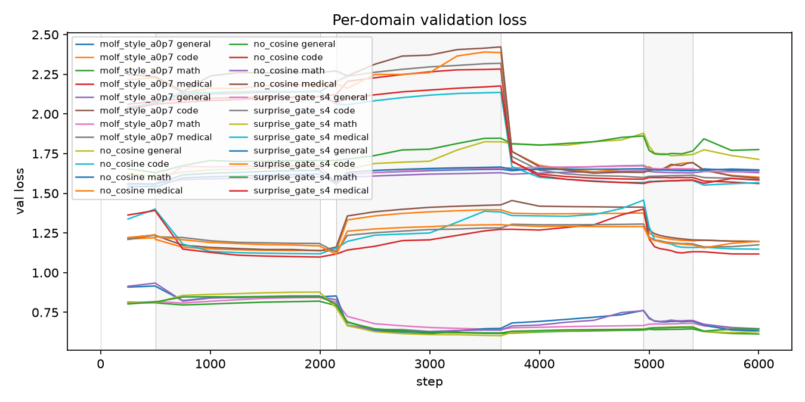
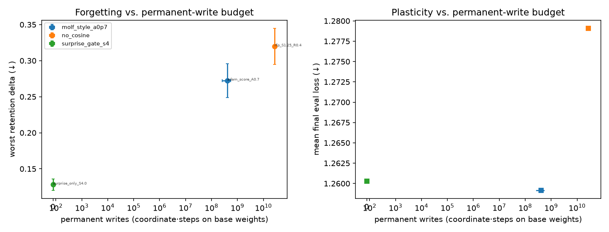
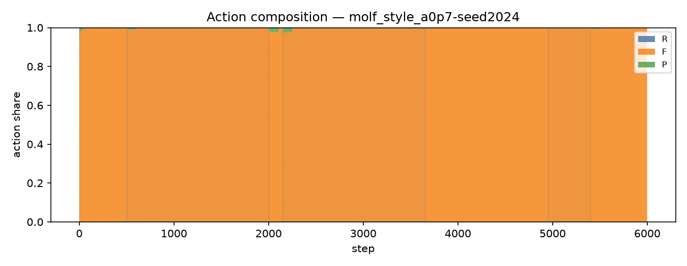
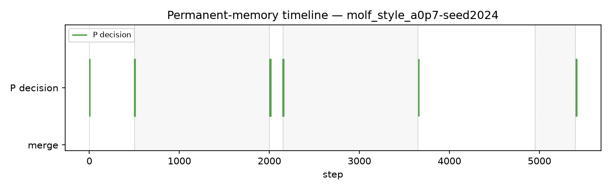
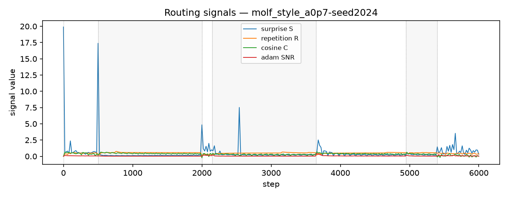
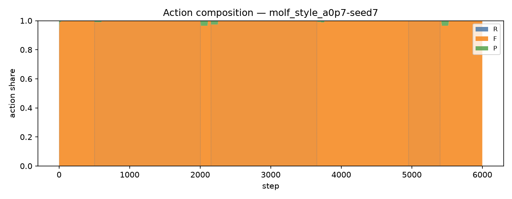
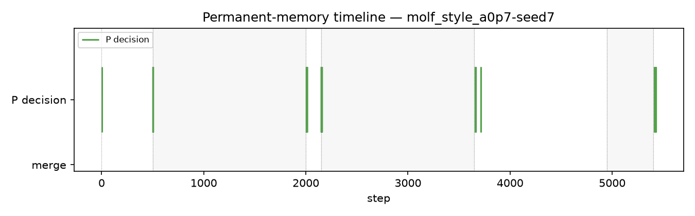
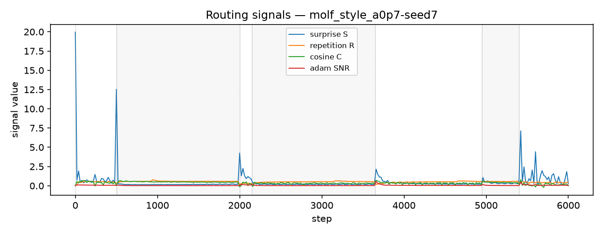
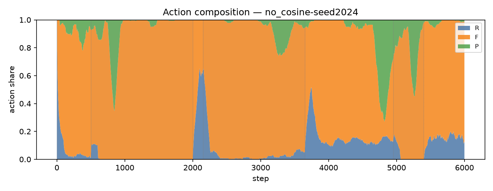
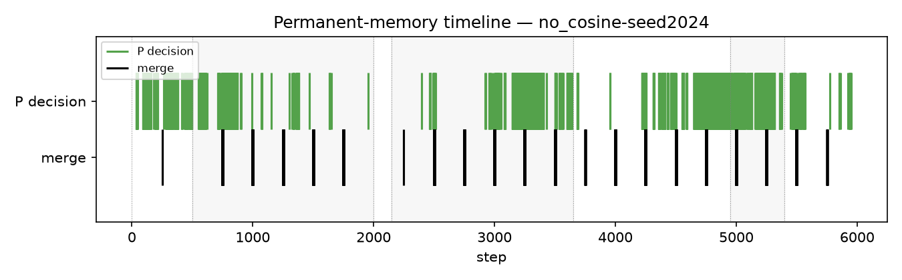
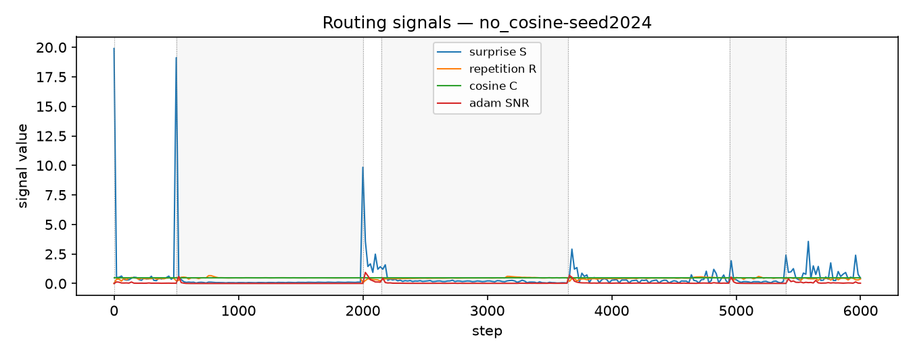
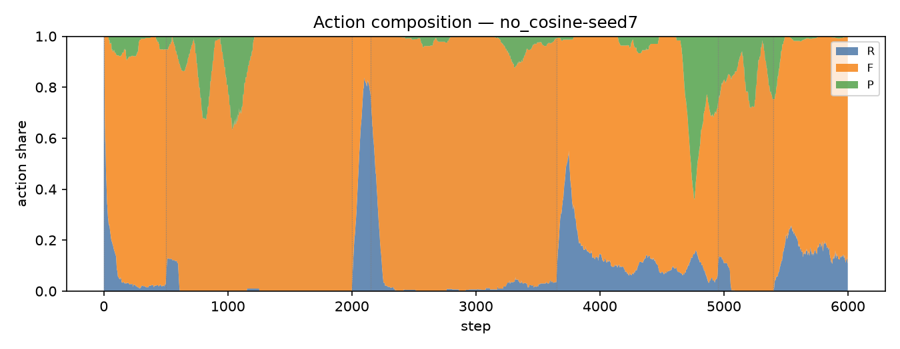
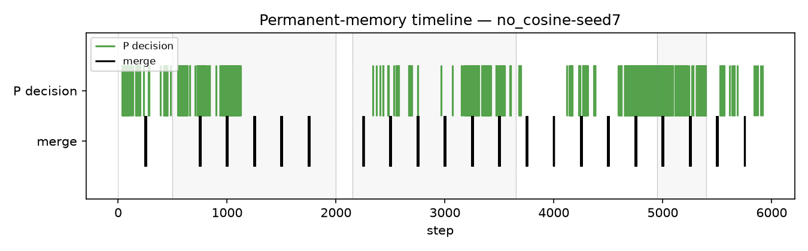
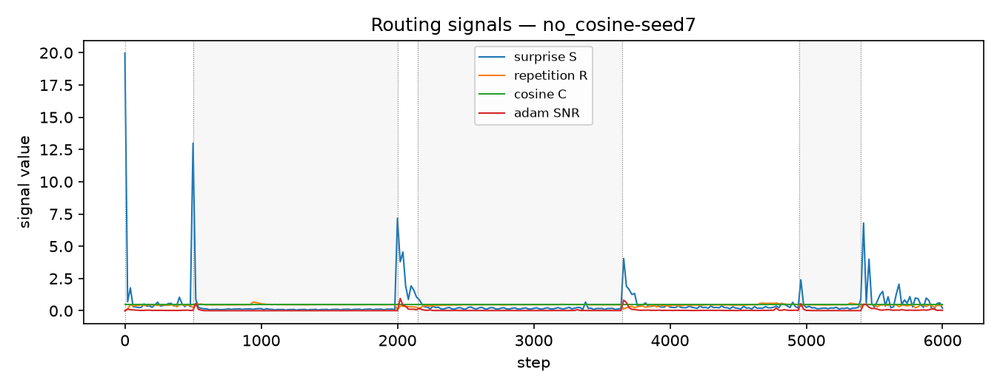
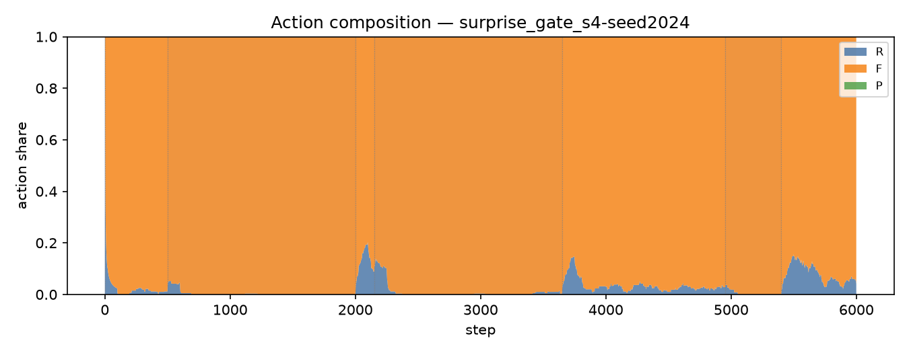
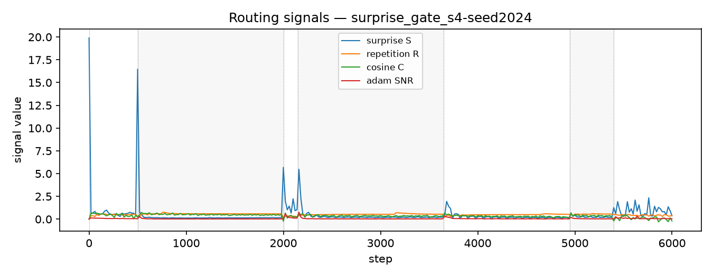
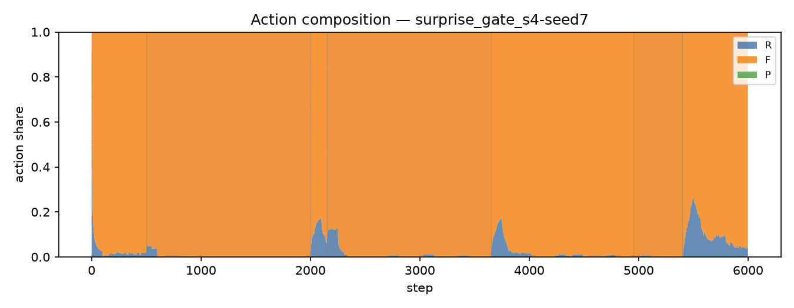
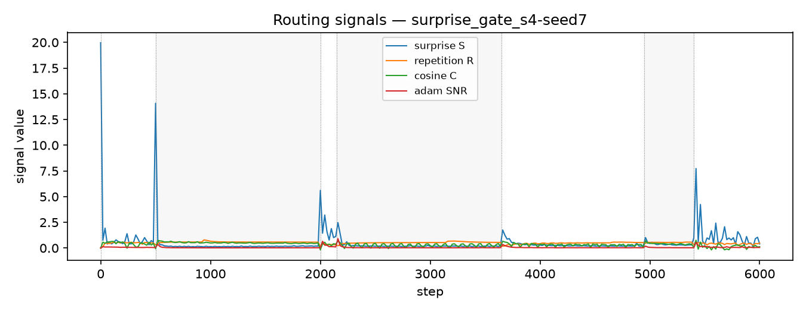
