# Report — priority_s3_v1_live

8 runs: frozen_blocks-seed1337, frozen_blocks-seed2024, frozen_blocks-seed7, periodic_merge-seed1337, periodic_merge-seed2024, trihope_sentinel-seed1337, trihope_sentinel-seed2024, trihope_sentinel-seed7

## forgetting_table

| spec_id          |   final_loss_general_mean |   final_loss_general_std |   final_loss_code_mean |   final_loss_code_std |   final_loss_math_mean |   final_loss_math_std |   final_loss_medical_mean |   final_loss_medical_std |   final_em_code_mean |   final_em_code_std |   final_em_math_mean |   final_em_math_std |   final_em_medical_mean |   final_em_medical_std |   worst_retention_delta_general_mean |   worst_retention_delta_general_std |   worst_retention_delta_code_mean |   worst_retention_delta_code_std |   worst_retention_delta_math_mean |   worst_retention_delta_math_std |   worst_retention_delta_medical_mean |   worst_retention_delta_medical_std |   wall_clock_s_mean |   wall_clock_s_std |   tokens_per_sec_mean |   tokens_per_sec_std |   peak_mem_gb_mean |   peak_mem_gb_std |   controller_fraction_mean |   controller_fraction_std |   r_count_mean |   r_count_std |   f_count_mean |   f_count_std |   p_count_mean |   p_count_std |   consolidations_mean |   consolidations_std |
|:-----------------|--------------------------:|-------------------------:|-----------------------:|----------------------:|-----------------------:|----------------------:|--------------------------:|-------------------------:|---------------------:|--------------------:|---------------------:|--------------------:|------------------------:|-----------------------:|-------------------------------------:|------------------------------------:|----------------------------------:|---------------------------------:|----------------------------------:|---------------------------------:|-------------------------------------:|------------------------------------:|--------------------:|-------------------:|----------------------:|---------------------:|-------------------:|------------------:|---------------------------:|--------------------------:|---------------:|--------------:|---------------:|--------------:|---------------:|--------------:|----------------------:|---------------------:|
| frozen_blocks    |                    1.6317 |                   0.0016 |                 1.2011 |                0.0058 |                 0.6321 |                0.0102 |                    1.5659 |                   0.0042 |               0.0938 |              0.0271 |               0.0312 |              0.0156 |                  0.0156 |                 0.0156 |                               0.1256 |                              0.0209 |                            0.1366 |                           0.0261 |                            0.0377 |                           0.0057 |                               0.0364 |                              0.008  |             5363.91 |            125.876 |               862.986 |              25.0731 |            28.8175 |            0.0001 |                     0.4016 |                    0.0171 |       36000    |         0     |              0 |         0     |         0      |        0      |                 0     |               0      |
| periodic_merge   |                  nan      |                 nan      |               nan      |              nan      |               nan      |              nan      |                  nan      |                 nan      |             nan      |            nan      |             nan      |            nan      |                nan      |               nan      |                             nan      |                            nan      |                          nan      |                         nan      |                          nan      |                         nan      |                             nan      |                            nan      |              nan    |            nan     |               nan     |             nan      |           nan      |          nan      |                   nan      |                  nan      |         nan    |       nan     |            nan |       nan     |       nan      |      nan      |               nan     |             nan      |
| trihope_sentinel |                    1.6805 |                   0.0088 |                 1.1347 |                0.0038 |                 0.6201 |                0.0013 |                    1.5481 |                   0.0089 |               0.0625 |              0.0312 |               0.0312 |              0      |                  0.0104 |                 0.018  |                               0.1183 |                              0.0206 |                            0.135  |                           0.0158 |                            0.0514 |                           0.0121 |                               0.0302 |                              0.0192 |             5722.34 |            492.2   |               812.645 |              71.2361 |            29.3022 |            0.0027 |                     0.4812 |                    0.0392 |        2333.67 |       238.706 |          35196 |       209.959 |        82.3333 |       16.4418 |               125.333 |              25.8134 |

## action_share_by_phase

| spec_id          | phase             |   r_share_mean |   r_share_std |   f_share_mean |   f_share_std |   p_share_mean |   p_share_std |   mean_coords_opened_mean |   mean_coords_opened_std |
|:-----------------|:------------------|---------------:|--------------:|---------------:|--------------:|---------------:|--------------:|--------------------------:|-------------------------:|
| frozen_blocks    | code_recurrent    |       100      |        0      |         0      |        0      |         0      |        0      |                      0    |                     0    |
| frozen_blocks    | code_revisit      |       100      |        0      |         0      |        0      |         0      |        0      |                      0    |                     0    |
| frozen_blocks    | general_warm      |       100      |        0      |         0      |        0      |         0      |        0      |                      0    |                     0    |
| frozen_blocks    | math_recurrent    |       100      |        0      |         0      |        0      |         0      |        0      |                      0    |                     0    |
| frozen_blocks    | medical_recurrent |       100      |        0      |         0      |        0      |         0      |        0      |                      0    |                     0    |
| frozen_blocks    | mixed_tail        |       100      |        0      |         0      |        0      |         0      |        0      |                      0    |                     0    |
| frozen_blocks    | novel_inject      |       100      |        0      |         0      |        0      |         0      |        0      |                      0    |                     0    |
| trihope_sentinel | code_recurrent    |         0.8333 |        0.154  |        98.963  |        0.1638 |         0.2037 |        0.0339 |                  13864.5  |                  3152.19 |
| trihope_sentinel | code_revisit      |         0.8148 |        0.4174 |        98.3333 |        0.3333 |         0.8519 |        0.2253 |                  64856.4  |                 16572.6  |
| trihope_sentinel | general_warm      |         5.0111 |        0.2365 |        94.2111 |        0.2365 |         0.7778 |        0.2365 |                  56972.6  |                 17430.8  |
| trihope_sentinel | math_recurrent    |         2.5296 |        0.3639 |        97.3778 |        0.3672 |         0.0926 |        0.057  |                   7456.54 |                  5485.8  |
| trihope_sentinel | medical_recurrent |        11.1197 |        1.65   |        88.7863 |        1.6314 |         0.094  |        0.0412 |                   7124.94 |                  2685.29 |
| trihope_sentinel | mixed_tail        |        14.9907 |        1.1168 |        84.9537 |        1.0891 |         0.0556 |        0.0278 |                   4077.8  |                  2017.99 |
| trihope_sentinel | novel_inject      |        50.1852 |       11.0092 |        49.8148 |       11.0092 |         0      |        0      |                      0    |                     0    |

## ablation_deltas

_no data_

## p_selection_stats

| spec_id          |   seed |   p_decisions |   consolidations |   forced_consolidations |   first_p_step |   first_merge_step |   mean_S_at_P |   mean_C_at_P |   mean_V_at_P |   mean_R_at_P |
|:-----------------|-------:|--------------:|-----------------:|------------------------:|---------------:|-------------------:|--------------:|--------------:|--------------:|--------------:|
| frozen_blocks    |   1337 |             0 |                0 |                       0 |            nan |                nan |      nan      |      nan      |      nan      |      nan      |
| frozen_blocks    |   2024 |             0 |                0 |                       0 |            nan |                nan |      nan      |      nan      |      nan      |      nan      |
| frozen_blocks    |      7 |             0 |                0 |                       0 |            nan |                nan |      nan      |      nan      |      nan      |      nan      |
| trihope_sentinel |   1337 |            76 |              108 |                       0 |             36 |                250 |        0.5609 |        0.6487 |        0.1742 |        0.5384 |
| trihope_sentinel |   2024 |            70 |              113 |                       0 |             39 |                750 |        0.4999 |        0.6217 |        0.1733 |        0.5449 |
| trihope_sentinel |      7 |           101 |              155 |                       0 |             34 |                250 |        0.4811 |        0.6946 |        0.1715 |        0.5402 |

## replay_timing

| spec_id          |   seed |   replays |   delay_median_steps |   delay_p90_steps |   cross_phase_share |   cross_phase_replays |   replays_in_medical_recurrent |   replays_in_mixed_tail |   replays_in_general_warm |   replays_in_math_recurrent |   replays_in_code_recurrent |   replays_in_code_revisit |
|:-----------------|-------:|----------:|---------------------:|------------------:|--------------------:|----------------------:|-------------------------------:|------------------------:|--------------------------:|----------------------------:|----------------------------:|--------------------------:|
| trihope_sentinel |   1337 |       268 |                 99.5 |             676.5 |              0.097  |                    26 |                            112 |                      76 |                        41 |                          26 |                           7 |                         6 |
| trihope_sentinel |   2024 |       277 |                115   |             541.8 |              0.0939 |                    26 |                            119 |                      72 |                        51 |                          22 |                           7 |                         6 |
| trihope_sentinel |      7 |       261 |                 85   |             520   |              0.0805 |                    21 |                            108 |                      75 |                        42 |                          26 |                           8 |                         2 |

## adapter_reuse_aulc

| spec_id          | phase          |   aulc_mean |   aulc_std |   final_loss_mean |   final_loss_std |
|:-----------------|:---------------|------------:|-----------:|------------------:|-----------------:|
| frozen_blocks    | math_recurrent |      1.7018 |     0.0837 |            1.5888 |           0.1541 |
| trihope_sentinel | math_recurrent |      1.5346 |     0.1044 |            1.4239 |           0.1577 |

## damage_recovery

_no data_

## budget_curve

| spec_id          | threshold_tag              |   permanent_writes_mean |   permanent_writes_std |   p_action_coords_mean |   p_action_coords_std |   merged_coords_mean |   merged_coords_std |   active_fraction_mean_mean |   active_fraction_mean_std |   replayed_total_mean |   replayed_total_std |   worst_retention_delta_mean |   worst_retention_delta_std |   mean_retention_delta_mean |   mean_retention_delta_std |   final_loss_general_mean |   final_loss_general_std |   final_loss_code_mean |   final_loss_code_std |   final_loss_math_mean |   final_loss_math_std |   final_loss_medical_mean |   final_loss_medical_std |   steps_to_recover_code_mean |   steps_to_recover_code_std |
|:-----------------|:---------------------------|------------------------:|-----------------------:|-----------------------:|----------------------:|---------------------:|--------------------:|----------------------------:|---------------------------:|----------------------:|---------------------:|-----------------------------:|----------------------------:|----------------------------:|---------------------------:|--------------------------:|-------------------------:|-----------------------:|----------------------:|-----------------------:|----------------------:|--------------------------:|-------------------------:|-----------------------------:|----------------------------:|
| frozen_blocks    | rfp:always_r_S1.25_R0.4    |              0          |            0           |            0           |           0           |          0           |         0           |                      0      |                          0 |                 0     |               0      |                       0.1409 |                      0.02   |                      0.0701 |                     0.0132 |                    1.6317 |                   0.0016 |                 1.2011 |                0.0058 |                 0.6321 |                0.0102 |                    1.5659 |                   0.0042 |                           50 |                           0 |
| periodic_merge   | rfp_S1.25_R0.4_plateau10.0 |            nan          |          nan           |          nan           |         nan           |        nan           |       nan           |                    nan      |                        nan |               nan     |             nan      |                     nan      |                    nan      |                    nan      |                   nan      |                  nan      |                 nan      |               nan      |              nan      |               nan      |              nan      |                  nan      |                 nan      |                          nan |                         nan |
| trihope_sentinel | rfp_S1.25_R0.4             |              1.5498e+09 |            3.17397e+08 |            6.08174e+08 |           1.29026e+08 |          9.41621e+08 |         1.93822e+08 |                      0.0003 |                          0 |               268.667 |               8.0208 |                       0.135  |                      0.0158 |                      0.0746 |                     0.0041 |                    1.6805 |                   0.0088 |                 1.1347 |                0.0038 |                 0.6201 |                0.0013 |                    1.5481 |                   0.0089 |                          100 |                           0 |

## teacher_attribution

| run                       | spec_id          |   seed | teacher            | phase             |   R_count |   F_count |   P_count |   replay_count |   coords_opened_F |   coords_opened_P |   consolidations_attributed |   merged_coords_attributed |
|:--------------------------|:-----------------|-------:|:-------------------|:------------------|----------:|----------:|----------:|---------------:|------------------:|------------------:|----------------------------:|---------------------------:|
| frozen_blocks-seed1337    | frozen_blocks    |   1337 | general_teacher_hf | general_warm      |      3000 |         0 |         0 |              0 |                 0 |                 0 |                      0      |                0           |
| frozen_blocks-seed1337    | frozen_blocks    |   1337 | code_teacher_hf    | code_recurrent    |      9000 |         0 |         0 |              0 |                 0 |                 0 |                      0      |                0           |
| frozen_blocks-seed1337    | frozen_blocks    |   1337 | general_teacher_hf | novel_inject      |       900 |         0 |         0 |              0 |                 0 |                 0 |                      0      |                0           |
| frozen_blocks-seed1337    | frozen_blocks    |   1337 | math_teacher_hf    | math_recurrent    |      9000 |         0 |         0 |              0 |                 0 |                 0 |                      0      |                0           |
| frozen_blocks-seed1337    | frozen_blocks    |   1337 | medical_teacher_hf | medical_recurrent |      7800 |         0 |         0 |              0 |                 0 |                 0 |                      0      |                0           |
| frozen_blocks-seed1337    | frozen_blocks    |   1337 | code_teacher_hf    | code_revisit      |      2700 |         0 |         0 |              0 |                 0 |                 0 |                      0      |                0           |
| frozen_blocks-seed1337    | frozen_blocks    |   1337 | medical_teacher_hf | mixed_tail        |       918 |         0 |         0 |              0 |                 0 |                 0 |                      0      |                0           |
| frozen_blocks-seed1337    | frozen_blocks    |   1337 | general_teacher_hf | mixed_tail        |       822 |         0 |         0 |              0 |                 0 |                 0 |                      0      |                0           |
| frozen_blocks-seed1337    | frozen_blocks    |   1337 | math_teacher_hf    | mixed_tail        |       978 |         0 |         0 |              0 |                 0 |                 0 |                      0      |                0           |
| frozen_blocks-seed1337    | frozen_blocks    |   1337 | code_teacher_hf    | mixed_tail        |       882 |         0 |         0 |              0 |                 0 |                 0 |                      0      |                0           |
| frozen_blocks-seed2024    | frozen_blocks    |   2024 | general_teacher_hf | general_warm      |      3000 |         0 |         0 |              0 |                 0 |                 0 |                      0      |                0           |
| frozen_blocks-seed2024    | frozen_blocks    |   2024 | code_teacher_hf    | code_recurrent    |      9000 |         0 |         0 |              0 |                 0 |                 0 |                      0      |                0           |
| frozen_blocks-seed2024    | frozen_blocks    |   2024 | general_teacher_hf | novel_inject      |       900 |         0 |         0 |              0 |                 0 |                 0 |                      0      |                0           |
| frozen_blocks-seed2024    | frozen_blocks    |   2024 | math_teacher_hf    | math_recurrent    |      9000 |         0 |         0 |              0 |                 0 |                 0 |                      0      |                0           |
| frozen_blocks-seed2024    | frozen_blocks    |   2024 | medical_teacher_hf | medical_recurrent |      7800 |         0 |         0 |              0 |                 0 |                 0 |                      0      |                0           |
| frozen_blocks-seed2024    | frozen_blocks    |   2024 | code_teacher_hf    | code_revisit      |      2700 |         0 |         0 |              0 |                 0 |                 0 |                      0      |                0           |
| frozen_blocks-seed2024    | frozen_blocks    |   2024 | medical_teacher_hf | mixed_tail        |       930 |         0 |         0 |              0 |                 0 |                 0 |                      0      |                0           |
| frozen_blocks-seed2024    | frozen_blocks    |   2024 | general_teacher_hf | mixed_tail        |       912 |         0 |         0 |              0 |                 0 |                 0 |                      0      |                0           |
| frozen_blocks-seed2024    | frozen_blocks    |   2024 | code_teacher_hf    | mixed_tail        |       864 |         0 |         0 |              0 |                 0 |                 0 |                      0      |                0           |
| frozen_blocks-seed2024    | frozen_blocks    |   2024 | math_teacher_hf    | mixed_tail        |       894 |         0 |         0 |              0 |                 0 |                 0 |                      0      |                0           |
| frozen_blocks-seed7       | frozen_blocks    |      7 | general_teacher_hf | general_warm      |      3000 |         0 |         0 |              0 |                 0 |                 0 |                      0      |                0           |
| frozen_blocks-seed7       | frozen_blocks    |      7 | code_teacher_hf    | code_recurrent    |      9000 |         0 |         0 |              0 |                 0 |                 0 |                      0      |                0           |
| frozen_blocks-seed7       | frozen_blocks    |      7 | general_teacher_hf | novel_inject      |       900 |         0 |         0 |              0 |                 0 |                 0 |                      0      |                0           |
| frozen_blocks-seed7       | frozen_blocks    |      7 | math_teacher_hf    | math_recurrent    |      9000 |         0 |         0 |              0 |                 0 |                 0 |                      0      |                0           |
| frozen_blocks-seed7       | frozen_blocks    |      7 | medical_teacher_hf | medical_recurrent |      7800 |         0 |         0 |              0 |                 0 |                 0 |                      0      |                0           |
| frozen_blocks-seed7       | frozen_blocks    |      7 | code_teacher_hf    | code_revisit      |      2700 |         0 |         0 |              0 |                 0 |                 0 |                      0      |                0           |
| frozen_blocks-seed7       | frozen_blocks    |      7 | math_teacher_hf    | mixed_tail        |       948 |         0 |         0 |              0 |                 0 |                 0 |                      0      |                0           |
| frozen_blocks-seed7       | frozen_blocks    |      7 | code_teacher_hf    | mixed_tail        |       858 |         0 |         0 |              0 |                 0 |                 0 |                      0      |                0           |
| frozen_blocks-seed7       | frozen_blocks    |      7 | medical_teacher_hf | mixed_tail        |       888 |         0 |         0 |              0 |                 0 |                 0 |                      0      |                0           |
| frozen_blocks-seed7       | frozen_blocks    |      7 | general_teacher_hf | mixed_tail        |       906 |         0 |         0 |              0 |                 0 |                 0 |                      0      |                0           |
| trihope_sentinel-seed1337 | trihope_sentinel |   1337 | general_teacher_hf | general_warm      |       149 |      2834 |        17 |            246 |          21299200 |         122683392 |                      1      |                6.29146e+06 |
| trihope_sentinel-seed1337 | trihope_sentinel |   1337 | code_teacher_hf    | code_recurrent    |        67 |      8912 |        21 |             42 |           3670016 |         154140672 |                      0.358  |                3.37808e+06 |
| trihope_sentinel-seed1337 | trihope_sentinel |   1337 | general_teacher_hf | novel_inject      |       343 |       557 |         0 |              0 |                 0 |                 0 |                      0      |                0           |
| trihope_sentinel-seed1337 | trihope_sentinel |   1337 | math_teacher_hf    | math_recurrent    |       254 |      8742 |         4 |            156 |          13451264 |          28311552 |                      2.2534 |                2.04689e+07 |
| trihope_sentinel-seed1337 | trihope_sentinel |   1337 | medical_teacher_hf | medical_recurrent |       779 |      7010 |        11 |            672 |          57147392 |          78643200 |                      0.75   |                7.07789e+06 |
| trihope_sentinel-seed1337 | trihope_sentinel |   1337 | code_teacher_hf    | code_revisit      |        16 |      2664 |        20 |             36 |           3129344 |         154140672 |                      0.4748 |                4.11067e+06 |
| trihope_sentinel-seed1337 | trihope_sentinel |   1337 | medical_teacher_hf | mixed_tail        |       122 |       796 |         0 |            246 |          21086208 |                 0 |                      0      |                0           |
| trihope_sentinel-seed1337 | trihope_sentinel |   1337 | general_teacher_hf | mixed_tail        |       344 |       478 |         0 |            144 |          12337152 |                 0 |                      0      |                0           |
| trihope_sentinel-seed1337 | trihope_sentinel |   1337 | math_teacher_hf    | mixed_tail        |        36 |       941 |         1 |             66 |           5668864 |           6291456 |                      0      |                0           |
| trihope_sentinel-seed1337 | trihope_sentinel |   1337 | code_teacher_hf    | mixed_tail        |         0 |       880 |         2 |              0 |                 0 |          12582912 |                      0      |                0           |
| trihope_sentinel-seed1337 | trihope_sentinel |   1337 | general_teacher_hf | code_recurrent    |         0 |         0 |         0 |              0 |                 0 |                 0 |                      4.642  |                3.75164e+07 |
| trihope_sentinel-seed1337 | trihope_sentinel |   1337 | general_teacher_hf | math_recurrent    |         0 |         0 |         0 |              0 |                 0 |                 0 |                      1.3917 |                8.75607e+06 |
| trihope_sentinel-seed1337 | trihope_sentinel |   1337 | code_teacher_hf    | math_recurrent    |         0 |         0 |         0 |              0 |                 0 |                 0 |                      0.3548 |                2.23233e+06 |
| trihope_sentinel-seed1337 | trihope_sentinel |   1337 | math_teacher_hf    | medical_recurrent |         0 |         0 |         0 |              0 |                 0 |                 0 |                      0.25   |                2.3593e+06  |
| trihope_sentinel-seed1337 | trihope_sentinel |   1337 | math_teacher_hf    | code_revisit      |         0 |         0 |         0 |              0 |                 0 |                 0 |                      0.2992 |                2.33153e+06 |
| trihope_sentinel-seed1337 | trihope_sentinel |   1337 | medical_teacher_hf | code_revisit      |         0 |         0 |         0 |              0 |                 0 |                 0 |                      4.226  |                2.81608e+07 |
| trihope_sentinel-seed2024 | trihope_sentinel |   2024 | general_teacher_hf | general_warm      |       158 |      2820 |        22 |            306 |          26132480 |         163577856 |                      0      |                0           |
| trihope_sentinel-seed2024 | trihope_sentinel |   2024 | code_teacher_hf    | code_recurrent    |        67 |      8918 |        15 |             42 |           3555328 |          97517568 |                      0.1667 |                1.04858e+06 |
| trihope_sentinel-seed2024 | trihope_sentinel |   2024 | general_teacher_hf | novel_inject      |       537 |       363 |         0 |              0 |                 0 |                 0 |                      0      |                0           |
| trihope_sentinel-seed2024 | trihope_sentinel |   2024 | math_teacher_hf    | math_recurrent    |       191 |      8802 |         7 |            132 |          11304960 |          50331648 |                      1.2055 |                1.13763e+07 |
| trihope_sentinel-seed2024 | trihope_sentinel |   2024 | medical_teacher_hf | medical_recurrent |      1015 |      6779 |         6 |            714 |          61079552 |          50331648 |                      0.8409 |                7.93581e+06 |
| trihope_sentinel-seed2024 | trihope_sentinel |   2024 | code_teacher_hf    | code_revisit      |        35 |      2646 |        19 |             36 |           3129344 |         144703488 |                      0.3793 |                3.12507e+06 |
| trihope_sentinel-seed2024 | trihope_sentinel |   2024 | medical_teacher_hf | mixed_tail        |        84 |       846 |         0 |            228 |          19496960 |                 0 |                      3.2053 |                2.52384e+07 |
| trihope_sentinel-seed2024 | trihope_sentinel |   2024 | general_teacher_hf | mixed_tail        |       476 |       436 |         0 |            162 |          13795328 |                 0 |                      0.393  |                2.86602e+06 |
| trihope_sentinel-seed2024 | trihope_sentinel |   2024 | code_teacher_hf    | mixed_tail        |         3 |       861 |         0 |              6 |            507904 |                 0 |                      0.0464 |           291872           |
| trihope_sentinel-seed2024 | trihope_sentinel |   2024 | math_teacher_hf    | mixed_tail        |        19 |       874 |         1 |             36 |           3145728 |           6291456 |                      0.3553 |                3.061e+06   |
| trihope_sentinel-seed2024 | trihope_sentinel |   2024 | general_teacher_hf | code_recurrent    |         0 |         0 |         0 |              0 |                 0 |                 0 |                      3.8333 |                3.04087e+07 |
| trihope_sentinel-seed2024 | trihope_sentinel |   2024 | general_teacher_hf | math_recurrent    |         0 |         0 |         0 |              0 |                 0 |                 0 |                      0.6986 |                6.5931e+06  |
| trihope_sentinel-seed2024 | trihope_sentinel |   2024 | code_teacher_hf    | math_recurrent    |         0 |         0 |         0 |              0 |                 0 |                 0 |                      0.0959 |           904935           |
| trihope_sentinel-seed2024 | trihope_sentinel |   2024 | math_teacher_hf    | medical_recurrent |         0 |         0 |         0 |              0 |                 0 |                 0 |                      0.1591 |                1.50137e+06 |
| trihope_sentinel-seed2024 | trihope_sentinel |   2024 | medical_teacher_hf | code_revisit      |         0 |         0 |         0 |              0 |                 0 |                 0 |                      4.6465 |                3.47857e+07 |
| trihope_sentinel-seed2024 | trihope_sentinel |   2024 | general_teacher_hf | code_revisit      |         0 |         0 |         0 |              0 |                 0 |                 0 |                      0.5192 |                3.26647e+06 |
| trihope_sentinel-seed2024 | trihope_sentinel |   2024 | math_teacher_hf    | code_revisit      |         0 |         0 |         0 |              0 |                 0 |                 0 |                      0.4551 |                2.86293e+06 |
| trihope_sentinel-seed7    | trihope_sentinel |      7 | general_teacher_hf | general_warm      |       144 |      2825 |        31 |            252 |          21610496 |         226492416 |                      0      |                0           |
| trihope_sentinel-seed7    | trihope_sentinel |      7 | code_teacher_hf    | code_recurrent    |        91 |      8890 |        19 |             48 |           4128768 |         122683392 |                      0.2677 |                2.38313e+06 |
| trihope_sentinel-seed7    | trihope_sentinel |      7 | general_teacher_hf | novel_inject      |       475 |       425 |         0 |              0 |                 0 |                 0 |                      0      |                0           |
| trihope_sentinel-seed7    | trihope_sentinel |      7 | math_teacher_hf    | math_recurrent    |       238 |      8748 |        14 |            156 |          13467648 |         122683392 |                      4.9808 |                4.44868e+07 |
| trihope_sentinel-seed7    | trihope_sentinel |      7 | medical_teacher_hf | medical_recurrent |       808 |      6987 |         5 |            648 |          55853056 |          37748736 |                      6.926  |                4.94165e+07 |
| trihope_sentinel-seed7    | trihope_sentinel |      7 | code_teacher_hf    | code_revisit      |        15 |      2655 |        30 |             12 |           1064960 |         226492416 |                      0.3687 |                2.7115e+06  |
| trihope_sentinel-seed7    | trihope_sentinel |      7 | math_teacher_hf    | mixed_tail        |        20 |       926 |         2 |             48 |           4194304 |          18874368 |                      0      |                0           |
| trihope_sentinel-seed7    | trihope_sentinel |      7 | code_teacher_hf    | mixed_tail        |         0 |       858 |         0 |              0 |                 0 |                 0 |                      0      |                0           |
| trihope_sentinel-seed7    | trihope_sentinel |      7 | medical_teacher_hf | mixed_tail        |        96 |       792 |         0 |            210 |          18153472 |                 0 |                      0      |                0           |
| trihope_sentinel-seed7    | trihope_sentinel |      7 | general_teacher_hf | mixed_tail        |       419 |       487 |         0 |            192 |          16596992 |                 0 |                      0      |                0           |
| trihope_sentinel-seed7    | trihope_sentinel |      7 | general_teacher_hf | code_recurrent    |         0 |         0 |         0 |              0 |                 0 |                 0 |                      2.7323 |                2.27827e+07 |
| trihope_sentinel-seed7    | trihope_sentinel |      7 | general_teacher_hf | math_recurrent    |         0 |         0 |         0 |              0 |                 0 |                 0 |                      4.9636 |                3.33941e+07 |
| trihope_sentinel-seed7    | trihope_sentinel |      7 | code_teacher_hf    | math_recurrent    |         0 |         0 |         0 |              0 |                 0 |                 0 |                      1.0556 |                7.05367e+06 |
| trihope_sentinel-seed7    | trihope_sentinel |      7 | math_teacher_hf    | medical_recurrent |         0 |         0 |         0 |              0 |                 0 |                 0 |                      2.074  |                1.34981e+07 |
| trihope_sentinel-seed7    | trihope_sentinel |      7 | general_teacher_hf | medical_recurrent |         0 |         0 |         0 |              0 |                 0 |                 0 |                      1      |                9.43718e+06 |
| trihope_sentinel-seed7    | trihope_sentinel |      7 | medical_teacher_hf | code_revisit      |         0 |         0 |         0 |              0 |                 0 |                 0 |                      6.6313 |                4.76201e+07 |

## containment

_no data_

## Figures

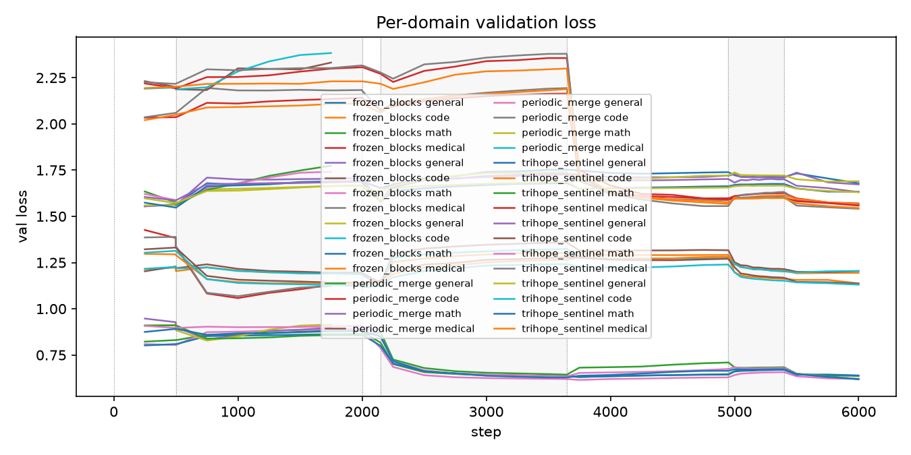
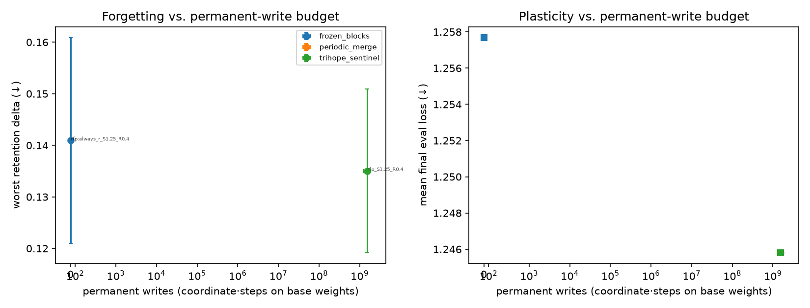
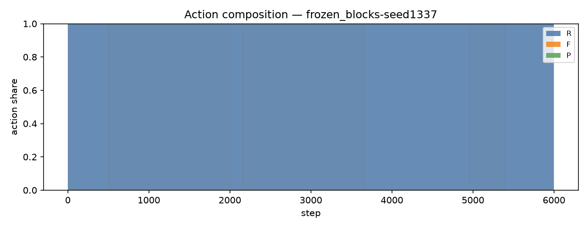
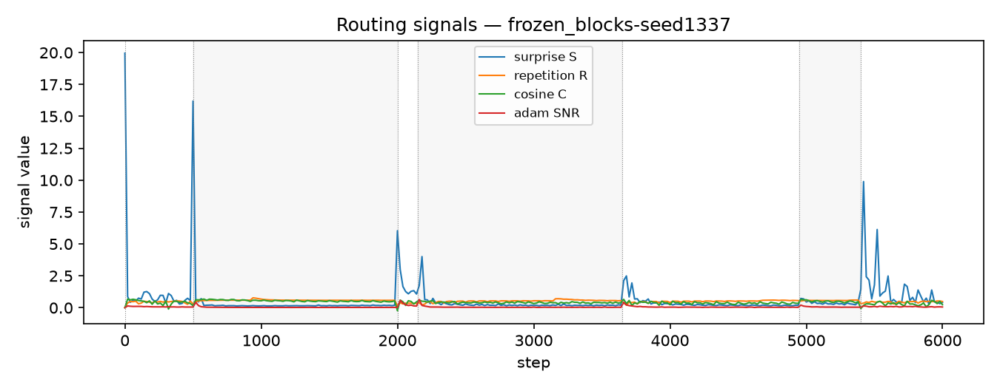

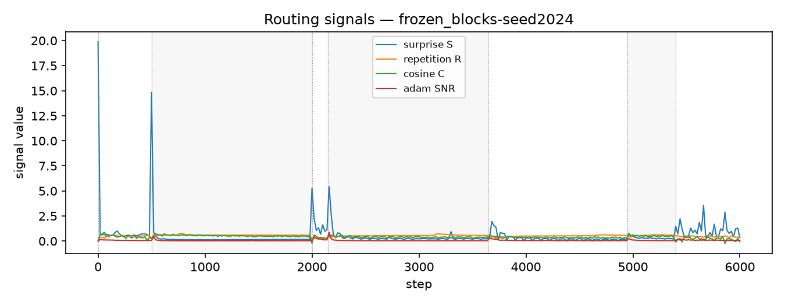

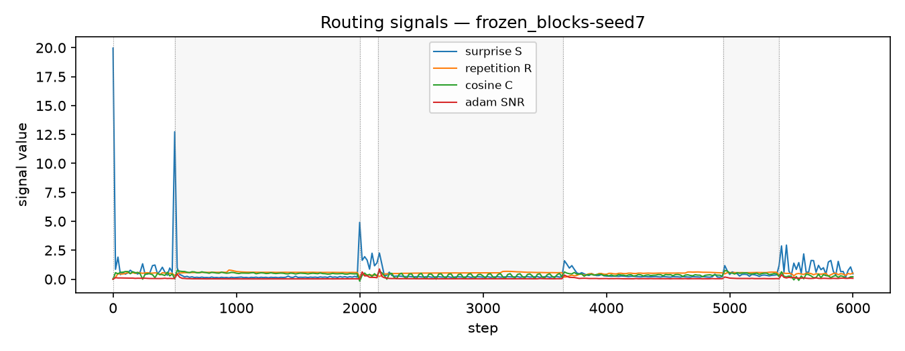
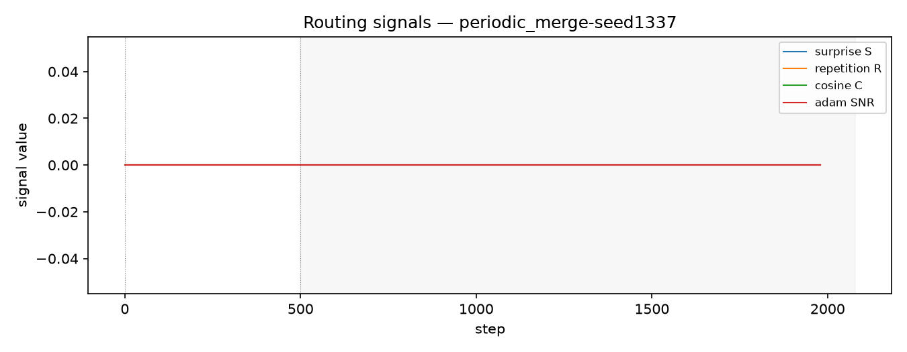
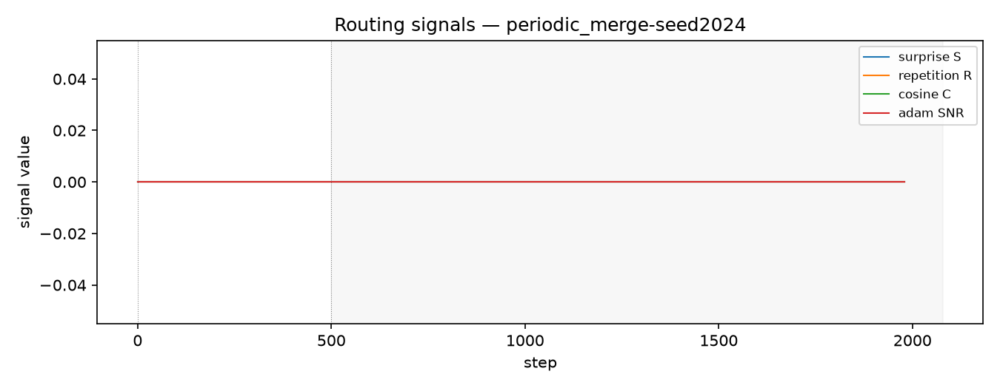
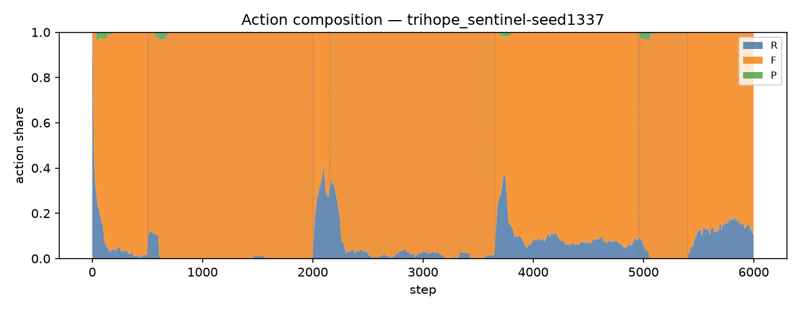
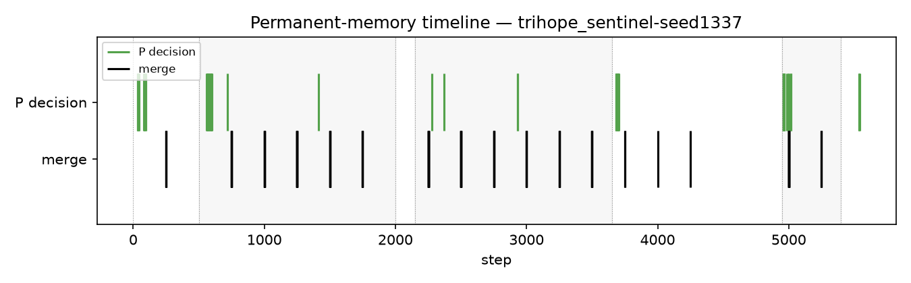
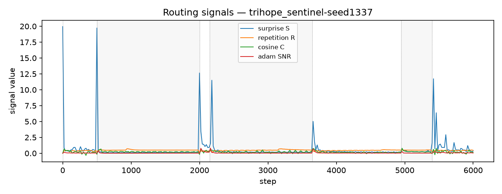
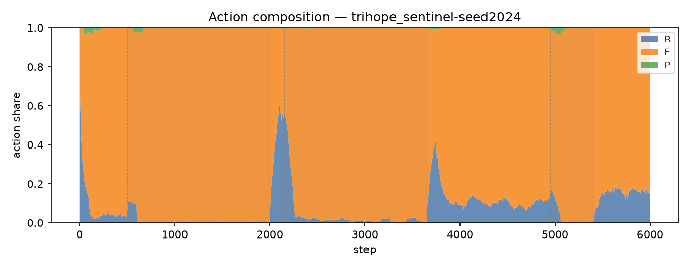
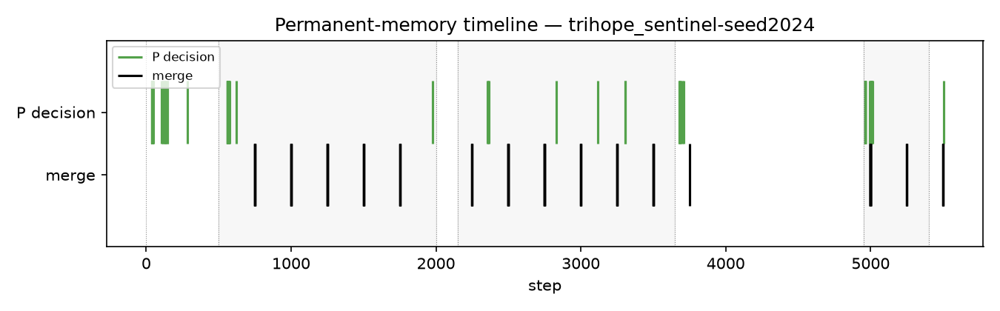
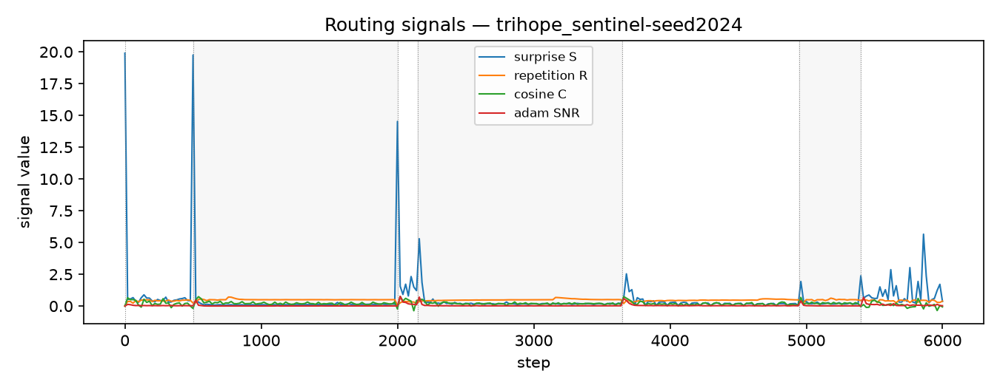
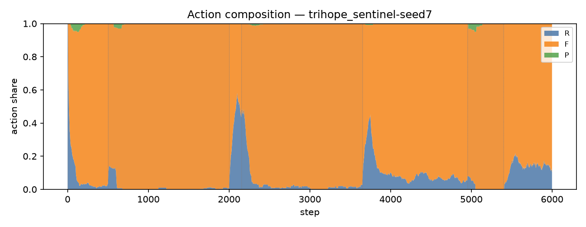
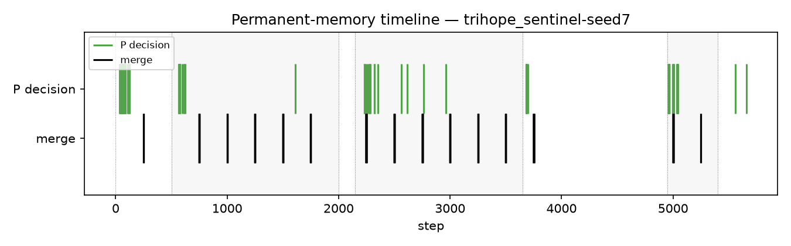
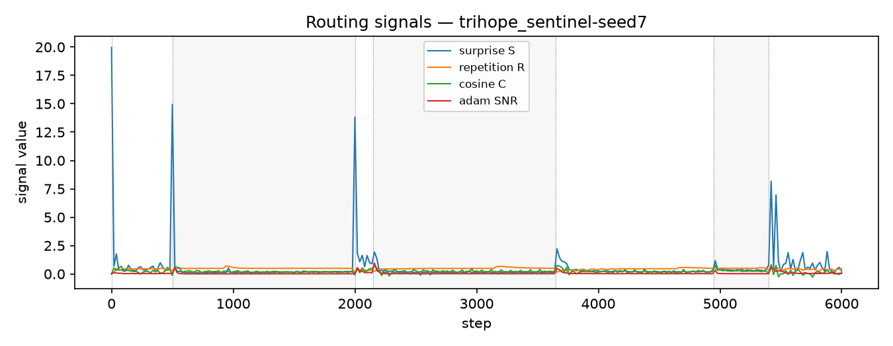
