# Report — priority_s4_v1_live

3 runs: random_commit-seed1337, random_commit-seed2024, random_commit-seed7

## forgetting_table

| spec_id       |   final_loss_general_mean |   final_loss_general_std |   final_loss_code_mean |   final_loss_code_std |   final_loss_math_mean |   final_loss_math_std |   final_loss_medical_mean |   final_loss_medical_std |   final_em_code_mean |   final_em_code_std |   final_em_math_mean |   final_em_math_std |   final_em_medical_mean |   final_em_medical_std |   worst_retention_delta_general_mean |   worst_retention_delta_general_std |   worst_retention_delta_code_mean |   worst_retention_delta_code_std |   worst_retention_delta_math_mean |   worst_retention_delta_math_std |   worst_retention_delta_medical_mean |   worst_retention_delta_medical_std |   wall_clock_s_mean |   wall_clock_s_std |   tokens_per_sec_mean |   tokens_per_sec_std |   peak_mem_gb_mean |   peak_mem_gb_std |   controller_fraction_mean |   controller_fraction_std |   r_count_mean |   r_count_std |   f_count_mean |   f_count_std |   p_count_mean |   p_count_std |   consolidations_mean |   consolidations_std |
|:--------------|--------------------------:|-------------------------:|-----------------------:|----------------------:|-----------------------:|----------------------:|--------------------------:|-------------------------:|---------------------:|--------------------:|---------------------:|--------------------:|------------------------:|-----------------------:|-------------------------------------:|------------------------------------:|----------------------------------:|---------------------------------:|----------------------------------:|---------------------------------:|-------------------------------------:|------------------------------------:|--------------------:|-------------------:|----------------------:|---------------------:|-------------------:|------------------:|---------------------------:|--------------------------:|---------------:|--------------:|---------------:|--------------:|---------------:|--------------:|----------------------:|---------------------:|
| random_commit |                    1.6741 |                   0.0105 |                 1.1587 |                0.0086 |                 0.6241 |                0.0085 |                    1.5523 |                   0.0067 |               0.0677 |               0.009 |               0.0208 |              0.0239 |                  0.0052 |                  0.009 |                               0.0895 |                              0.0149 |                            0.1655 |                             0.02 |                            0.0507 |                           0.0098 |                               0.0308 |                              0.0072 |             5301.88 |            133.349 |               873.135 |              26.8566 |            29.2999 |             0.002 |                     0.4461 |                     0.016 |        2375.33 |       83.9663 |        35182.7 |        135.92 |             76 |             5 |               216.333 |              27.5379 |

## action_share_by_phase

| spec_id       | phase             |   r_share_mean |   r_share_std |   f_share_mean |   f_share_std |   p_share_mean |   p_share_std |   mean_coords_opened_mean |   mean_coords_opened_std |
|:--------------|:------------------|---------------:|--------------:|---------------:|--------------:|---------------:|--------------:|--------------------------:|-------------------------:|
| random_commit | code_recurrent    |         0.6778 |        0.2009 |        99.1481 |        0.1686 |         0.1741 |        0.0559 |                  11767.4  |                  3358.6  |
| random_commit | code_revisit      |         2      |        1.9672 |        97.2099 |        1.9246 |         0.7901 |        0.0428 |                  57089.1  |                  5078.49 |
| random_commit | general_warm      |         4.9111 |        0.0192 |        94.3556 |        0.1072 |         0.7333 |        0.1202 |                  50681.2  |                  9456.58 |
| random_commit | math_recurrent    |         2.3778 |        0.0111 |        97.5185 |        0.017  |         0.1037 |        0.0128 |                   7456.54 |                  1008.99 |
| random_commit | medical_recurrent |        11.0171 |        0.0729 |        88.8846 |        0.0925 |         0.0983 |        0.0485 |                   7393.81 |                  3382.26 |
| random_commit | mixed_tail        |        15.4537 |        0.5064 |        84.5463 |        0.5064 |         0      |        0      |                      0    |                     0    |
| random_commit | novel_inject      |        53.7037 |        8.3572 |        46.2963 |        8.3572 |         0      |        0      |                      0    |                     0    |

## ablation_deltas

_no data_

## p_selection_stats

| spec_id       |   seed |   p_decisions |   consolidations |   forced_consolidations |   first_p_step |   first_merge_step |   mean_S_at_P |   mean_C_at_P |   mean_V_at_P |   mean_R_at_P |
|:--------------|-------:|--------------:|-----------------:|------------------------:|---------------:|-------------------:|--------------:|--------------:|--------------:|--------------:|
| random_commit |   1337 |            81 |              243 |                       0 |             21 |                250 |        0.5155 |        0.3512 |        0.145  |        0.5031 |
| random_commit |   2024 |            76 |              188 |                       0 |             33 |                250 |        0.3909 |        0.3255 |        0.1155 |        0.4929 |
| random_commit |      7 |            71 |              218 |                       0 |             25 |                250 |        0.4509 |        0.3665 |        0.0938 |        0.5062 |

## replay_timing

| spec_id       |   seed |   replays |   delay_median_steps |   delay_p90_steps |   cross_phase_share |   cross_phase_replays |   replays_in_medical_recurrent |   replays_in_mixed_tail |   replays_in_general_warm |   replays_in_math_recurrent |   replays_in_code_recurrent |   replays_in_code_revisit |
|:--------------|-------:|----------:|---------------------:|------------------:|--------------------:|----------------------:|-------------------------------:|------------------------:|--------------------------:|----------------------------:|----------------------------:|--------------------------:|
| random_commit |   1337 |       258 |                   90 |             537.4 |              0.0853 |                    22 |                            115 |                      71 |                        38 |                          26 |                           7 |                         1 |
| random_commit |   2024 |       277 |                  100 |             522.8 |              0.0866 |                    24 |                            102 |                      75 |                        44 |                          25 |                           3 |                        28 |
| random_commit |      7 |       282 |                   68 |             500.4 |              0.0816 |                    23 |                            119 |                      80 |                        41 |                          26 |                           8 |                         8 |

## adapter_reuse_aulc

| spec_id       | phase          |   aulc_mean |   aulc_std |   final_loss_mean |   final_loss_std |
|:--------------|:---------------|------------:|-----------:|------------------:|-----------------:|
| random_commit | math_recurrent |      1.5305 |      0.092 |            1.4278 |           0.1395 |

## damage_recovery

_no data_

## budget_curve

| spec_id       | threshold_tag                |   permanent_writes_mean |   permanent_writes_std |   p_action_coords_mean |   p_action_coords_std |   merged_coords_mean |   merged_coords_std |   active_fraction_mean_mean |   active_fraction_mean_std |   replayed_total_mean |   replayed_total_std |   worst_retention_delta_mean |   worst_retention_delta_std |   mean_retention_delta_mean |   mean_retention_delta_std |   final_loss_general_mean |   final_loss_general_std |   final_loss_code_mean |   final_loss_code_std |   final_loss_math_mean |   final_loss_math_std |   final_loss_medical_mean |   final_loss_medical_std |   steps_to_recover_code_mean |   steps_to_recover_code_std |
|:--------------|:-----------------------------|------------------------:|-----------------------:|-----------------------:|----------------------:|---------------------:|--------------------:|----------------------------:|---------------------------:|----------------------:|---------------------:|-----------------------------:|----------------------------:|----------------------------:|---------------------------:|--------------------------:|-------------------------:|-----------------------:|----------------------:|-----------------------:|----------------------:|--------------------------:|-------------------------:|-----------------------------:|----------------------------:|
| random_commit | rfp:random_commit_S1.25_R0.4 |             2.20096e+09 |            2.45696e+08 |            5.36871e+08 |           3.95829e+07 |          1.66409e+09 |         2.22592e+08 |                      0.0003 |                          0 |               272.333 |              12.6623 |                       0.1655 |                        0.02 |                      0.0731 |                     0.0026 |                    1.6741 |                   0.0105 |                 1.1587 |                0.0086 |                 0.6241 |                0.0085 |                    1.5523 |                   0.0067 |                      216.667 |                     104.083 |

## teacher_attribution

| run                    | spec_id       |   seed | teacher            | phase             |   R_count |   F_count |   P_count |   replay_count |   coords_opened_F |   coords_opened_P |   consolidations_attributed |   merged_coords_attributed |
|:-----------------------|:--------------|-------:|:-------------------|:------------------|----------:|----------:|----------:|---------------:|------------------:|------------------:|----------------------------:|---------------------------:|
| random_commit-seed1337 | random_commit |   1337 | general_teacher_hf | general_warm      |       147 |      2827 |        26 |            228 |          19660800 |         179306496 |                      2      |                1.57286e+07 |
| random_commit-seed1337 | random_commit |   1337 | code_teacher_hf    | code_recurrent    |        63 |      8926 |        11 |             42 |           3670016 |          78643200 |                      1.4091 |                1.112e+07   |
| random_commit-seed1337 | random_commit |   1337 | general_teacher_hf | novel_inject      |       512 |       388 |         0 |              0 |                 0 |                 0 |                      0      |                0           |
| random_commit-seed1337 | random_commit |   1337 | math_teacher_hf    | math_recurrent    |       213 |      8777 |        10 |            156 |          13484032 |          72351744 |                      6      |                5.34774e+07 |
| random_commit-seed1337 | random_commit |   1337 | medical_teacher_hf | medical_recurrent |       861 |      6927 |        12 |            690 |          60325888 |          88080384 |                      0.7381 |                4.64369e+06 |
| random_commit-seed1337 | random_commit |   1337 | code_teacher_hf    | code_revisit      |        18 |      2660 |        22 |              6 |            524288 |         160432128 |                      0.5596 |                3.5755e+06  |
| random_commit-seed1337 | random_commit |   1337 | medical_teacher_hf | mixed_tail        |       127 |       791 |         0 |            258 |          22331392 |                 0 |                      0      |                0           |
| random_commit-seed1337 | random_commit |   1337 | general_teacher_hf | mixed_tail        |       408 |       414 |         0 |            114 |           9895936 |                 0 |                      0      |                0           |
| random_commit-seed1337 | random_commit |   1337 | math_teacher_hf    | mixed_tail        |        41 |       937 |         0 |             54 |           4751360 |                 0 |                      0      |                0           |
| random_commit-seed1337 | random_commit |   1337 | code_teacher_hf    | mixed_tail        |         0 |       882 |         0 |              0 |                 0 |                 0 |                      0      |                0           |
| random_commit-seed1337 | random_commit |   1337 | general_teacher_hf | code_recurrent    |         0 |         0 |         0 |              0 |                 0 |                 0 |                      8.5909 |                6.12318e+07 |
| random_commit-seed1337 | random_commit |   1337 | math_teacher_hf    | medical_recurrent |         0 |         0 |         0 |              0 |                 0 |                 0 |                      0.2619 |                1.64776e+06 |
| random_commit-seed1337 | random_commit |   1337 | math_teacher_hf    | code_revisit      |         0 |         0 |         0 |              0 |                 0 |                 0 |                      3.3306 |                2.11575e+07 |
| random_commit-seed1337 | random_commit |   1337 | medical_teacher_hf | code_revisit      |         0 |         0 |         0 |              0 |                 0 |                 0 |                     13.1097 |                9.16589e+07 |
| random_commit-seed2024 | random_commit |   2024 | general_teacher_hf | general_warm      |       147 |      2832 |        21 |            264 |          22446080 |         154140672 |                      1      |                6.29146e+06 |
| random_commit-seed2024 | random_commit |   2024 | code_teacher_hf    | code_recurrent    |        42 |      8937 |        21 |             18 |           1540096 |         138412032 |                      0.531  |                3.99101e+06 |
| random_commit-seed2024 | random_commit |   2024 | general_teacher_hf | novel_inject      |       540 |       360 |         0 |              0 |                 0 |                 0 |                      0      |                0           |
| random_commit-seed2024 | random_commit |   2024 | math_teacher_hf    | math_recurrent    |       214 |      8778 |         8 |            150 |          13008896 |          56623104 |                      2      |                1.57286e+07 |
| random_commit-seed2024 | random_commit |   2024 | medical_teacher_hf | medical_recurrent |       853 |      6941 |         6 |            612 |          52428800 |          44040192 |                      1.55   |                1.22683e+07 |
| random_commit-seed2024 | random_commit |   2024 | code_teacher_hf    | code_revisit      |       115 |      2565 |        20 |            168 |          14598144 |         138412032 |                      2.102  |                1.4328e+07  |
| random_commit-seed2024 | random_commit |   2024 | medical_teacher_hf | mixed_tail        |        59 |       871 |         0 |            192 |          16498688 |                 0 |                      0      |                0           |
| random_commit-seed2024 | random_commit |   2024 | general_teacher_hf | mixed_tail        |       447 |       465 |         0 |            210 |          17891328 |                 0 |                      0      |                0           |
| random_commit-seed2024 | random_commit |   2024 | code_teacher_hf    | mixed_tail        |         0 |       864 |         0 |              0 |                 0 |                 0 |                      0      |                0           |
| random_commit-seed2024 | random_commit |   2024 | math_teacher_hf    | mixed_tail        |        34 |       860 |         0 |             48 |           4145152 |                 0 |                      0      |                0           |
| random_commit-seed2024 | random_commit |   2024 | general_teacher_hf | code_recurrent    |         0 |         0 |         0 |              0 |                 0 |                 0 |                      6.469  |                4.63406e+07 |
| random_commit-seed2024 | random_commit |   2024 | math_teacher_hf    | medical_recurrent |         0 |         0 |         0 |              0 |                 0 |                 0 |                      0.45   |                3.4603e+06  |
| random_commit-seed2024 | random_commit |   2024 | medical_teacher_hf | code_revisit      |         0 |         0 |         0 |              0 |                 0 |                 0 |                      5.7499 |                4.38466e+07 |
| random_commit-seed2024 | random_commit |   2024 | math_teacher_hf    | code_revisit      |         0 |         0 |         0 |              0 |                 0 |                 0 |                      1.1481 |                7.88568e+06 |
| random_commit-seed7    | random_commit |      7 | general_teacher_hf | general_warm      |       148 |      2833 |        19 |            246 |          21086208 |         122683392 |                      1      |                6.29146e+06 |
| random_commit-seed7    | random_commit |      7 | code_teacher_hf    | code_recurrent    |        78 |      8907 |        15 |             48 |           4063232 |         100663296 |                      2.2945 |                1.80401e+07 |
| random_commit-seed7    | random_commit |      7 | general_teacher_hf | novel_inject      |       398 |       502 |         0 |              0 |                 0 |                 0 |                      0      |                0           |
| random_commit-seed7    | random_commit |      7 | math_teacher_hf    | math_recurrent    |       215 |      8775 |        10 |            156 |          13451264 |          72351744 |                      8      |                6.29146e+07 |
| random_commit-seed7    | random_commit |      7 | medical_teacher_hf | medical_recurrent |       864 |      6931 |         5 |            714 |          61931520 |          40894464 |                      4.4116 |                3.06651e+07 |
| random_commit-seed7    | random_commit |      7 | code_teacher_hf    | code_revisit      |        29 |      2649 |        22 |             48 |           4194304 |         163577856 |                      0.9533 |                6.66598e+06 |
| random_commit-seed7    | random_commit |      7 | math_teacher_hf    | mixed_tail        |        19 |       929 |         0 |             36 |           3162112 |                 0 |                      0      |                0           |
| random_commit-seed7    | random_commit |      7 | code_teacher_hf    | mixed_tail        |         0 |       858 |         0 |              0 |                 0 |                 0 |                      0      |                0           |
| random_commit-seed7    | random_commit |      7 | medical_teacher_hf | mixed_tail        |       115 |       773 |         0 |            258 |          22380544 |                 0 |                      0      |                0           |
| random_commit-seed7    | random_commit |      7 | general_teacher_hf | mixed_tail        |       419 |       487 |         0 |            186 |          16039936 |                 0 |                      0      |                0           |
| random_commit-seed7    | random_commit |      7 | general_teacher_hf | code_recurrent    |         0 |         0 |         0 |              0 |                 0 |                 0 |                      9.7055 |                7.00403e+07 |
| random_commit-seed7    | random_commit |      7 | math_teacher_hf    | medical_recurrent |         0 |         0 |         0 |              0 |                 0 |                 0 |                      0.5884 |                3.9379e+06  |
| random_commit-seed7    | random_commit |      7 | math_teacher_hf    | code_revisit      |         0 |         0 |         0 |              0 |                 0 |                 0 |                      1.8936 |                1.20335e+07 |
| random_commit-seed7    | random_commit |      7 | medical_teacher_hf | code_revisit      |         0 |         0 |         0 |              0 |                 0 |                 0 |                      8.1531 |                5.6798e+07  |

## containment

_no data_

## Figures

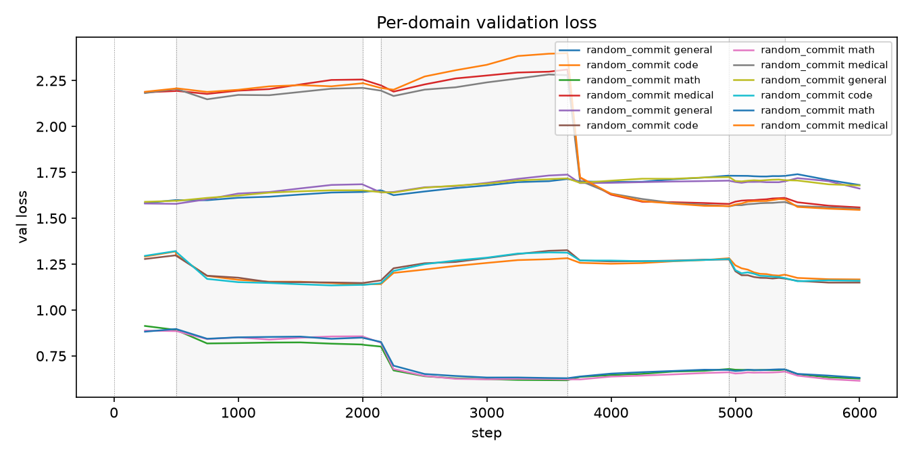
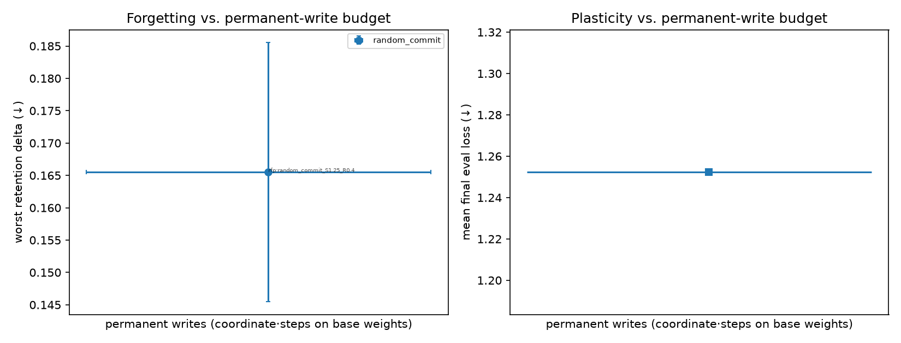
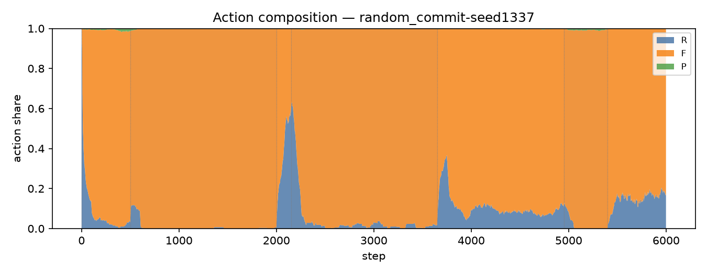
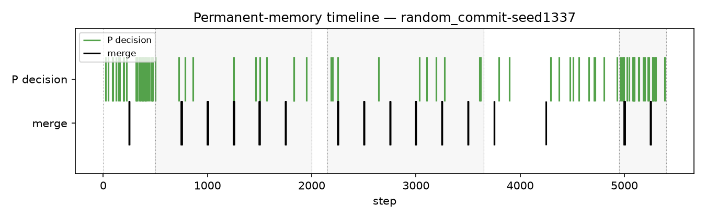
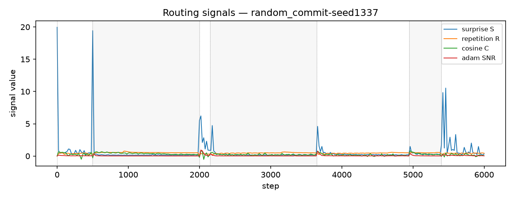
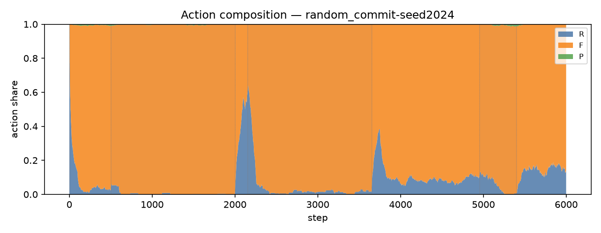
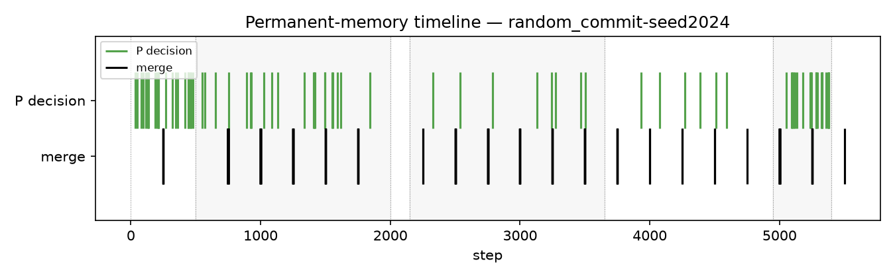
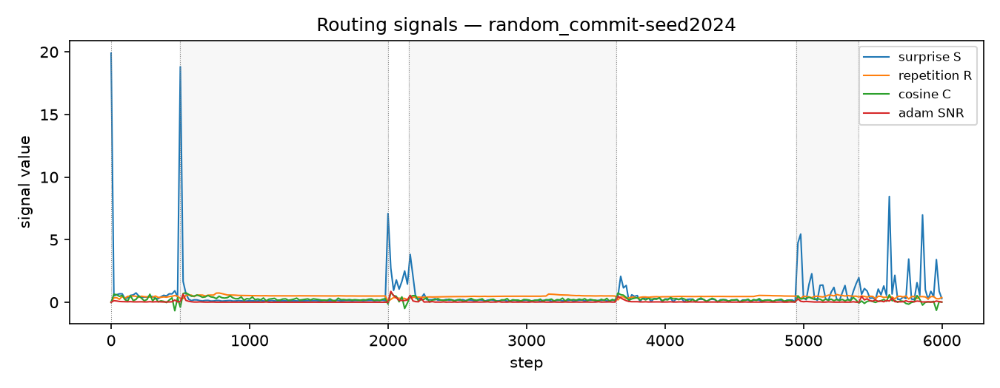
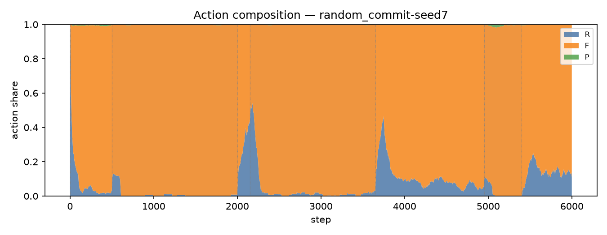
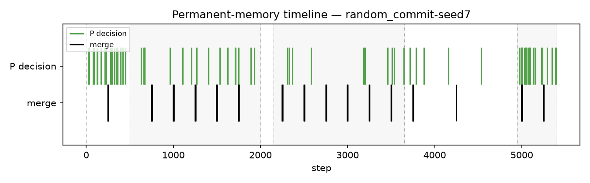
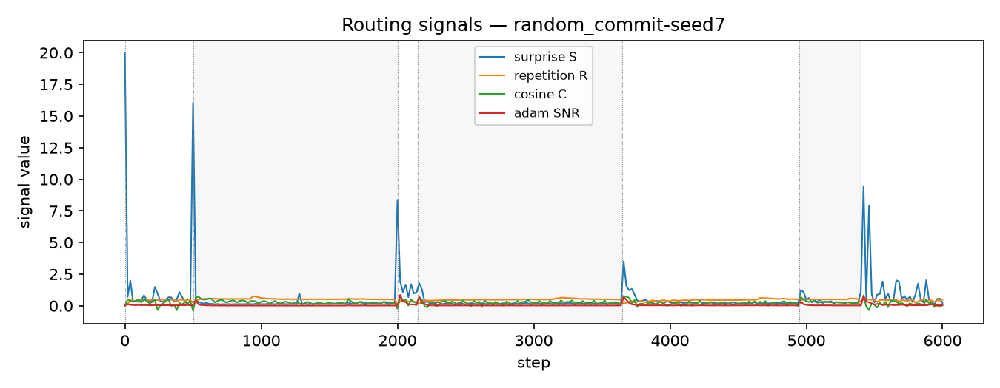
